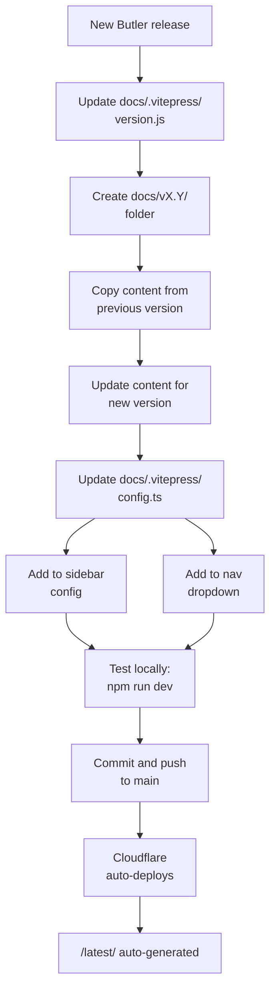

# Butler documentation site

This repository contains the [VitePress](https://vitepress.dev/) based documentation for [Butler](https://github.com/ptarmiganlabs/butler), which is an open source add-on tool for [Qlik Sense](https://www.qlik.com/us/products/qlik-sense).

The doc site created from this repository is available at [butler.ptarmiganlabs.com](https://butler.ptarmiganlabs.com).

**Live site**: [butler.ptarmiganlabs.com](https://butler.ptarmiganlabs.com)  
**Hosting**: Cloudflare Pages with automatic deployment on commits to `main` branch

## Quick Start

### Prerequisites

- Node.js 18+ and npm

### Commands

```bash
npm install          # Install dependencies
npm run dev          # Start dev server (http://localhost:5173)
npm run build        # Build production site
npm run serve        # Preview production build
```

All commands run pre-scripts automatically (version fetching + `/latest/` generation).

## Repository Structure

```
butler-docs/
├── docs/
│   ├── v16.0/           # Version 16.0 docs (source - edit here)
│   ├── v17.0/           # Version 17.0 docs (source - edit here)
│   ├── latest/          # Auto-generated from latest version (DO NOT EDIT)
│   ├── .vitepress/      # VitePress configuration
│   │   ├── config.ts    # Site config (nav, sidebar, theme)
│   │   └── version.js   # Auto-generated version info
│   ├── public/          # Static assets (images, favicons, _redirects, etc.)
│   └── index.md         # Homepage
├── scripts/
│   ├── fetch-butler-version.mjs     # Fetches latest Butler version
│   └── copy-latest-docs.mjs          # Generates /latest/ folder
└── package.json
```

## Version Management System

The documentation uses a versioned folder structure with automatic generation of a "latest" version:

**Source folders** (`v16.0/`, `v17.0/`): Manually maintained documentation for each major version.

**Generated folder** (`latest/`): Automatically created from the latest version folder at build time. This folder should never be edited directly.

**Version tracking** (`version.js`): Automatically fetched from the GitHub releases API to determine which version is "latest".

### Automated Scripts

Two scripts run automatically before every `dev`, `build`, and `serve` command:

1. **`fetch-butler-version.mjs`**: Queries the GitHub releases API to get the latest Butler version and writes it to `docs/.vitepress/version.js`.

2. **`copy-latest-docs.mjs`**: Reads the version from `version.js`, copies the corresponding version folder (e.g., `v17.0/`) to `latest/`, and rewrites all internal links from version-specific paths to `/latest/` paths.

## Adding a New Version

When Butler releases a new major version (e.g., v18.0), follow this workflow:



### Step-by-Step Checklist

1. **Update version**: Edit `docs/.vitepress/version.js` with the new version (e.g., `export const version = 'v18.0.0';`)

2. **Create version folder**:
   ```bash
   mkdir -p docs/v18.0
   cp -r docs/v17.0/* docs/v18.0/
   ```

3. **Update content**: Modify documentation in `docs/v18.0/` as needed for the new version

4. **Update configuration**: Edit `docs/.vitepress/config.ts`:
   - Add sidebar entry: `'/v18.0/': createSidebar('/v18.0'),`
   - Add nav dropdown item: `{ text: 'v18.0', link: '/v18.0/' }`

5. **Test locally**: Run `npm run dev` and verify the new version appears in the nav and sidebar

6. **Deploy**: Commit and push to `main` - Cloudflare Pages will auto-deploy

## Key Conventions

### Sidebar Configuration

The sidebar is defined once via the `createSidebar(prefix)` function in `config.ts`. All versions use the same structure with different path prefixes:

```typescript
sidebar: {
  '/v16.0/': createSidebar('/v16.0'),
  '/v17.0/': createSidebar('/v17.0'),
  '/latest/': createSidebar('/latest'),
}
```

Never duplicate sidebar definitions - just add a new line with the appropriate prefix.

### Images

Use the `<ResponsiveImage>` component for images with captions and zoom functionality:

```markdown
<ResponsiveImage
  src="./image.png"
  alt="Description"
  caption="Caption text"
  maxWidth="450px"
/>
```

Store images in `docs/public/` or relative to the markdown file.

### Links

- **In source docs** (`v16.0/`, `v17.0/`): Use version-specific paths like `/v17.0/about/`
- **Generated `/latest/`**: Links are automatically rewritten from version-specific to `/latest/` paths
- **Homepage and nav**: The "Guide" link and homepage "Documentation" button point to `/latest/`

## Build and Deployment

### Build Process

1. **Pre-scripts run automatically**:
   - Fetch latest version from GitHub releases API
   - Generate `/latest/` folder from the latest version

2. **VitePress builds** the site to `docs/.vitepress/dist/`

3. **Output** is optimized for production with minification and tree-shaking

### Deployment

- **Trigger**: Commits to the `main` branch
- **Platform**: Cloudflare Pages (auto-detect + build)
- **Process**: Fully automatic - no manual deployment needed
- **URL**: https://butler.ptarmiganlabs.com

## Hugo Archive

The previous Hugo-based documentation site has been archived in the `hugo-archive/` directory for reference and historical purposes. See the [Hugo Archive README](hugo-archive/README.md) for information on how to run the archived Hugo site if needed.

## Migration Documentation

Documentation about the VitePress migration process can be found in the `vitepress-migration-docs/` directory.
