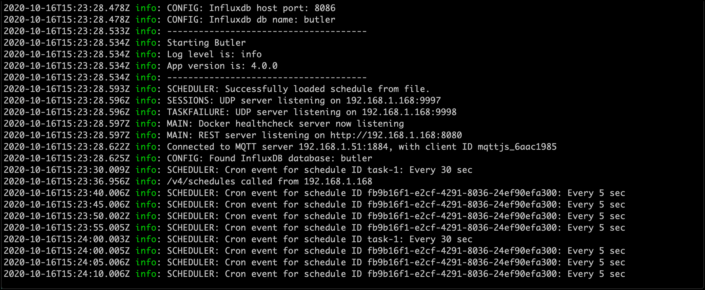

There are many ways to call REST APIs. In this page curl is used, but the same tests can be done using Paw, Postman and by using the REST connector from within Qlik Sense load scripts.

All the examples assume Butler is exposing it's API on 192.168.1.168:8080.

## List all defined schedules

Looks like there currently are three schedules:

```bash
➜  ~ curl "http://192.168.1.168:8080/v4/schedules" | json_pp
  % Total    % Received % Xferd  Average Speed   Time    Time     Time  Current
                                 Dload  Upload   Total   Spent    Left  Speed
100   856  100   856    0     0   167k      0 --:--:-- --:--:-- --:--:--  167k
[
   {
      "cronSchedule" : "*/30 * * * * *",
      "id" : "task-1",
      "lastKnownState" : "started",
      "name" : "Every 30 sec",
      "qlikSenseTaskId" : "0fe447a9-ba1f-44a9-ac23-68c3a1d88d8b",
      "startupState" : "started",
      "tags" : [
         "Sales",
         "abc 123 åäö",
         "Transform"
      ],
      "timezone" : "Europe/Stockholm"
   },
   {
      "cronSchedule" : "0 */2 * * *",
      "id" : "task-2",
      "lastKnownState" : "started",
      "name" : "Every 2 hours",
      "qlikSenseTaskId" : "0fe447a9-ba1f-44a9-ac23-68c3a1d88d8b",
      "startupState" : "started",
      "tags" : [
         "Finance",
         "Extract"
      ],
      "timezone" : "Europe/London"
   },
   {
      "cronSchedule" : "0-30/5 6-18 * * 1-5",
      "id" : "Manually-added-schedule-1",
      "lastKnownState" : "started",
      "name" : "Every 5th minute from 0 through 30 past every hour from 6 through 18 on every day-of-week from Monday through Friday",
      "qlikSenseTaskId" : "0fe447a9-ba1f-44a9-ac23-68c3a1d88d8b",
      "startupState" : "started",
      "tags" : [
         "finance ETL",
         "weekdays"
      ],
      "timezone" : "Europe/Paris"
   }
]
➜  ~
```

## Get a specific schedule

Let's take a look at the schedule with id "Manually-added-schedule-1":

```bash
➜  ~ curl "http://192.168.1.168:8080/v4/schedules?id=Manually-added-schedule-1" | json_pp
  % Total    % Received % Xferd  Average Speed   Time    Time     Time  Current
                                 Dload  Upload   Total   Spent    Left  Speed
100   366  100   366    0     0   178k      0 --:--:-- --:--:-- --:--:--  178k
{
   "cronSchedule" : "0-30/5 6-18 * * 1-5",
   "id" : "Manually-added-schedule-1",
   "lastKnownState" : "started",
   "name" : "Every 5th minute from 0 through 30 past every hour from 6 through 18 on every day-of-week from Monday through Friday",
   "qlikSenseTaskId" : "0fe447a9-ba1f-44a9-ac23-68c3a1d88d8b",
   "startupState" : "started",
   "tags" : [
      "finance ETL",
      "weekdays"
   ],
   "timezone" : "Europe/Paris"
}
➜  ~
```

## Add new schedule

Note how we get back information about the newly created schedule. It's the same data that was sent to the API method, with the addition of schedule id, created timestamp and last known state.

```bash
➜  ~ curl -X "POST" "http://192.168.1.168:8080/v4/schedules" -H 'Content-Type: application/json' -d $'{
  "timezone": "Europe/Stockholm",
  "tags": [
    "tag 1",
    "abc 123 åäö"
  ],
  "qlikSenseTaskId": "0fe447a9-ba1f-44a9-ac23-68c3a1d88d8b",
  "name": "Every 5 sec",
  "cronSchedule": "*/5 * * * * *",
  "startupState": "started"
}' | json_pp
  % Total    % Received % Xferd  Average Speed   Time    Time     Time  Current
                                 Dload  Upload   Total   Spent    Left  Speed
100   544  100   307  100   237  23615  18230 --:--:-- --:--:-- --:--:-- 41846
{
   "created" : "2020-10-16T15:23:36.957Z",
   "cronSchedule" : "*/5 * * * * *",
   "id" : "fb9b16f1-e2cf-4291-8036-24ef90efa300",
   "lastKnownState" : "started",
   "name" : "Every 5 sec",
   "qlikSenseTaskId" : "0fe447a9-ba1f-44a9-ac23-68c3a1d88d8b",
   "startupState" : "started",
   "tags" : [
      "tag 1",
      "abc 123 åäö"
   ],
   "timezone" : "Europe/Stockholm"
}
➜  ~
```

Looking in the Butler logs we see that the every-5-seconds schedule with an ID ending in ...a300 indeed fires every 5 seconds:

  

## Starting and stopping a schedule

Let's stop the schedule we just created:

```bash
➜  ~ curl -X "PUT" "http://192.168.1.168:8080/v4/schedules/fb9b16f1-e2cf-4291-8036-24ef90efa300/stop" | json_pp
  % Total    % Received % Xferd  Average Speed   Time    Time     Time  Current
                                 Dload  Upload   Total   Spent    Left  Speed
100   309  100   309    0     0  61800      0 --:--:-- --:--:-- --:--:-- 61800
[
   {
      "created" : "2020-10-16T15:23:36.957Z",
      "cronSchedule" : "*/5 * * * * *",
      "id" : "fb9b16f1-e2cf-4291-8036-24ef90efa300",
      "lastKnownState" : "stopped",
      "name" : "Every 5 sec",
      "qlikSenseTaskId" : "0fe447a9-ba1f-44a9-ac23-68c3a1d88d8b",
      "startupState" : "started",
      "tags" : [
         "tag 1",
         "abc 123 åäö"
      ],
      "timezone" : "Europe/Stockholm"
   }
]
➜  ~
```

If we get info about this schedule, it should have `lastKnownState`=stopped... Let's verify.

```bash
➜  ~ curl "http://192.168.1.168:8080/v4/schedules?id=fb9b16f1-e2cf-4291-8036-24ef90efa300" | json_pp
  % Total    % Received % Xferd  Average Speed   Time    Time     Time  Current
                                 Dload  Upload   Total   Spent    Left  Speed
100   307  100   307    0     0    99k      0 --:--:-- --:--:-- --:--:--   99k
{
   "created" : "2020-10-16T15:23:36.957Z",
   "cronSchedule" : "*/5 * * * * *",
   "id" : "fb9b16f1-e2cf-4291-8036-24ef90efa300",
   "lastKnownState" : "stopped",
   "name" : "Every 5 sec",
   "qlikSenseTaskId" : "0fe447a9-ba1f-44a9-ac23-68c3a1d88d8b",
   "startupState" : "started",
   "tags" : [
      "tag 1",
      "abc 123 åäö"
   ],
   "timezone" : "Europe/Stockholm"
}
➜  ~
```

Great!

As a final step, let's start the schedule again, as well as verifying it was successfully started:

```bash
➜  ~ curl -X "PUT" "http://192.168.1.168:8080/v4/schedules/fb9b16f1-e2cf-4291-8036-24ef90efa300/start" | json_pp
  % Total    % Received % Xferd  Average Speed   Time    Time     Time  Current
                                 Dload  Upload   Total   Spent    Left  Speed
100   309  100   309    0     0  77250      0 --:--:-- --:--:-- --:--:-- 77250
[
   {
      "created" : "2020-10-16T15:23:36.957Z",
      "cronSchedule" : "*/5 * * * * *",
      "id" : "fb9b16f1-e2cf-4291-8036-24ef90efa300",
      "lastKnownState" : "started",
      "name" : "Every 5 sec",
      "qlikSenseTaskId" : "0fe447a9-ba1f-44a9-ac23-68c3a1d88d8b",
      "startupState" : "started",
      "tags" : [
         "tag 1",
         "abc 123 åäö"
      ],
      "timezone" : "Europe/Stockholm"
   }
]
➜  ~ curl "http://192.168.1.168:8080/v4/schedules?id=fb9b16f1-e2cf-4291-8036-24ef90efa300" | json_pp
  % Total    % Received % Xferd  Average Speed   Time    Time     Time  Current
                                 Dload  Upload   Total   Spent    Left  Speed
100   307  100   307    0     0   149k      0 --:--:-- --:--:-- --:--:--  149k
{
   "created" : "2020-10-16T15:23:36.957Z",
   "cronSchedule" : "*/5 * * * * *",
   "id" : "fb9b16f1-e2cf-4291-8036-24ef90efa300",
   "lastKnownState" : "started",
   "name" : "Every 5 sec",
   "qlikSenseTaskId" : "0fe447a9-ba1f-44a9-ac23-68c3a1d88d8b",
   "startupState" : "started",
   "tags" : [
      "tag 1",
      "abc 123 åäö"
   ],
   "timezone" : "Europe/Stockholm"
}
➜  ~
```

All good!
