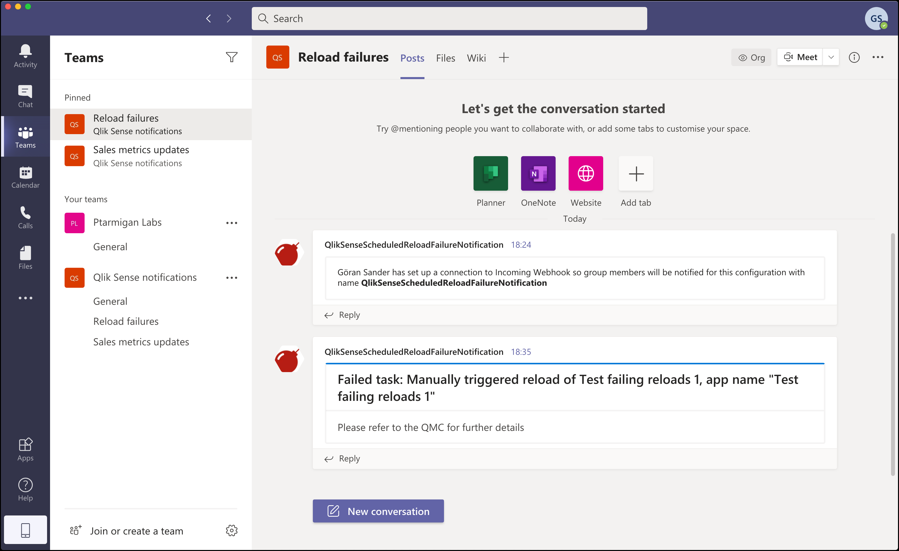
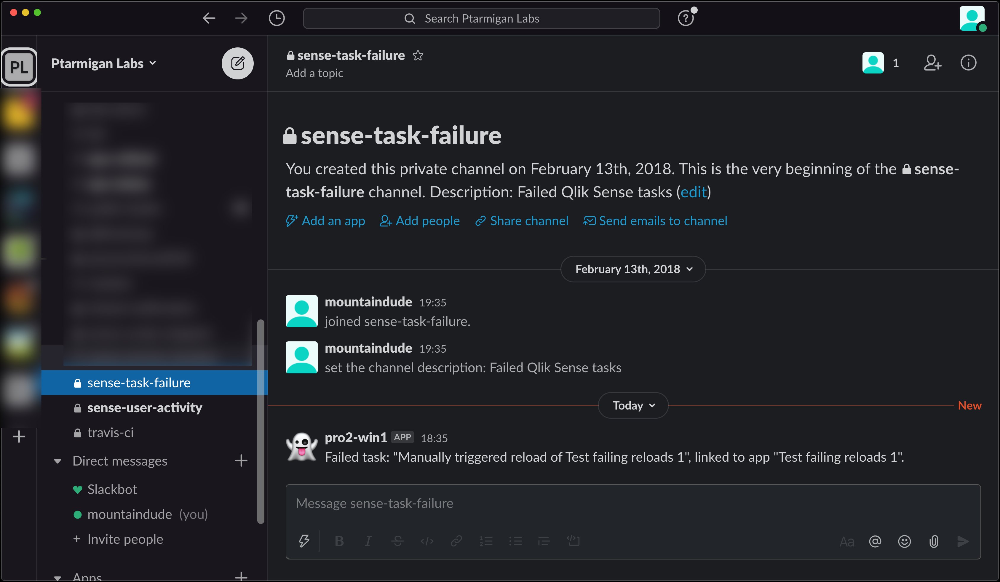

## Microsoft Teams notifications

A reload failure notification in Team looks like this:

  

Requirements:

1. Log appenders being correctly set up on the Sense servers where failed reloads should be caught.
2. A running Butler instance with the UDP server enabled (`Butler.udpServerConfig.enable` setting in Butler config file). Make sure the UDP IP and port in the XML file and Butler's config matches!
3. MS Teams notifications must be enabled in the `Butler.teamsConfig.enable` property in the config file.
4. An incoming webhook defined in MS Teams. These are created per channel in Teams, so make sure to create it in the channel where notifications should appear. The `Butler.teamsConfig.taskFailureWebhookURL` should be set to the URL you get from Teams.

## Slack notifications

  

Requirements:

1. Log appenders being correctly set up on the Sense servers where failed reloads should be caught.
2. A running Butler instance with the UDP server enabled (`Butler.udpServerConfig.enable` setting in Butler config file). Make sure the UDP IP and port in the XML file and Butler's config match!
3. Slack notifications must be enabled in the `Butler.slackConfig.enable` property in the config file.
4. An incoming webhook defined in Slack. While these are associated with a specific Slack channel, you can overrise the channel when posting messages. The `Butler.slackConfig.webhookURL` should be set to the URL you get from Teams.
5. The name of the Slack channel to which notifications should be sent.
