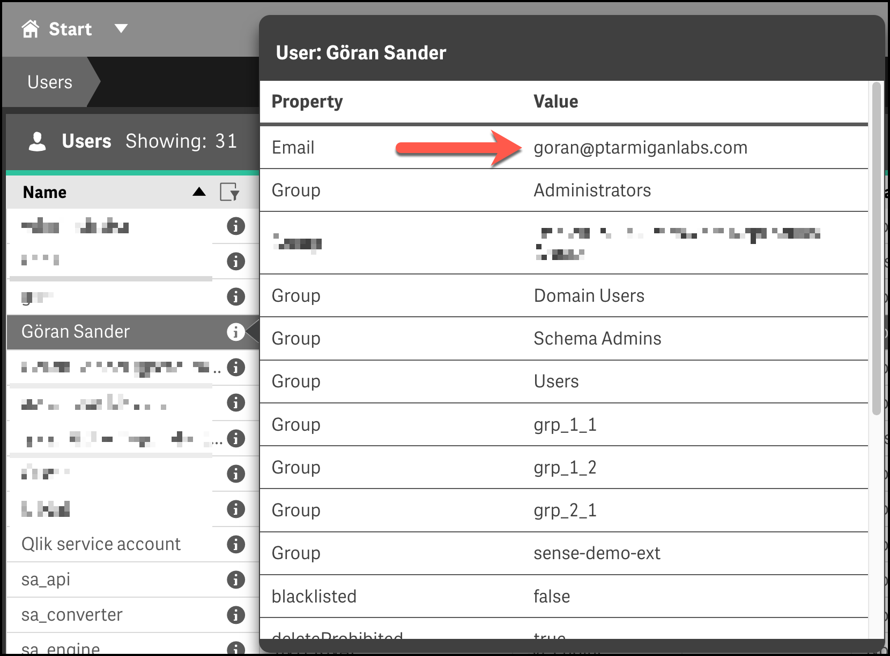

## Scheduled vs manual app reloads

It might not be obvious at first, but there are several kinds of reloads in Qlik Sense Enterprise on Windows:

1. **Reloads started from QMC.** These are usually created and managed in the QMC. Quite often they are also combined into reload chains. The common thing about these reloads is that they - under the hood - are managed by Sense's scheduling service.
2. **Manual reloads started from the script editor.** When developing apps in the standard Sense client/script editor you usually reload the apps from there. This does trigger an app reload, but not via the Sense scheduling service. Instead the reload is done directly in the engine service.

The reload failure notifications described here work by looking at log entries written by the scheduling service. When that service writes information to the logs about a failed reload, your logging appender will detect it and send a UDP message to Butler - who will forward the message to all the notification destinations configured in the config file.

It's also possible to have the log appender send emails without using Butler.
It works perfectly fine, but the emails will be very basic when it comes to formatting and you will not get any of the features offered by Butler (last few lines of the reload script log included in the email, customizable email subjects etc).

## Alert emails

Butler can send two kinds of alert emails:

- When a scheduled reload task fails.
- When a running reload task is stopped.

Alert emails can be formatted using HTML, use CSS styling, emojis etc.  
There's no reason an alert email can't look good!

Alert emails viewed on a mobile phone give direct insight into what has happened:

|  |  |
|-|-|
| Failed reload alert email on mobile home screen. | Failed reload alert email viewed on mobile. |

In a regular email client a reload failed email could look like below.

***Note the end of the script*** - the last few lines of the reload log are often very useful when it comes to understanding what caused the reload failure.

  

### Basic alert emails also possible

Qlik Sense Enterprise on Windows uses the log4net logging framework to create log files. Log4net is quite flexible and can - among other things - send emails when events such as reload failures occur. There is however little flexibility when it comes to layout and contents of those emails. They are text only (no formatting, tables, different fonts, colors etc) and the email subjects cannot contain any dynamic fields (for example the name of the failed reload task).

The goal of Butler's alert emails is to address these limitations and offer a flexible foundation not only for emails, but for all kinds of alerts.

If you want to explore what's possible using just the features offered by log4net, Christof Schwarz has a [good post](https://www.linkedin.com/pulse/qlik-sense-task-email-notifications-so-easy-christof-schwarz/?trackingId=X8MEGEmppfSvdukFRbnLwQ%3D%3D) on sending basic notification emails when scheduled reloads fail, with links to [Levi Turner's great examples](https://github.com/levi-turner/getting_notified_from_qliksense).

## Alert emails to app owners

Qlik Sense can be configured in many ways. In some companies all apps are owned by a central service account.  
Other companies set the developer as app owner also for published apps.

In the latter case it might be relevant to send the app owner a notification email when a reload task fails or is aborted. That way the developer is immediately made aware of the issue and can act on it as needed.

This feature assumes the app owner's user account (in the Sense user directory) has an email address associated with it. When syncing users from Active Directory the users' emails are often brought along into Sense, but there is no guarantee for this.

*If* an email address is available for a Sense user, the QMC user section can look like this:

## Alert emails only for some tasks

Sometimes there is a desire to only have email alerts for *some* tasks.  
One example can be a Sense cluster that hosts both development and production apps, maybe separated on different servers.

As of Butler 7.4.0 it is possible to control per task if an alert email should be sent when the task fails or is aborted from the QMC.

Conceptually it works like this:

Instructions for how to configure this feature is available [here](/docs/getting-started/setup/reload-alerts/alert-emails/#send-alerts-only-for-some-tasks).

Note: This feature is similar to - but independent from - the "task specific email recipients" feature below. Either feature can be enabled or disabled independently of the other in Butler's config file.

## Task specific email recipients

They may be cases where all alert emails should normally go to for example a Sense administrator, but *some* alerts should instead (or also) go to some other recipients.

An example could be a sales related Sense app. If it fails reloading the standard alert email should go to the Sense administrator, but there should also be an alert email sent to the sales operations team, to notify them that they won't find updated numbers in the Sales app.

Butler handles this scenario by using a custome propperty (its name is configurable in the Butler config file) to set alert email recipients on a per-task basis.

Conceptually it works like this:

Instructions for how to configure this feature is available [here](/docs/getting-started/setup/reload-alerts/alert-emails/#send-alerts-to-specific-people-for-some-tasks).

Note: This feature is similar to - but independent from - the "alert emails only for some tasks" feature below. Either feature can be enabled or disabled independently of the other in Butler's config file.

## How it works

Butler uses a templating engine called [Handlebars](https://handlebarsjs.com/guide/). It is used when sending all kinds of alert emails supported by Butler.

Slack, MS Teams and MQTT messages are currently not using the templating engine - this is however likely to change in coming Butler versions. Feel free to [add (or +1) a request on GitHub](https://github.com/ptarmiganlabs/butler/issues) if this is of interest to you!

  

### Template fields

The Handlebars templating engine looks for *template fields* in the template files you create.

A complete list of template fields - including descriptions - is available in the [Reference](/docs/reference/alert-template-fields) section.

### Not all failed reloads will cause alert emails

While not obvious at first, there are different kinds of reloads taking place in a Qlik Sense Enterprise environment:

- Reloads started by the Sense Scheduler service. These reloads always have a *task* associated with them.

- Reloads started from Sense's standard script editor. These reloads are *not* started by the Sense scheduler, but rather directly in the Sense engine. Progress for such reloads will therefore go to the *engine logs*.

The log appenders that drive Butler's alerts rely on the Scheduler logs - not the engine logs.  
This is an intentional design decision.

It is certainly possible to add log appenders also for engine logs and that way get notified when *any* reload fail. The question is whether that's an interesting use case. In most cases sys admins aren't very interested in reloads that fail during app development - they only care about failures caused by apps in production - i.e. app reload tasks managed by the Sense Scheduler. Thus, Butler currently doesn't deal with reload failures reported from the Sense engine.

## References

- [Qlik's documenation](https://help.qlik.com/en-US/sense-admin/September2020/Subsystems/DeployAdministerQSE/Content/Sense_DeployAdminister/QSEoW/Deploy_QSEoW/Server-Logging-Using-Appenders.htm) around log appenders and how to hook into the Sense logs is somewhat brief, but does provide a starting point if you want to dive deeper into this topic.

- The main [log4net documentation](https://logging.apache.org/log4net/) (log4net is the logging framework used by Qlik Sense Enterprise) can also be useful.

These links describe how emails can be sent from the log4net logging framework itself, directly to the recipient. Butler includes sameple XML files for this use case too, but Butler takes things further by using the data in the Sense logs to pull in more data around the failed or stopped reload.

In other words - Butler's alert emails are significantly more flexible and contain information (such as script logs) that are not availble using purely log4net.

## Seeing is believing

The video below is available at [Ptarmigan Labs' YouTube channel](https://www.youtube.com/channel/UCpQblhippq-KfWkXEEYFHTQ) and also in the [Butler playlist](https://www.youtube.com/playlist?list=PLUuyY5OOOsz3XX5YT2QEwa7dzaBT1kOCP).


