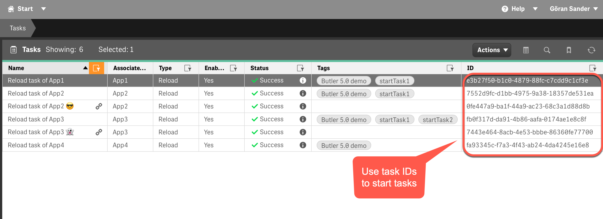
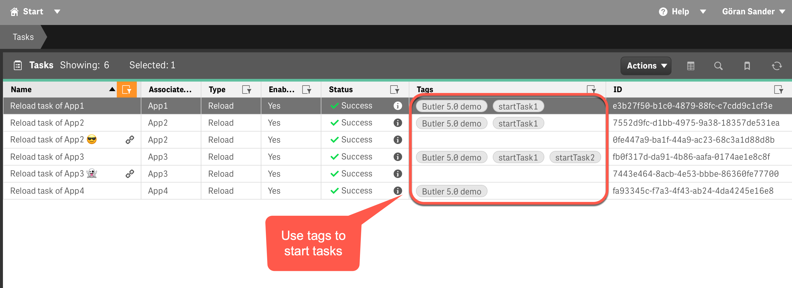
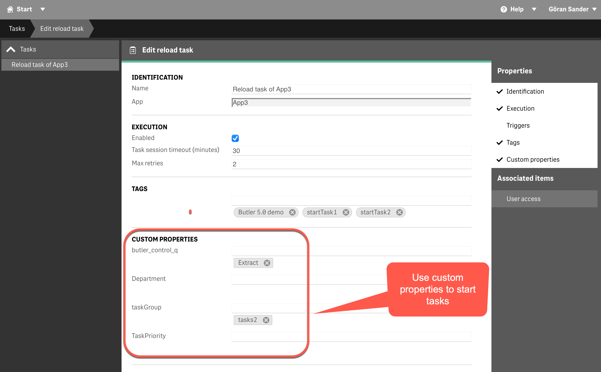

## What's wrong with starting tasks from the QMC?

Nothing really. At least not if starting tasks is considerd a manual activity.

There are also scenarios that benefit from automation.  
Consider a Sense environment that gets its data from some source system, for example a financial ERP system.:

**Sense could poll that source system for data ever so often - or the source system could start the needed tasks when new data is available.**

Or simply: Notifications are usually (always?) a better solution than polling for new data.

The good news is that Butler includes solid support for starting Sense tasks from 3rd party systems.

Below the concept is described on a high level.  
Actual examples are available [here](/docs/examples/start-task-from-rest/).

## Start tasks by IDs, tags and custom properties

Butler's `/v4/reloadtask/<taskid>/start` API endpoint is used to start tasks.  
For historical reasons there are two variants: POST and PUT. Both do the exactly the same though.

The general idea of this API is

- **One** task should be started. The task is **identified by its task ID**.  
  Done using just a properly formatted URL. This is usually the most common scenario.
- **More than one** task should be started. The tasks are **identified by their IDs**.  
  The first task can be specified in the URL and the rest in an array in the call's body.  
  Or all task IDs can be specified in the call's body.
- **One or more tasks** should be started. The tasks are **identified by tags** set in the QMC.  
  The tags are specified in the call's body.  
  All tasks having the tags included in the call will be started.
- **One or more tasks** should be started. The tasks are **identified by custom property values** set in the QMC.  
  Same principle as for tags, but using custom properties instead.  
  All tasks having the custom property/value combinations in the call will be started.

{}
Task IDs are permanent for a specific task, but if tasks are re-created they will get new task IDs.

By specifying tasks using tags and/or custom properties instead, the outside systems that need to start tasks don't have to deal with task IDs that may change.

Lower risk for issues and less maintenance thus.
{}

### Start tasks by ID

While this may be the most obvious way to control what task(s) should be started, it requires the caller to know the exact ID of the task of interest.  
If the task for some reason is re-created its ID will change.

Still, there are certainly cases where task IDs are relevant and the easiest option to use and set up.

  

### Start tasks by tags

Given the example below, **a single call** to Butlers API could start all four of the tasks tagged `Butler 5.0 demo`.  
Or the three tasks tagged `startTask1`.  
Or all of those tasks, if both tags were passed to the Butler API.

  

### Start tasks by custom properties

Using custom properties to identify which tasks to start works similarly to how tags are used (see above).  
The main difference is that the caller must know the name of the custom property and at least one of the possible values for that custom property, in order to start the associated task.

In the example below, calling the Butler API with parameters `taskGroup=tasks2` would result in all tasks having the `taskGroup` custom property set to `tasks2` to be started.

  
