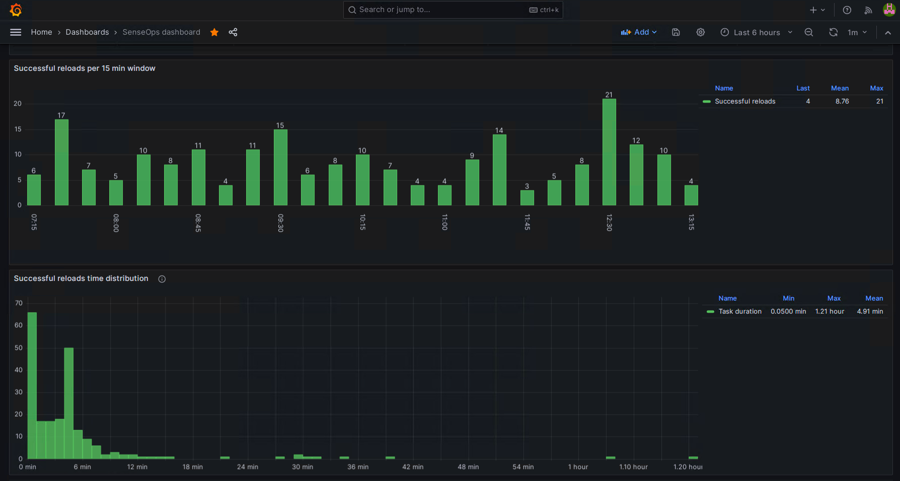
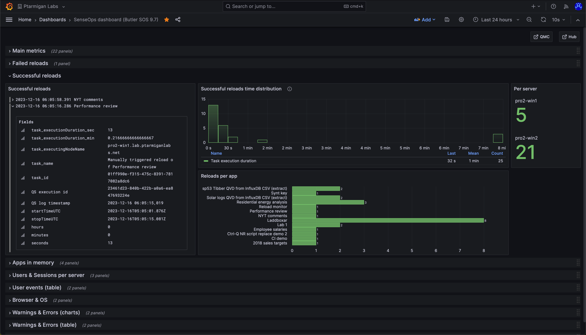

## What's this?

Butler can optionally track successfully completed reload tasks.

Historically few Sense admins have probably paid much attention to successful reloads (but rather looked at failed ditto), but from a performance planning perspective it's relevant to also monitor successful reloads.

## Monitoring some successful reloads or all

Butler can be configured to track all successful reloads, or only those that have a specific custom property set.  
This can be useful if you want to track successful reloads for some apps but not others.

- To enable this feature for all reload tasks, set `Butler.influxDb.reloadTaskSuccess.allReloadTasks.enable` to `true`.
- To enable this feature for only some reload tasks, set `Butler.influxDb.reloadTaskSuccess.byCustomProperty.enable` to `true`.  
This setting will have no effect if `Butler.influxDb.reloadTaskSuccess.allReloadTasks.enable` is set to `true`.
- The name of the custom property is configured in the Butler config file, `Butler.influxDb.reloadTaskSuccess.byCustomProperty.customPropertyName`.
- The value of the custom property that will enable per-task-tracking is found in `Butler.influxDb.reloadTaskSuccess.byCustomProperty.enabledValue`.

## Using tags

Both Sense apps and reload tasks can have tags attached to them (set in the QMC).  
Butler can be configured to get these tags and include them in the data sent to the enabled destinations.

In the case of InfluxDB the Sense tags will be sent as InfluxDB tags, which means they can be used to filter data in InfluxDB queries and Grafana dashboards.

The config file also allows for adding static tags to the data sent to InfluxDB, this is set in `Butler.influxDb.reloadTaskSuccess.tag.static`.

## Grafana dashboards

Given the information stored in InfluxDB, several interesting Grafana dashboards can be created:

- Distribution of reload durations. If filtering on a specific reload task this will show how much the task duration vary. Can be very useful when investigating server performance problems.
- Number of successful reloads per (for example) 15-minute blocks. This shows how reloads are distributed over the course of a day, and can be useful when deciding when to schedule reloads.

Sample dashboard showing the above charts:



Here is another set of charts, also showing what metadata is available for each reload task:



## How it works

### Reload success UDP server

Butler includes a UDP server to which Sense's logging framework Log4Net can send reload success messages.

The UDP server is configured in the Butler config file, and is disabled by default.
When enabled, the UDP server listens for UDP messages on the configured port.

When a UDP message is received, the UDP server will parse the message to determine what it is about and to extract relevant data, then dispatch the message to the enabled destinations.  
The XML appenders must be correctly deployed on the Sense servers for this to work.  
See [this page](/docs/getting-started/setup/reload-alerts/#adding-a-log-appender) for more information on setting up the XML appenders.

In the case of successful reload tasks, the UDP server will determine which app was reloaded, the duration of the reload task, who started the task etc.  
Butler will then send this information to the enabled destinations.

## Email notifications

Butler can be configured to send email notifications when a reload task completes successfully.  
The concept is the same as for failed/aborted reload tasks (described [here](/docs/concepts/failed-reloads/client-managed/alert-emails/)), except that emails are never sent to app owners for successfully completed reload tasks.

Can look like this:


## Supported destinations

The following destinations are supported:

- InfluxDB
- Email

### Config file settings

```yaml
Butler:
...
  ...          
  # InfluxDB settings
  influxDb:
    enable: false                   # Master switch for InfluxDB integration. If false, no data will be sent to InfluxDB.
    ...
    ...
    reloadTaskSuccess:
      enable: true
      allReloadTasks:
        enable: false
      byCustomProperty:
        enable: true
        customPropertyName: 'Butler_SuccessReloadTask_InfluxDB'
        enabledValue: 'Yes'
      tag: 
        static:                 # Static attributes/dimensions to attach to events sent to InfluxDb
          # - name: event-specific-tag 1
          #   value: abc 123
        dynamic:
          useAppTags: true      # Should app tags be sent to InfluxDb as tags?
          useTaskTags: true     # Should task tags be sent to InfluxDb as tags?
  ...
  ...
  # Settings needed to send email notifications when for example reload tasks fail.
  # Reload failure notifications assume a log appender is configured in Sense AND that the UDP server in Butler is running.
  emailNotification:
    enable: false
    reloadTaskSuccess:
      enable: false
      # Custom property used to control which task successes will cause alert emails to be sent
      # If this setting is true, alerts will not be sent for all tasks, but *only* for tasks with the CP set to the enabledValue.
      # If this setting is false, alerts will be sent for all failed reload tasks.
      alertEnableByCustomProperty:
        enable: false
        customPropertyName: 'Butler_SuccessAlertEnableEmail'
        enabledValue: 'Yes'
      # Custom property used to say that alerts for a certain task should be sent to zero or more recipients
      # These alerts will be sent irrespective of the alertEnableByCustomProperty.enable setting.
      alertEnabledByEmailAddress:
        customPropertyName: 'Butler_SuccessAlertSendToEmail'
      rateLimit: 60              # Min seconds between emails for a given taskID/recipient combo. Defaults to 5 minutes.
      headScriptLogLines: 15
      tailScriptLogLines: 25
      priority: high              # high/normal/low
      subject: '✅ Qlik Sense reload success: "{{taskName}}"'
      bodyFileDirectory: path/to/email_templates
      htmlTemplateFile: success-reload-qseow
      fromAddress: Qlik Sense (no-reply) <qliksense-noreply@ptarmiganlabs.com>
      recipients:
        - <Email address 1>
        - <Email address 2>
    ...
    ...
    smtp:                                             # Email server settings. See https://nodemailer.com/smtp/ for details on the meaning of these fields.
      host: <FQDN or IP or email server, e.g. smtp.gmail.com>
      port: <port on which SMTP server is listening>
      secure: true                                    # true/false
      tls:
        serverName:                                   # If specified the serverName field will be used for TLS verification instead of the host field.
        ignoreTLS: false
        requireTLS: true
        rejectUnauthorized: false
      auth:
        enable: true
        user: <Username, email address etc>
        password: <your-secret-password>
```


