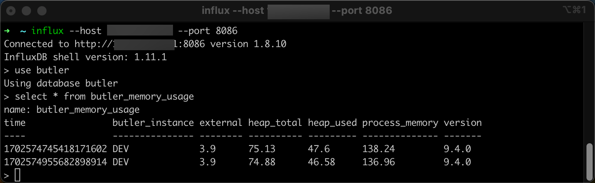
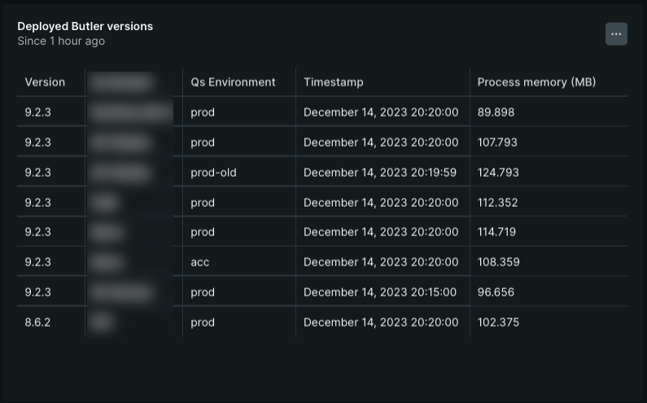

Butler can optionally store uptime information (Butler version number and memory usage) in [InfluxDB](https://docs.influxdata.com/influxdb/v1/) or [New Relic](https://newrelic.com).  
InfluxDB is a database for time-series data such as measurements, while New Relic is an enterprise grade, SaaS observability solution.

Once in InfluxDB it's easy to create nice monitoring charts in [Grafana](https://grafana.com/) or similar tools.  
New Relic has their own built-in dashboard tool (but Grafana can actually load data from New Relic too!).

But hey - why spend CPU cycles and disk space on this?

Well, if you are serious about your Qlik Sense Enterprise environment, you should also be serious about your supporting tools and microservices, Butler included.

Even though Butler over the years has proven to be a very stable piece of software, there is always the risk of new features misbehaving or new bugs appearing.  
It's thus a good idea to monitor for example how much memory (RAM) tools like Butler use over time and alert if things go wrong.

## Enable Butler's uptime monitor

Both he uptime monitor and the logging to desired destination (InfluxDB or New Relic) must be enabled. Note that there are two settings for this. If your InfluxDB uses authentication you'll need to enable this too in Butler's config file.

If you use New Relic to monitor your uptime metrics you must first define the New Relic API credentials in the Butler config file's `Butler.thirdPartyToolsCredentials.newRelic` settings, then configure the uptime monitoring specifics in `Butler.uptimeMonitor.storeNewRelic`.

The uptime monitoring part of the config file could looks like this:

```yaml
  # Uptime monitor
  uptimeMonitor:
    enable: false                   # Should uptime messages be written to the console and log files?
    frequency: every 15 minutes     # https://bunkat.github.io/later/parsers.html
    logLevel: verbose               # Starting at what log level should uptime messages be shown?
    storeInInfluxdb: 
      enable: false                 # Should Butler memory usage be logged to InfluxDB?
    storeNewRelic:
      enable: false
      destinationAccount:
        - First NR account
        - Second NR account
      # There are different URLs depending on whther you have an EU or US region New Relic account.
      # The available URLs are listed here: https://docs.newrelic.com/docs/accounts/accounts-billing/account-setup/choose-your-data-center/
      # As of this writing the options for the New Relic metrics API are
      # https://insights-collector.eu01.nr-data.net/metric/v1
      # https://metric-api.newrelic.com/metric/v1 
      url: https://insights-collector.eu01.nr-data.net/metric/v1   # Where should uptime data be sent?
      header:                       # Custom http headers
        - name: X-My-Header
          value: Header value
      metric:
        dynamic:
          butlerMemoryUsage:
            enable: true            # Should Butler's memory/RAM usage be sent to New Relic?
          butlerUptime:
            enable: true            # Should Butler's uptime (how long since it was started) be sent to New Relic?
      attribute: 
        static:                     # Static attributes/dimensions to attach to the data sent to New Relic.
          - name: metricType
            value: butler-uptime
          - name: service
            value: butler
          - name: environment
            value: prod
        dynamic:
          butlerVersion: 
            enable: true            # Should the Butler version be included in the data sent to New Relic?
```

## Creating a InfluxDB database

When starting Butler for the first time and InfluxDB is enabled, it will connect to InfluxDB and if needed create a new database with a name controlled by the `Butler.influxDb.dbName` setting in the Butler config file.  
A retention policy with its name controlled by the `Butler.influxDb.retentionPolicy.name` setting in the Butler config file will also be created:

```
2023-12-14T17:25:29.851Z info: CONFIG: Influxdb enabled: true
2023-12-14T17:25:29.851Z info: CONFIG: Influxdb host IP: 192.168.1.51
2023-12-14T17:25:29.852Z info: CONFIG: Influxdb host port: 8086
2023-12-14T17:25:29.852Z info: CONFIG: Influxdb db name: butler
2023-12-14T17:25:30.614Z info: CONFIG: Created new InfluxDB database: butler
2023-12-14T17:25:30.746Z info: --------------------------------------
2023-12-14T17:25:30.746Z info: Starting Butler
2023-12-14T17:25:30.747Z info: Log level      : info
2023-12-14T17:25:30.747Z info: App version    : 9.4.0
...
```

Note that the only thing needed is a running InfluxDB instance. Butler creates the database in InfluxDB if needed, together with a retention policy that is defined in the Butler config file.

## Hey data, are you there?

So far so good. Let's wait a few minutes and then verify that New Relic and/or InfluxDB has received a few dataspoints.  
The interval between the uptime messages is controlled by the `Butler.uptimeMonitor.frequency` setting in the Butler config file.

Using the InfluxDB command line client to connect to InfluxDB we can do a manual query:

  

Indeed, there are a few data points in InfluxDB. Butler's uptime monitor seems to be working.

## Butler + InfluxDB + Grafana = 🎉📈

Grafana has excellent support for InfluxDB, it's therefore a good way to visualise Butler memory use over time.

To use the Grafana dashboard included in the Butler GitHub repository you first need to create a Grafana data source named `Butler ops metrics`, and point it to the InfluxDB database in which Butler stores its data.

Once the Grafana data source is in place and working you can import the Grafana dashboard file `Butler operational metrics.json` (available in the docs/grafana folder in the GitHub repo).

If everything works you'll see something like this:


Looks like Butler is using ca 70 MByte here. This is pretty normal, memory usage is usually around 100 MByte, even when Butler has been running for days, weeks and months. Exact memory usage will vary depending on which features are enabled.

Butler's version number is also included in the data sent to InfluxDB.

This means that you can easily create a Grafana dashboard showing which Butler version is running on which server.  
If you have multiple Butler instances running in your environment, this can be very useful.


## Butler + New Relic = 😎🌟

While InfluxDB combined with Grafana is hard to beat when it comes to flexibility and look'n'feel of the dashboards, New Relic is outstanding when it comes to ease of setup.

New Relic is a SaaS product which means you don't have to host neither databaes nor dashboard tool yourself.  
It's all there within New Relic.

What about cost? Is New Relic expensive?

Well, if you have lots of metrics, log files etc New Relic can become quite expensive as they charge you based on how much data you send to New Relic.  
But given that Butler will send *very little* data you are unlikely to ever reach the limit of New Relic's free tier.  
There is thus a good chance you won't even have to pay for New Relic if you only use it to monitor Butler.

A New Relic chart showing Butler memory usage can look like this:

  

Similarly to the Grafana dashboard, Butler's version number is also included in the data sent to New Relic, and can be used to create a chart showing which Butler version is running on which server:


