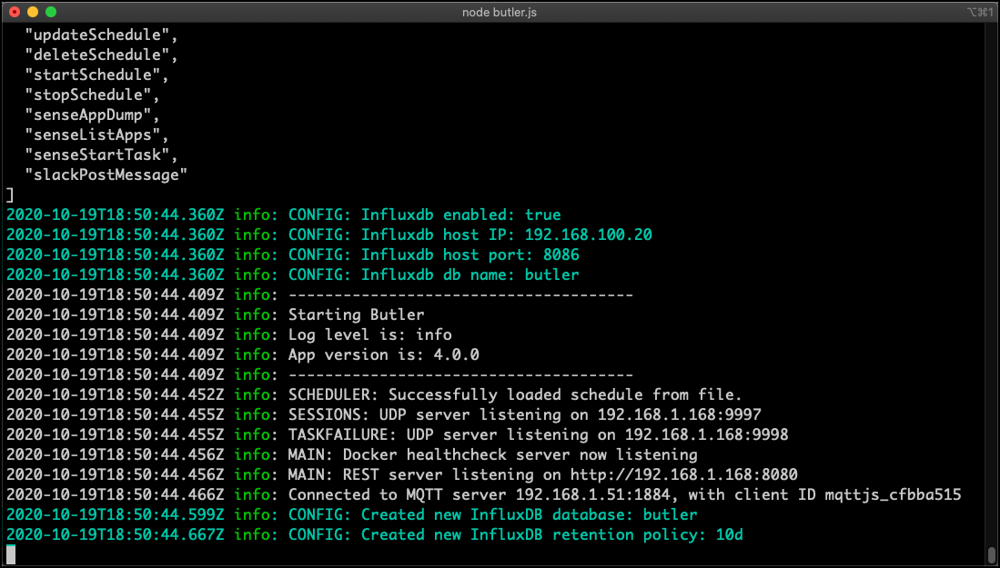

Butler 4.0 adds several new features, one being the uptime messages that can be optionally posted to the logs. Each message tells how long Butler has been running and how much memory it is using right then.

This information can also, again optionally, be stored to [InfluxDB](https://docs.influxdata.com/influxdb/v1.8/). InfluxDB is a database for time-series data such as measurements.  
Once in InfluxDB it's easy to create nice monitoring charts in [Grafana](https://grafana.com/) or similar tools.

Why spend CPU cycles and disk space on this, you may ask?

Well, if you are serious about your Qlik Sense Enterprise environment, you should also be serious about your supporting tools and microservices, Butler included.

Even though Butler over the years has proven to be a very stable piece of software, there is always the risk of new features misbehaving, or new bugs appearing.  
It's thus a good idea to monitor for example how much memory (RAM) tools like Butler use over time, and alert if things go the wrong way.

## Enable Butler's uptime monitor

Both he uptime monitor and the logging to InfluxDB must be enabled. Note that there are two settings for this. If your InfluxDB uses authentication you'll need to enable this too in Butler's config file.

If you use New Relic to monitor your uptime metrics you must define the New Relic API key etc in the Butler config file's `Butler.thirdPartyToolsCredentialsnewRelic` settings.

A snippet from a real-life Butler config file could look like this:

```yaml
  # Uptime monitor
  uptimeMonitor:
    enable: true                    # Should uptime messages be written to the console and log files?
    frequency: every 15 seconds     # https://bunkat.github.io/later/parsers.html
    logLevel: verbose               # Starting at what log level should uptime messages be shown?
    storeInInfluxdb:
      enable: true
      hostIP: 192.168.100.20
      hostPort: 8086
      auth:
        enable: false
        # username: user_joe
        # password: joesecret
      dbName: butler
      instanceTag: DEV              # Tag that can be used to differentiate data from multiple Butler instances
      # Default retention policy that should be created in InfluxDB when Butler creates a new database there.
      # Any data older than retention policy threshold will be purged from InfluxDB.
      retentionPolicy:
        name: 10d
        duration: 10d
    storeNewRelic:
      enable: true
      # There are different URLs depending on whther you have an EU or US region New Relic account.
      # The available URLs are listed here: https://docs.newrelic.com/docs/accounts/accounts-billing/account-setup/choose-your-data-center/
      # As of this writing the options for the New Relic metrics API are
      # https://insights-collector.eu01.nr-data.net/metric/v1
      # https://metric-api.newrelic.com/metric/v1 
      url: https://insights-collector.eu01.nr-data.net/metric/v1   # Where should uptime data be sent?
      header:                       # Custom http headers
        - name: X-My-Header
          value: Header value
      metric:
        dynamic:
          butlerMemoryUsage:
            enable: true            # Should Butler's memory/RAM usage be sent to New Relic?
          butlerUptime:
            enable: true            # Should Butler's uptime (how long since it was started) be sent to New Relic?
      attribute: 
        static:                     # Static attributes/dimensions to attach to the data sent to New Relic.
          - name: metricType
            value: butler-uptime
          - name: service
            value: butler
          - name: environment
            value: prod
        dynamic:
          butlerVersion: 
            enable: true            # Should the Butler version be included in the data sent to New Relic?
```

When starting Butler for the first time and InfluxDB is enabled, it will connect to InfluxDB and if needed create a new database called `butler`, together with a retention policy called `10d`:

  

Note that the only thing needed is a running InfluxDB instance. Butler creates the database in InfluxDB if needed, together with a retention policy that is defined in the Butler config file.

## Hey data, are you there?

So far so good. Let's wait a few minutes and then verify that the InfluxDB database has received a few dataspoints. There should be data with 15 second intervals, to be precise.

Use the InfluxDB command line client to connect to InfluxDB and do a manual query:

  

Indeed, there are a few data points in InfluxDB. Butler's uptime monitor seems to be working.

## Butler + InfluxDB + Grafana = 🎉📈

Let's wrap up by creating a Grafana chart showing Butler memory use over time.

To use the Grafana dashboard included in the Butler GitHub repository you first need to create a Grafana data source named `Butler ops metrics`, and point it to the InfluxDB database in which Butler stores its data.

Once the Grafana data source is in place and working you can import the Grafana dashboard file `Butler operational metrics.json` (available in the docs/grafana folder in the GitHub repo).

If everything works you'll see something like this:


Looks like Butler is using ca 70 MByte here. This is pretty normal, memory usage usually stays well below 100 MByte, even when Butler has been running for days, weeks and months.

## Butler + New Relic = 😎🌟

While InfluxDB combined with Grafana is hard to beat when it comes to flexibility and look'n'feel of the dashboards, New Relic is outstanding when it comes to ease of setup. 

New Relic is a SaaS product which means you don't have to host neither databaes nor dashboard tool yourself.  
It's all there within New Relic.

What about cost then?  
Is New Relic expensive?

Well, if you have lots of metrics, log files etc New Relic can become quite expensive as they charge you based on how much data you send to New Relic.  
But given that Butler will send *very little* data you are unlikely to ever reach the limit of New Relic's free tier.  
There is thus a good chance you won't even have to pay for New Relic if you only use it to monitor Butler.
