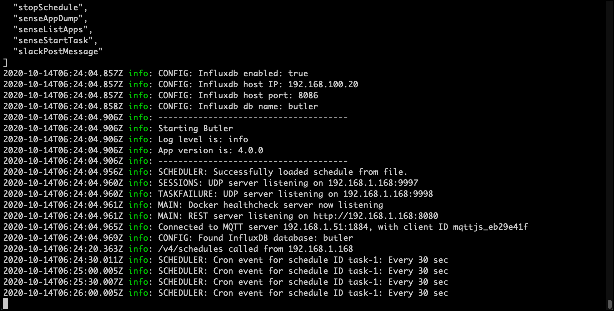

Below are some examples of how Butler's built-in Swagger docs can be used to test-drive the Butler API.

## OpenAPI documentation built into Butler

The complete documentation for Butler's REST API is built into Butler itself.
This means that its very easy to try out and get familiar with the various API endpoints, without having to create Sense apps for everything you want to try out.

If Butler's config file contains the settings below, the API will be available at http:192.168.1.168:8080.

  ```yaml
  ...
  restServerConfig:
    enable: true
    serverHost: 192.168.1.168
    serverPort: 8080
  ...
  ```

In addition to the API endpoints, the API documentation will be available at http://192.168.1.168:8080/docs/swagger. Looks like this:




{}
If the OpenAPI interface to Butler's API feels limited, there are lots of tools dedicated to this task.  
Two good ones are:

* [Paw](https://paw.cloud/) is Mac only, costs a bit of money, but is very, very good. Highly recommended.
* [Postman](https://www.postman.com/) is also good and cross platform.
{}

### Butler ping

This is the most basic API endpoint of them all. Can be used to verify that Butler is actually running and responding as expected.

Looks like this. Note the response we get from Butler's API.



### List all enabled API endpoints

Let's take a look at which API endpoints are [enabled in the restServerEndpointsEnable section of the config file](/docs/reference/config-file/):



### Key-value pairs, demo 1

Create and query key-value pairs.



### Schedules, demo 1

Create, query, edit and delete task reload schedules using Butler's scheduling API.

When wathcing the video below, you will notice there are two pre-defined schedules.  
One of them fires every 30 seconds and this is also visible in the Butler logs:

  



### List available Sense apps and extract them as JSON

List existing apps on Sense server, then export one of them to JSON.


