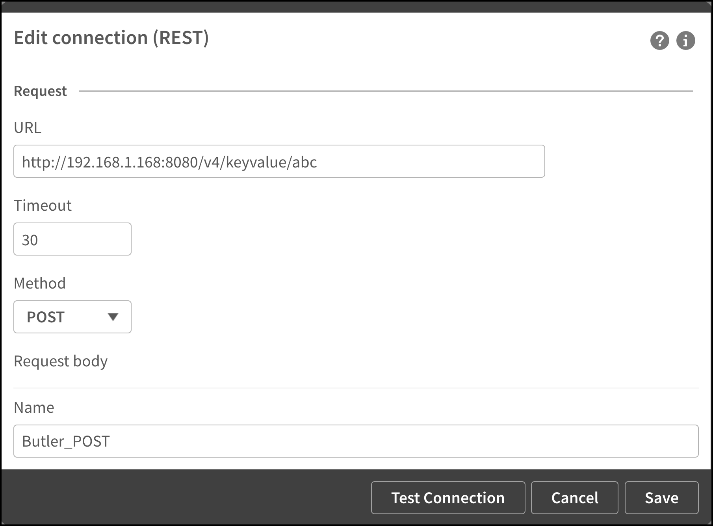

## Reload chaining with parameters à la Butler

First: Some people argue that apps in an ETL chain should be atomic and not pass parameters to each other.

There is certainly some merit to this view, but there are also cases where you just have to tell the following app(s) what happened in a previous step in the reload chain. Some kind of parameter passing is thus needed.

Passing parameters between apps in a QMC reload chain can be done in various ways.

The most common option is to use what's available in Sense out of the box:  
Store the parameters in a disk file (CSV, QVD etc) in the first app, then load the parameters back into the second app when it is reloading.

Butler offers a different approach: Store and manipulate named key-value pairs within Butler, using its REST API.

It works like this:

  

Pretty easy, right?

One more thing. There is an optional but useful property for each KV pair: TTL, or time-to-live.

If a ttl is set (in milliseconds) for a KV pair, it will be automatically deleted when the ttl clock expire. This is an easy way to keep the Butler key-value store nice and tidy.

### Data connections not included

In order to call Butler's REST API you need a couple of REST data connections defined in Qlik Sense. The apps described in this example assumes `Butler_Get` and `Butler_POST` exists. They look like this:

#### Butler_GET

This data connection is trivial. When creating it any REST API that responds to GET requests can be used. Later on (before the calls to the Butler API) the URL will be replaced with the correct one = host:port where Butler is running.


#### Butler_POST

This data connection is a bit more complex.

First, in order to create the connection you need a REST endpoint that takes a POST with data passed in the body of the message. The data connection used by the apps in this example are found below. Note the http method, the request body and the `Content-Type` Query header. Any other settings can be ignored.

Secondly, Qlik Sense's REST connector only supports GET and POST methods over http. That's fine in this particular case, because we'll use a POST to create a new key-value pair. On a generel levels it's however really quite bad that Qlik's REST connector only supports GET and POST: PUT, DELETE and other http methods are certainly also used out there on the Internet, and should be supported too.

Some of the Butler API endpoints use PUT or DELETE methods, which is nothing strange at all - rather the opposite. Butler tries to follow best practices when it comes to using GET, POST, PUT and DELETE at the appropriate times.

We still need a way to invoke PUT and DELETE endpoints from Sense load script.
This is done in the script, by adding an extra http header in the call to Butler's API: `X-HTTP-Method-Override`

If `X-HTTP-Method-Override` is set to PUT in the call to Butler's API, the Butler will convert the call to a PUT call before it reaches the message dispatching within Butler. Same thing for DELETEs.

  

  

  

## Parameter passing in action

The scenario is as follows:

* App 1 needs to pass a parameter called "Paramater 1" to App 2
* App 2 is scheduled to reload either directly or in some later stage after App 1.
* App 1 stores the parameter in Butler's key-value store during reload of App 1.
* When App 2 reloads it pulls the parameter from the KV store.

When App 1 reloads the reload window looks like this. Note how the app has created a key-value pair within Butler.

  

App 2 is scheduled to reload when App 1 has finished reloading. Note that we get back the same value that was set by App 1. Mission accomplished.

  

## Qlik script for passing parameters between apps

Let's take a closer look at the two apps. The apps are available in the sense_apps directory of [the Butler repository on GitHub](https://github.com/ptarmiganlabs/butler).

The apps are called `Butler 4.0 - Reload chain parameters, app 1.qvf` and `Butler 4.0 - Reload chain parameters, app 2.qvf`.

### App 1

The app has three script sections, each is shown below.

#### Script section 1: Init

The interesting parts here are the two variables towards the end. These tell the rest of the script where Butler is running.

```
SET ThousandSep=',';
SET DecimalSep='.';
SET MoneyThousandSep=',';
SET MoneyDecimalSep='.';
SET MoneyFormat='$#,##0.00;-$#,##0.00';
SET TimeFormat='h:mm:ss TT';
SET DateFormat='M/D/YYYY';
SET TimestampFormat='M/D/YYYY h:mm:ss[.fff] TT';
SET FirstWeekDay=6;
SET BrokenWeeks=1;
SET ReferenceDay=0;
SET FirstMonthOfYear=1;
SET CollationLocale='en-US';
SET CreateSearchIndexOnReload=1;
SET MonthNames='Jan;Feb;Mar;Apr;May;Jun;Jul;Aug;Sep;Oct;Nov;Dec';
SET LongMonthNames='January;February;March;April;May;June;July;August;September;October;November;December';
SET DayNames='Mon;Tue;Wed;Thu;Fri;Sat;Sun';
SET LongDayNames='Monday;Tuesday;Wednesday;Thursday;Friday;Saturday;Sunday';
SET NumericalAbbreviation='3:k;6:M;9:G;12:T;15:P;18:E;21:Z;24:Y;-3:m;-6:μ;-9:n;-12:p;-15:f;-18:a;-21:z;-24:y';


// The Butler instance is running at this IP/port:
let vButlerHost = '192.168.1.168';
let vButlerPort = '8080';
```

#### Script section 2: Sub definitions

Here we define two subs: One to get a bit more friendly looking trace messages, and one that encapsulates the code needed to store key-value pairs in Butler.

```
// ------------------------------------------------------------
// ** Time stamped trace messages **
//
// Get nice trace lines in the reload log by calling the line with 
// CALL NiceTrace('My trace message. Variable value=$(vVariableName)');
//
// Paramaters:
// vMsg                  : Message sent to reload log
// ------------------------------------------------------------
sub NiceTrace(vMsg)
    let vNow = Now(1);
    TRACE >>> $(vNow): $(vMsg);

    // Clear timestamp variable
    set vNow=;
end sub


// ------------------------------------------------------------
// ** Add key-value pair to a namespace **
//
// Paramaters:
// vNamespace            : Namespace in which the KV pair will be stored
// vKey                  : Key name
// vValue                : Value to store together with key
// vTimeToLive           : How long should the KV pair exist before being automatically deleted?
//                         Set to 0 to disable TTL feature (=no auto-delete of KV pair)
// ------------------------------------------------------------
sub AddKeyValue(vNamespace, vKey, vValue, vTimeToLive)
    LIB CONNECT TO 'Butler_POST';

    if (vTimeToLive>0) then
        let vRequestBody = '{"key": "$(vKey)", "value": "$(vValue)", "ttl": "$(vTimeToLive)"}';
    else
        let vRequestBody = '{"key": "$(vKey)", "value": "$(vValue)"}';
    end if

    // Escape " in request body 
    let vRequestBody = replace(vRequestBody,'"', chr(34)&chr(34));

    RestConnectorMasterTable:
    SQL SELECT 
        "namespace",
        "key",
        "value",
        "ttl"
    FROM JSON (wrap on) "root"
    WITH CONNECTION (
    Url "http://$(vButlerHost):$(vButlerPort)/v4/keyvalues/$(vNamespace)",
    BODY "$(vRequestBody)",
    HTTPHEADER "Content-Type" "application/json"
    );

    DROP TABLE RestConnectorMasterTable;
end sub
```

#### Script section 3: Write parameters to KV store

Finally, the code needed to actually store the parameter in Butler is just a few lines:

```
// Create key-value pair in Butler's key-value store. 

Call NiceTrace('---------------------------')
Call NiceTrace('Writing parameter to Butler key-value store. No time-to-live (ttl).')
Call AddKeyValue('Reload chain parameter demo', 'Parameter 1', 'a1 abc 123', 0)

Call NiceTrace('Written parameter to key-value store: ')
Call NiceTrace('Namespace="Reload chain parameter demo", Key="Parameter 1", Value="a1 abc 123"')
```

### App 2

#### Script section 1: Init

Set host and port where Butler is running. Exactly the same script as in App 1.

```
SET ThousandSep=',';
SET DecimalSep='.';
SET MoneyThousandSep=',';
SET MoneyDecimalSep='.';
SET MoneyFormat='$#,##0.00;-$#,##0.00';
SET TimeFormat='h:mm:ss TT';
SET DateFormat='M/D/YYYY';
SET TimestampFormat='M/D/YYYY h:mm:ss[.fff] TT';
SET FirstWeekDay=6;
SET BrokenWeeks=1;
SET ReferenceDay=0;
SET FirstMonthOfYear=1;
SET CollationLocale='en-US';
SET CreateSearchIndexOnReload=1;
SET MonthNames='Jan;Feb;Mar;Apr;May;Jun;Jul;Aug;Sep;Oct;Nov;Dec';
SET LongMonthNames='January;February;March;April;May;June;July;August;September;October;November;December';
SET DayNames='Mon;Tue;Wed;Thu;Fri;Sat;Sun';
SET LongDayNames='Monday;Tuesday;Wednesday;Thursday;Friday;Saturday;Sunday';
SET NumericalAbbreviation='3:k;6:M;9:G;12:T;15:P;18:E;21:Z;24:Y;-3:m;-6:μ;-9:n;-12:p;-15:f;-18:a;-21:z;-24:y';


// The Butler instance is running at this IP/port:
let vButlerHost = '192.168.1.168';
let vButlerPort = '8080';
```

#### Script section 2: Sub definitions

Here we define a NiceTrace sub, and a sub for retrieving key-value pairs from Butler.

```
// ------------------------------------------------------------
// ** Time stamped trace messages **
//
// Get nice trace lines in the reload log by calling the line with
// CALL NiceTrace('My trace message. Variable value=$(vVariableName)');
//
// Paramaters:
// vMsg                  : Message sent to reload log
// ------------------------------------------------------------
sub NiceTrace(vMsg)
    let vNow = Now(1);
    TRACE >>> $(vNow): $(vMsg);

    // Clear timestamp variable
    set vNow=;
end sub


// ------------------------------------------------------------
// ** Get key-value pair from a namespace **
//
// Paramaters:
// vNamespace            : Namespace in which the KV pair will be stored
// vKey                  : Key name
// vResultVarName        : Name of variable in wich value will be placed
// ------------------------------------------------------------
sub GetKeyValue(vNamespace, vKey, vResultVarName)
    LIB CONNECT TO 'Butler_GET';

    RestConnectorMasterTable:
    SQL SELECT 
        "key",
        "value"
    FROM JSON (wrap on) "root"
    WITH CONNECTION (
    Url "http://$(vButlerHost):$(vButlerPort)/v4/keyvalues/$(vNamespace)?key=$(vKey)"
    );

    let $(vResultVarName) = Peek('value', 0, 'RestConnectorMasterTable');
    set vResultVarName=;

    DROP TABLE RestConnectorMasterTable;
end sub
```

#### Script section 3: Read parameter from KV store

Again, the code needed to interact with the key-value API is pretty compact:

```
// Define variable to store the retrieved parameter in
let vParam1='';

Call NiceTrace('---------------------------')
Call NiceTrace('Loading parameter from Butler key-value store.')
Call GetKeyValue('Reload chain parameter demo', 'Parameter 1', 'vParam1')

Call NiceTrace('Retrieved parameter value:')
Call NiceTrace('Namespace="Reload chain parameter demo", Key="Parameter 1", Value="$(vParam1)"')
set vParam1=;
```
