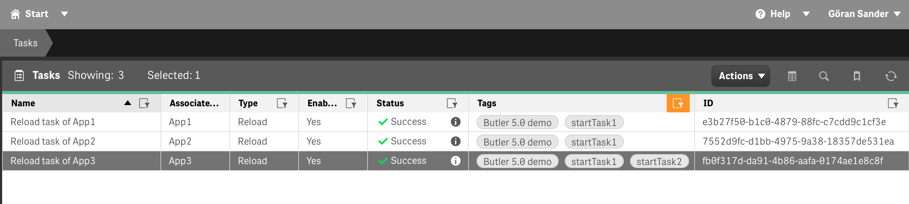
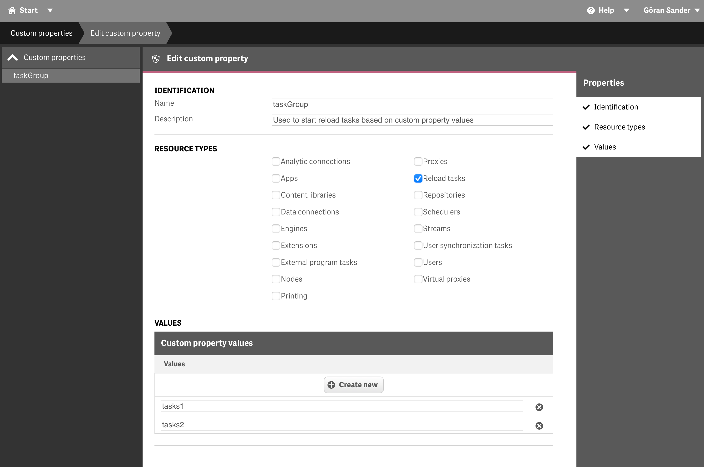

## Use Butler's REST API to start Sense tasks

If the Butler config file is properly set up it's possible to start Sense tasks by doing a PUT or POST call to /v4/reloadtask/{taskId}/start endpoint.

A great use case is to have upstream systems that feed Qlik Sense with data trigger a Sense task when new data is available.  
That way Sense doesn't have to poll for new data, with less system resources used in both upstream system and in Sense.

***AND*** users get the new data as quickly as possible!

{}
The API docs contain the best info for how the API works, a few things to keep in mind though:

* Butler will verify that all specified task IDs exist before trying to start them. Invalid task IDs will be reported in the http response.
* If the `allTaskIdsMustExist` URL parameter is set to `true` it means that **all** specified task IDs must be valid for **any** of them to be started.
  * Tasks associated with tags and custom properties are not affected by the `allTaskIdsMustExist` flag.
{}

## Requirements

These config file settings must be set up before Butler can use the REST API to start tasks:

* Configure Butler's REST server:
  * Butler.restServerConfig.enable: true
  * Butler.restServerConfig.serverHost: <IP or hostname where Butler's REST server is running>
  * Butler.restServerConfig.serverPort: <Port where Butler is exposing its REST server>
  * Butler.restServerConfig.backgroundServerPort: <Port used by Butler internally>
* Enable the start task API endpoint
  * Butler.restServerEndpointsEnable.senseStartTask: true

## Seeing is believing

The video below is available at [Ptarmigan Labs' YouTube channel](https://www.youtube.com/channel/UCpQblhippq-KfWkXEEYFHTQ) and also in the [Butler playlist](https://www.youtube.com/playlist?list=PLUuyY5OOOsz3XX5YT2QEwa7dzaBT1kOCP).  

The video gives a quick demo of what calling the APIs can look like when using macOS.



<br>
There are many tools that can be used to call REST APIs.  

[Postman](https://www.postman.com) is cross platform and works in the browser, [Paw](https://paw.cloud) is outstanding if you're using macOS - and many others.

In the examples below we keep it simple and just use curl to call the API.

Note:

* This API requires an empty array to be passed in the body even when no tags, custom properties or similar are used.
* In the examples Butler is exposing its API on 192.168.1.168:8080

### Start a single task using task ID

Using a `PUT` call to start task with ID `e3b27f50-b1c0-4879-88fc-c7cdd9c1cf3e`:

```bash
➜  ~ curl -X "PUT" "http://192.168.1.168:8080/v4/reloadtask/e3b27f50-b1c0-4879-88fc-c7cdd9c1cf3e/start" \
     -H 'Content-Type: application/json; charset=utf-8' \
     -d $'[]'
{
  "tasksId": {
    "started": [
      {
        "taskId": "e3b27f50-b1c0-4879-88fc-c7cdd9c1cf3e",
        "taskName": "Reload task of App1"
      }
    ],
    "invalid": [],
    "denied": []
  },
  "tasksTag": [],
  "tasksTagDenied": [],
  "tasksCP": [],
  "tasksCPDenied": []
}
➜  ~
```

The response tells us:

* One task was started.
* No task IDs were invalid.
* No task IDs were denied based on task filtering.
* No tasks were started or denied using tags or custom properties.

### Start a single task using an invalid task ID

The task ID `abc123` is invalid. This will be detected and reported in the response:

```bash
➜  ~ curl -X "PUT" "http://192.168.1.168:8080/v4/reloadtask/abc123/start" -H 'Content-Type: application/json; charset=utf-8' -d $'[]'
{
  "tasksId": {
    "started": [],
    "invalid": [
      {
        "taskId": "abc123"
      }
    ],
    "denied": []
  },
  "tasksTag": [],
  "tasksTagDenied": [],
  "tasksCP": [],
  "tasksCPDenied": []
}
➜  ~
```

### Start multiple tasks using valid task IDs

In this example all task IDs are valid. One of them is passed in the URL and the other two in the message body.

```bash
➜  ~ curl -X "PUT" "http://192.168.1.168:8080/v4/reloadtask/-/start" \
     -H 'Content-Type: application/json; charset=utf-8' \
     -d $'[
  {
    "type": "starttaskid",
    "payload": {
      "taskId": "7552d9fc-d1bb-4975-9a38-18357de531ea"
    }
  },
  {
    "type": "starttaskid",
    "payload": {
      "taskId": "fb0f317d-da91-4b86-aafa-0174ae1e8c8f"
    }
  }
]'
{
  "tasksId": {
    "started": [
      {
        "taskId": "7552d9fc-d1bb-4975-9a38-18357de531ea",
        "taskName": "Reload task of App2"
      },
      {
        "taskId": "fb0f317d-da91-4b86-aafa-0174ae1e8c8f",
        "taskName": "Reload task of App3"
      }
    ],
    "invalid": [],
    "denied": []
  },
  "tasksTag": [],
  "tasksTagDenied": [],
  "tasksCP": [],
  "tasksCPDenied": []
}
➜  ~
```

The response tells us:

* The magic task ID "-" will be ignored.
* Two tasks, specified in the request body, were started.

### Start multiple tasks using task IDs, all task IDs must exist, task filtering ON

Here two task IDs are valid and on the list of approved task IDs. One task ID is invalid (too short).  
As `allTaskIdsMustExist=true` we expect that no task is started (*all* task IDs must exist for *any* task to be started based on task ID!).
Task filtering is turned on in the config file's `Butler.startTaskFilter.enable` entry.

```bash
➜  ~ curl -X "PUT" "http://192.168.1.168:8080/v4/reloadtask/e3b27f50-b1c0-4879-88fc-c7cdd9c1cf3e/start?allTaskIdsMustExist=true" \
     -H 'Content-Type: application/json; charset=utf-8' \
     -d $'[
  {
    "type": "starttaskid",
    "payload": {
      "taskId": "7552d9fc-d1bb-4975-9a38-18357de531ea"
    }
  },
  {
    "type": "starttaskid",
    "payload": {
      "taskId": "fb0f317d-da91-4b86-aafa-0174ae1e8c8"
    }
  }
]'
{
  "tasksId": {
    "started": [],
    "invalid": [
      {
        "taskId": "fb0f317d-da91-4b86-aafa-0174ae1e8c8"
      }
    ],
    "denied": [
      {
        "taskId": "e3b27f50-b1c0-4879-88fc-c7cdd9c1cf3e"
      },
      {
        "taskId": "7552d9fc-d1bb-4975-9a38-18357de531ea"
      }
    ]
  },
  "tasksTag": [],
  "tasksTagDenied": [],
  "tasksCP": [],
  "tasksCPDenied": []
}
➜  ~
```

The response tells us:

* No tasks were started based on task IDs.
* One invalid (too short!) task is returned in the response.
* As there was one or more invalid task IDs, the two valid and approved task IDs were not started.
  Their task IDs are returned in the denied array in the response.

### Start multiple tasks using task IDs, all task IDs must exist, task filtering OFF

Here two task IDs are valid and on the list of approved task IDs. One task ID is invalid (too short).  
As `allTaskIdsMustExist=true` we expect that no task is started (*all* task IDs must exist for *any* task to be started based on task ID!).
Task filtering is turned off in the config file's `Butler.startTaskFilter.enable` entry.

```bash
➜  ~ curl -X "PUT" "http://192.168.1.168:8080/v4/reloadtask/e3b27f50-b1c0-4879-88fc-c7cdd9c1cf3e/start?allTaskIdsMustExist=true" \
     -H 'Content-Type: application/json; charset=utf-8' \
     -d $'[
  {
    "type": "starttaskid",
    "payload": {
      "taskId": "7552d9fc-d1bb-4975-9a38-18357de531ea"
    }
  },
  {
    "type": "starttaskid",
    "payload": {
      "taskId": "fb0f317d-da91-4b86-aafa-0174ae1e8c8"
    }
  }
]'
{
  "tasksId": {
    "started": [],
    "invalid": [
      {
        "taskId": "fb0f317d-da91-4b86-aafa-0174ae1e8c8"
      }
    ],
    "denied": [
      {
        "taskId": "e3b27f50-b1c0-4879-88fc-c7cdd9c1cf3e"
      },
      {
        "taskId": "7552d9fc-d1bb-4975-9a38-18357de531ea"
      }
    ]
  },
  "tasksTag": [],
  "tasksTagDenied": [],
  "tasksCP": [],
  "tasksCPDenied": []
}
➜  ~
```

The response and its message is the same as in the previous example:

* No tasks were started based on task IDs.
* One invalid (too short!) task is returned in the response.
* As there was one or more invalid task IDs, the two valid and approved task IDs were not started.
  Their task IDs are returned in the denied array in the response.

### Start multiple tasks using task IDs, task filtering ON

* Two task IDs are valid and on the list of approved task IDs.
* One task ID is valid but not on list of approved task IDs.
* One task ID is invalid (too short).
* Task filtering is turned on in the config file's `Butler.startTaskFilter.enable` entry.

```bash
➜  ~ curl -X "PUT" "http://192.168.1.168:8080/v4/reloadtask/e3b27f50-b1c0-4879-88fc-c7cdd9c1cf3e/start" \
     -H 'Content-Type: application/json; charset=utf-8' \
     -d $'[
  {
    "type": "starttaskid",
    "payload": {
      "taskId": "7552d9fc-d1bb-4975-9a38-18357de531ea"
    }
  },
  {
    "type": "starttaskid",
    "payload": {
      "taskId": "fb0f317d-da91-4b86-aafa-0174ae1e8c8"
    }
  },
  {
    "type": "starttaskid",
    "payload": {
      "taskId": "8b4fe424-d90c-493f-a61d-0ce91cd485c9"
    }
  }
]'
{
  "tasksId": {
    "started": [
      {
        "taskId": "e3b27f50-b1c0-4879-88fc-c7cdd9c1cf3e",
        "taskName": "Reload task of App1"
      },
      {
        "taskId": "7552d9fc-d1bb-4975-9a38-18357de531ea",
        "taskName": "Reload task of App2"
      }
    ],
    "invalid": [
      {
        "taskId": "fb0f317d-da91-4b86-aafa-0174ae1e8c8"
      }
    ],
    "denied": [
      {
        "taskId": "8b4fe424-d90c-493f-a61d-0ce91cd485c9"
      }
    ]
  },
  "tasksTag": [],
  "tasksTagDenied": [],
  "tasksCP": [],
  "tasksCPDenied": []
}
➜  ~
```

The response tells us:

* Two tasks were started, as their task IDs were approved in the config file.
* One task ID was invalid (too short!).
* One task ID had a valid format but was not on the list of approved task IDs.

### Start tasks using tags

The underlying Qlik Sense system has two tags associated with tasks: `startTask1` and `startTask2`.  

The QMC shows which tasks have these tags set:



Starting the three tasks tagged with `starttask1`:

```bash
➜  ~ curl -X "PUT" "http://192.168.1.168:8080/v4/reloadtask/-/start" -H 'Content-Type: application/json; charset=utf-8' -d $'[
  {
    "type": "starttasktag",
    "payload": {
      "tag": "startTask1"
    }
  }
]'
{
  "tasksId": {
    "started": [],
    "invalid": [],
    "denied": []
  },
  "tasksTag": [
    {
      "taskId": "e3b27f50-b1c0-4879-88fc-c7cdd9c1cf3e",
      "taskName": "Reload task of App1"
    },
    {
      "taskId": "7552d9fc-d1bb-4975-9a38-18357de531ea",
      "taskName": "Reload task of App2"
    },
    {
      "taskId": "fb0f317d-da91-4b86-aafa-0174ae1e8c8f",
      "taskName": "Reload task of App3"
    }
  ],
  "tasksTagDenied": [],
  "tasksCP": [],
  "tasksCPDenied": []
}
➜  ~
```

The response tells us:

* Three tasks were started because they had a tag matching the one specified in the call to the API.
* One invalid task ID was specified. This is the one in the URL - if needed it's ok to provide a dummy task ID, as done here.

### Start tasks using custom properties

A custom property `taskGroup` available on reload tasks have the following possible values:



Here's a call that will start all tasks that have the custom property `taskGroup` set to either `tasks1` or `tasks2`:

```bash
➜  ~ curl -X "PUT" "http://192.168.1.168:8080/v4/reloadtask/-/start?allTaskIdsMustExist=false" \
     -H 'Content-Type: application/json; charset=utf-8' \
     -d $'[
  {
    "type": "starttaskcustomproperty",
    "payload": {
      "customPropertyName": "taskGroup",
      "customPropertyValue": "tasks1"
    }
  },
  {
    "type": "starttaskcustomproperty",
    "payload": {
      "customPropertyName": "taskGroup",
      "customPropertyValue": "tasks2"
    }
  }
]'
{
  "tasksId": {
    "started": [],
    "invalid": [],
    "denied": []
  },
  "tasksTag": [],
  "tasksTagDenied": [],
  "tasksCP": [
    {
      "taskId": "e3b27f50-b1c0-4879-88fc-c7cdd9c1cf3e",
      "taskName": "Reload task of App1"
    },
    {
      "taskId": "7552d9fc-d1bb-4975-9a38-18357de531ea",
      "taskName": "Reload task of App2"
    },
    {
      "taskId": "fb0f317d-da91-4b86-aafa-0174ae1e8c8f",
      "taskName": "Reload task of App3"
    },
    {
      "taskId": "7552d9fc-d1bb-4975-9a38-18357de531ea",
      "taskName": "Reload task of App2"
    }
  ],
  "tasksCPDenied": []
}
➜  ~
```

The response tells us:

* 3 unique tasks were started.
* As the task "Reload task of App2" had both values set for the custom property, this task was started twice.

### Sending parameters to apps

Sometimes there is a need to send parameters from outside of Sense to an app that should be reloaded.  
This is supported by Butler as follows:

1. Start a task and pass in one or more key-value pairs (=the parameters that should be sent to the app(s)) in the body of the call.
2. Have the app being reloaded read the key-value pairs from within the load script, using the Butler APIs.
3. Optional: Clear up (delete KV pairs or the namespace used) the key-value store when done.

Here a single task, identified by its ID in the URL, is started.  
Two key-value pairs are passed along as parameters to the app. One has a TimeToLive of 10 seconds, the other has no TTL (=it will not be automatically deleted).

Task filtering is off, i.e. any task can be started using this API.

```bash
➜  ~ curl -X "PUT" "http://192.168.1.168:8080/v4/reloadtask/fbf645f0-0c92-40a4-af9a-6e3eb1d3c35c/start" -H 'Content-Type: application/json; charset=utf-8' -d $'[
  {
    "type": "keyvaluestore",
    "payload": {
      "value": "TheValue",
      "namespace": "MyFineNamespace",
      "key": "AnImportantKey",
      "ttl": 10000
    }
  },
  {
    "type": "keyvaluestore",
    "payload": {
      "value": "Bar",
      "namespace": "MyFineNamespace",
      "key": "Foo"
    }
  }
]'
{
  "tasksId": {
    "started": [
      {
        "taskId": "fbf645f0-0c92-40a4-af9a-6e3eb1d3c35c",
        "taskName": "Reload Operations Monitor"
      }
    ],
    "invalid": [],
    "denied": []
  },
  "tasksTag": [],
  "tasksTagDenied": [],
  "tasksCP": [],
  "tasksCPDenied": []
}
➜  ~
```

### A bit of everything

Combining all of the above can look like this:

```bash
➜  ~ curl -X "PUT" "http://192.168.1.168:8080/v4/reloadtask/e3b27f50-b1c0-4879-88fc-c7cdd9c1cf3e/start?allTaskIdsMustExist=true" -H 'Content-Type: application/json; charset=utf-8' -d $'[
  {
    "type": "starttaskid",
    "payload": {
      "taskId": "7552d9fc-d1bb-4975-9a38-18357de531ea"
    }
  },
  {
    "type": "starttaskid",
    "payload": {
      "taskId": "fb0f317d-da91-4b86-aafa-0174ae1e8c8f"
    }
  },
  {
    "type": "starttasktag",
    "payload": {
      "tag": "startTask1"
    }
  },
  {
    "type": "starttasktag",
    "payload": {
      "tag": "startTask2"
    }
  },
  {
    "type": "starttaskcustomproperty",
    "payload": {
      "customPropertyName": "taskGroup",
      "customPropertyValue": "tasks1"
    }
  },
  {
    "type": "starttaskcustomproperty",
    "payload": {
      "customPropertyName": "taskGroup",
      "customPropertyValue": "tasks2"
    }
  },
  {
    "type": "keyvaluestore",
    "payload": {
      "value": "TheValue",
      "namespace": "MyFineNamespace",
      "key": "AnImportantKey",
      "ttl": 10000
    }
  },
  {
    "type": "keyvaluestore",
    "payload": {
      "namespace": "MyFineNamespace",
      "key": "Foo",                                                                                                                                                                                               <....
{
  "tasksId": {
    "started": [
      {
        "taskId": "e3b27f50-b1c0-4879-88fc-c7cdd9c1cf3e",
        "taskName": "Reload task of App1"
      },
      {
        "taskId": "7552d9fc-d1bb-4975-9a38-18357de531ea",
        "taskName": "Reload task of App2"
      },
      {
        "taskId": "fb0f317d-da91-4b86-aafa-0174ae1e8c8f",
        "taskName": "Reload task of App3"
      }
    ],
    "invalid": [],
    "denied": []
  },
  "tasksTag": [
    {
      "taskId": "e3b27f50-b1c0-4879-88fc-c7cdd9c1cf3e",
      "taskName": "Reload task of App1"
    },
    {
      "taskId": "7552d9fc-d1bb-4975-9a38-18357de531ea",
      "taskName": "Reload task of App2"
    },
    {
      "taskId": "fb0f317d-da91-4b86-aafa-0174ae1e8c8f",
      "taskName": "Reload task of App3"
    },
    {
      "taskId": "fb0f317d-da91-4b86-aafa-0174ae1e8c8f",
      "taskName": "Reload task of App3"
    }
  ],
  "tasksTagDenied": [],
  "tasksCP": [
    {
      "taskId": "e3b27f50-b1c0-4879-88fc-c7cdd9c1cf3e",
      "taskName": "Reload task of App1"
    },
    {
      "taskId": "7552d9fc-d1bb-4975-9a38-18357de531ea",
      "taskName": "Reload task of App2"
    },
    {
      "taskId": "fb0f317d-da91-4b86-aafa-0174ae1e8c8f",
      "taskName": "Reload task of App3"
    },
    {
      "taskId": "7552d9fc-d1bb-4975-9a38-18357de531ea",
      "taskName": "Reload task of App2"
    }
  ],
  "tasksCPDenied": []
}
➜  ~
```
