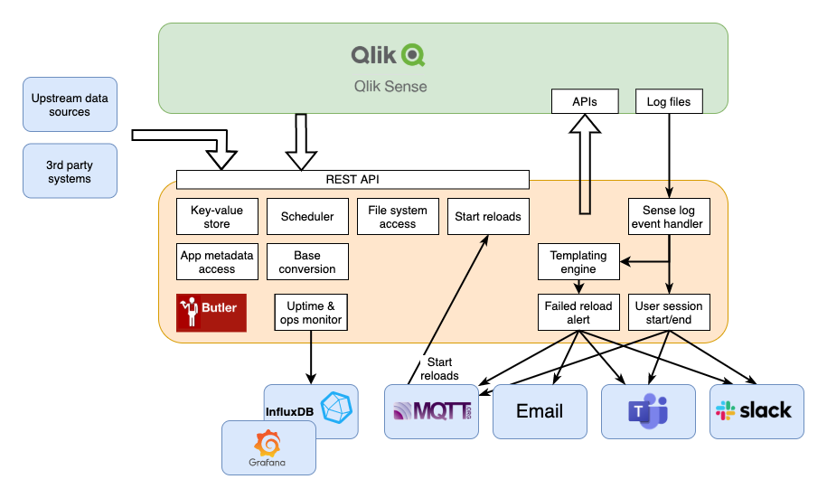

## Conceptual overview

  

The main components of Butler are outlined in the system diagram above.

{}
Individual parts of Butler can be enabled/disabled in the main [config file](/docs/reference/config-file/).

If you're unsure what each REST API endpoint does, the [API docs](/docs/reference/rest_api/) is the place to check.
{}
