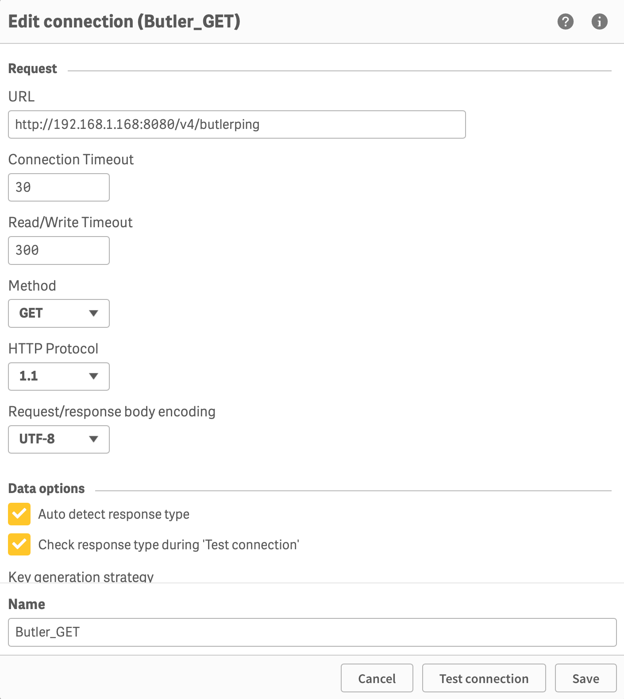
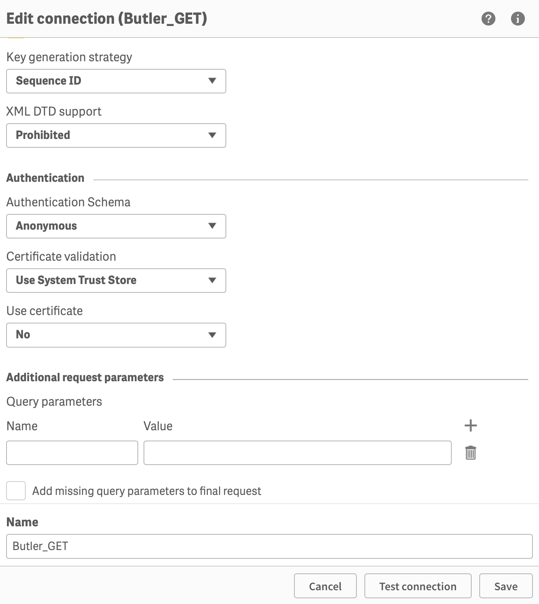
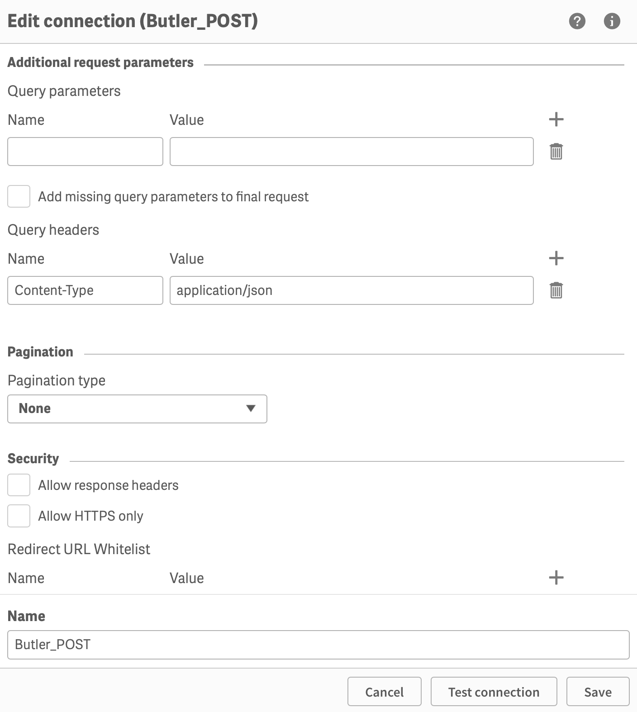

{}
These settings are mandatory if you plan to use Butler's REST API from the load scripts of Sense apps.
{}

Two data connections must be created: Butler_GET and Butler_POST.

The latter is used both for POST calls and also PUT, DELETE and other HTTP operations.  
The `X-HTTP-Method-Override` HTTP header is used with the Butler_POST data connection to tell Butler which HTTP operation should be used.

This is a way to work around a limitation of Qlik's REST connector, as it only supports GET and POST operations.

## Butler_GET

With Butler running, create a new REST data connection called "Butler_GET".  
It's URL should point to Butler's host/port.

When createing REST data connections it's always a good idea to verify they work.  
Using the `/v4/butlerping` endpoint is an easy way to do this (assuming that endpoint is enabled in Butler's config file):

  

No special settings are needed - just make sure the REST connector finds Butler as it should.  
The actual URL of the data connection will be modified on the fly every time you call the Butler APIs, it's thus not really important which URL is entered during the setup phase. But the `/v4/butlerping` endpoint is a conveneint way to check that the data connection works.

Test the connection:

  

{}
As with all new data connections, Sense will change the name your new connection (adding your username as a suffix).  
**Use the QMC to change the name to "Butler_GET".**
{}

## Butler_POST

The data connection used for POST, PUT, DELETE and all other HTTP operations beyond GET should be named "Butler_POST".  
Its configuration is similar to that of Butler_GET, except that a message body is also needed for the POST to work. 

Assuming Butler's [key-value store is enabled](/docs/getting-started/setup/key-value-store) in the main config file, the following should work:

  

... and test the connection...

  

{}
As with all new data connections, Sense will change the name your new connection (adding your username as a suffix).  
**Use the QMC to change the name to "Butler_POST".**
{}
