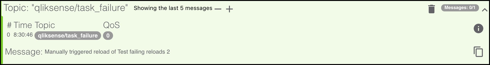
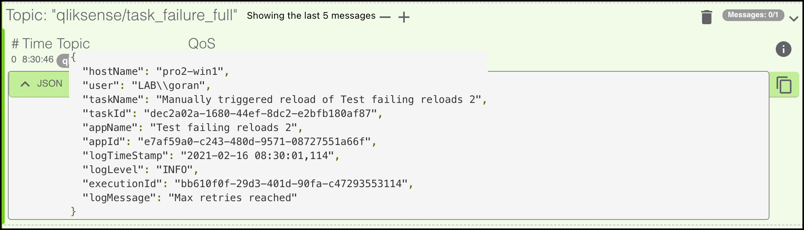

## What's this?

Butler can send two kinds of alert messages as MQTT messages:

- When a scheduled, running reload task fails.
- When a scheduled, running reload task is somehow stopped.

## How it works

### Basic message

The MQTT message will be sent on the MQTT topic defined in the config file property `Butler.mqttConfig.taskAbortedTopic` or `Butler.mqttConfig.taskFailureTopic`, depending on the event type.  
The task name will be sent in the message body.

The basic message looks like this when viewed in the MQTTLens app:

  

### Complete message

Optionally a larger, more complete message is also sent if `Butler.mqttConfig.taskFailureSendFull` or `Butler.mqttConfig.taskFailureSendFull` are set to true.  
This message contains a stringified JSON of all available information about the failed/aborted task.  
The message is sent on the `Butler.mqttConfig.taskFailureFullTopic` or `Butler.mqttConfig.taskAbortedFullTopic` topics.

That message can look like this:

  

{}
Don't forget to create the log appender .xml files on the Sense server(s).  
[This page](../) describes how.

Those xml files are the foundation on top of which all Butler alerts are built - without them the alerts described on this page won't work.
{}

The concept is more or less the same as for [alert emails](../alert-emails/#how-it-works).

## Settings in config file

```yaml
---
Butler:
  ...
  ...
  mqttConfig:
    enable: false                                     # Should Qlik Sense events be forwarded as MQTT messages?
    brokerHost: <FQDN or IP of MQTT server>
    brokerPort: 1883
    taskFailureSendFull: true
    taskAbortedSendFull: true
    subscriptionRootTopic: qliksense/#                                  # Topic that Butler will subscribe to
    taskStartTopic: qliksense/start_task                                # Topic for incoming messages used to start Sense tasks. Should be subtopic to subscriptionRootTopic
    taskFailureTopic: qliksense/task_failure
    taskFailureFullTopic: qliksense/task_failure_full
    taskFailureServerStatusTopic: qliksense/butler/task_failure_server
    taskAbortedTopic: qliksense/task_aborted
    taskAbortedFullTopic: qliksense/task_aborted_full
  ...
  ...
  udpServerConfig:
    enable: false                                     # Should the UDP server responsible for receving task failure and session events be started? true/false
    serverHost: <FQDN or IP (or localhost) of server where Butler is running>
    portTaskFailure: 9998
  ...
  ...
```
