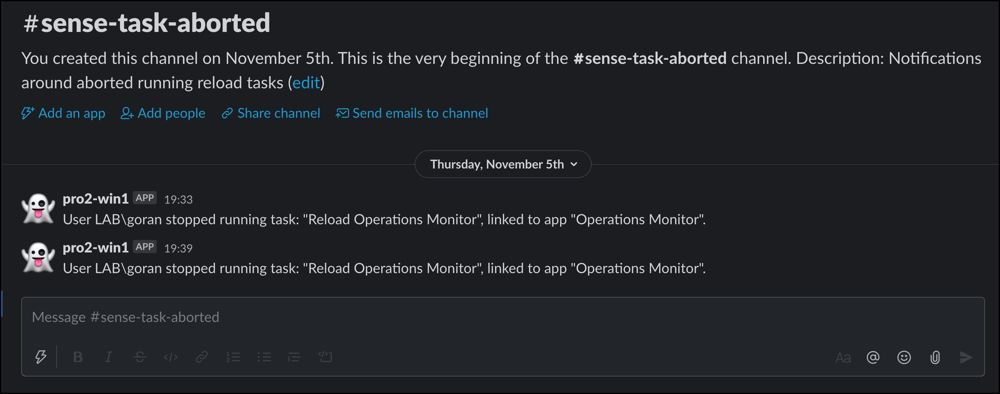
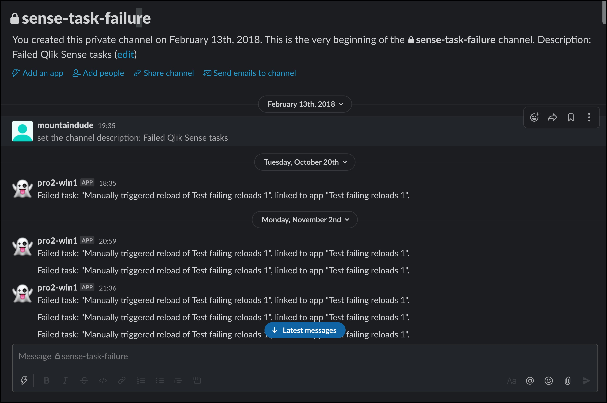

{}
These settings are optional.  
If alerts via Slack are not of interest, just turn off this feature and leave the default values in the config as they are.

Do note though that Butler expects the configuration properties below to exist in the config file, but will *ignore their values* if the related features are disabled.
{}

## What's this?

Butler can send two kinds of alert messages via Slack:

- When a scheduled, running reload task fails.
- When a scheduled, running reload task is somehow stopped.

A "reload stopped" Slack message could look like this.  

  

A "reload failed" Slack message could look like this.  

  

## How it works

{}
Don't forget to create the log appender .xml files on the Sense server(s).  
[This page](../) describes how.

Those xml files are the foundation on top of which all Butler alerts are built - without them the alerts described on this page won't work.
{}

The concept is the same as for [alert emails](../alert-emails/).

Butler's Slack alerts don't currently support the templates available for alert emails.

## Settings in main config file

```yaml
---
Butler:
  ...
  ...
  slackConfig:
    enable: false
    webhookURL: <fill in your web hook URL from Slack>
    loginNotificationChannel: sense-user-activity     # Slack channel to which user activity data is sent
    taskFailureChannel: sense-task-failure            # Slack channel to which task failure notifications are sent
    taskAbortedChannel: sense-task-aborted            # Slack channel to which task stopped notifications are sent
  ...
  ...
  udpServerConfig:
    enable: false                                     # Should the UDP server responsible for receving task failure and session events be started? true/false
    serverHost: <FQDN or IP (or localhost) of server where Butler is running>
    portTaskFailure: 9998
  ...
  ...
```
