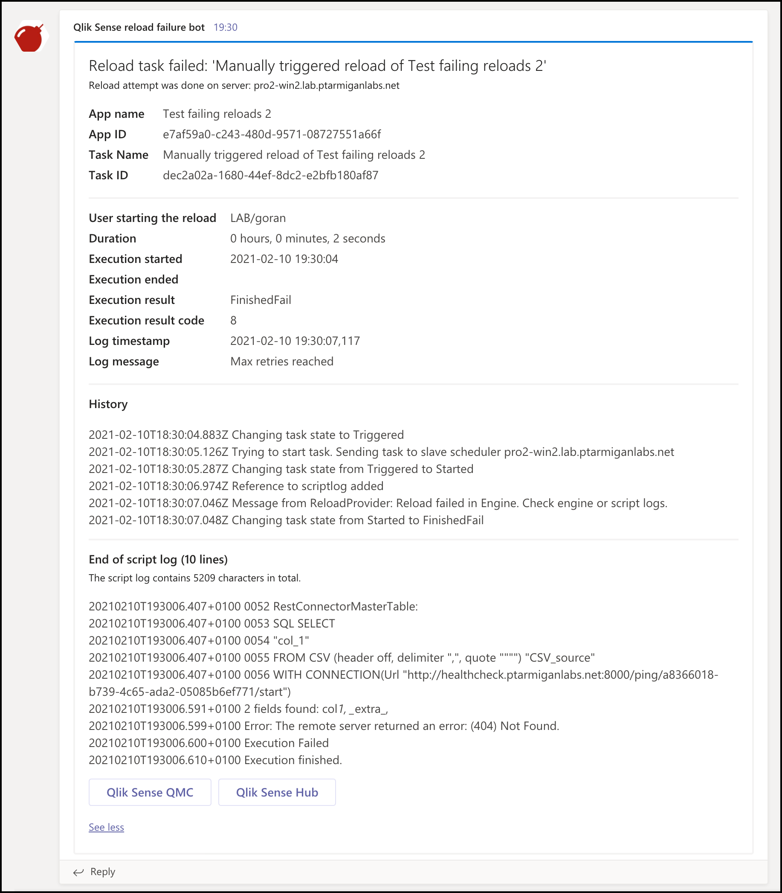
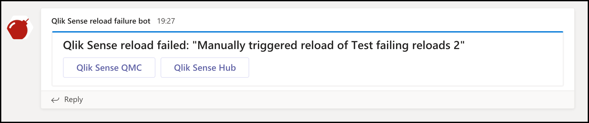

{}
These settings are optional.  
If alerts via Teams are not of interest, just turn off this feature and leave the default values in the config as they are.

Do note though that Butler expects the configuration properties below to exist in the config file, but will *ignore their values* if the related features are disabled.
{}

## What's this?

Butler can send two kinds of alert messages via Teams:

- When a scheduled or started from the QMC reload task fails.
- When a scheduled or started from the QMC reload task is somehow stopped.

<!-- TODO -->
See the [Concepts section](/docs/concepts/todo/) for additional details.

A complete reference to the config file format is found [here](/docs/reference/config-file/).

## Basic vs formatted Teams alerts

Teams alerts come in two forms:

- Customizable formatting using a template concept. A standard template that will fit most use cases is included with Butler. With this option the last part of the script log can be included in the message, allowing you to tell from the Teams message what caused the reload to fail.
- A fixed, more basic format that is built into Butler. No template file needed.

Which option to go for depends on whether you want just a notification that something went wrong, or if you want as much detail as possible in the Teams message.

### Sample message with custom formatting

A "reload task failed" Teams message using the custom formatting option could look like this:

  

Here's how to set it up:

1. Create an incoming webhook in Teams, take note of its URL (you will need it in step 2 below).
2. Edit the Teams section of the config file i.e. the settings in `Butler.teamsNotification.reloadTaskFailure` and/or `Butler.teamsNotification.reloadTaskAborted` sections of the confi file.

   The `messageType` property should be set to `formatted`.  
   The `basicMsgTemplate` property is not used with formatted messages and can thus be left empty,
3. Edit the template file(s) as needed, these are specified by `Butler.teamsNotification.reloadTaskFailure.templateFile` and `Butler.teamsNotification.reloadTaskAborted.templateFile`. They are using the Handlebars templating engine, to which Butler provides template fields with actual values.

   The available template fields are described [here](/docs/reference/alert-template-fields/).

   Sample template files are available in the GitHub repository's [src/config/teams_templates](https://github.com/ptarmiganlabs/butler/tree/master/src/config/teams_templates) directory.
4. Restart Butler if it's already running.

### Sample message with basic formatting

A "reload task failed" Teams message with basic formatting could look like this:

  

To set it up:

1. Create an incoming webhook in Teams if you don't already have one, take note of its URL (you will need it in step 2 below).
2. Edit the Teams section of the config file i.e. the settings in `Butler.teamsNotification.reloadTaskFailure` and/or `Butler.teamsNotification.reloadTaskAborted` sections of the confi file.

   The `messageType` property should be set to `basic`.  
   The `basicMsgTemplate` property is the message that will be sent via Teams. [Template fields](/docs/reference/alert-template-fields/) can be used.
3. Restart Butler if it's already running.

## How it works

{}
Don't forget to create the log appender .xml files on the Sense server(s).  
[This page](../) describes how.

Those xml files are the foundation on top of which all Butler alerts are built - without them the alerts described on this page won't work.
{}

The concept is the same as for [all alert types](/docs/getting-started/setup/reload-alerts/#how-it-works).

## Settings in main config file

```yaml
---
Butler:
  ...
  ...
  teamsNotification:
    enable: true
    userSessionEvents:
      enable: true
      webhookURL: <web hook URL from MS Teams>
    reloadTaskFailure:
      enable: true
      webhookURL: <web hook URL from MS Teams>
      messageType: formatted     # formatted / basic. Formatted means that template file below will be used to create the message.
      basicMsgTemplate: 'Qlik Sense reload failed: "{{taskName}}"'      # Only needed if message type = basic
      rateLimit: 300             # Min seconds between emails for a given taskID. Defaults to 5 minutes.
      headScriptLogLines: 10
      tailScriptLogLines: 10
      templateFile: /path/to/teams/template/directory/failed-reload.handlebars
    reloadTaskAborted:
      enable: true
      webhookURL: <web hook URL from MS Teams>
      messageType: formatted     # formatted / basic. Formatted means that template file below will be used to create the message.
      basicMsgTemplate: 'Qlik Sense reload aborted: "{{taskName}}"'       # Only needed if message type = basic
      rateLimit: 300             # Min seconds between emails for a given taskID. Defaults to 5 minutes.
      headScriptLogLines: 10
      tailScriptLogLines: 10
      templateFile: /path/to/teams/template/directory/aborted-reload.handlebars
  ...
  ...
  udpServerConfig:
    enable: false                                     # Should the UDP server responsible for receving task failure and session events be started? true/false
    serverHost: <FQDN or IP (or localhost) of server where Butler is running>
    portTaskFailure: 9998
  ...
  ...
```
