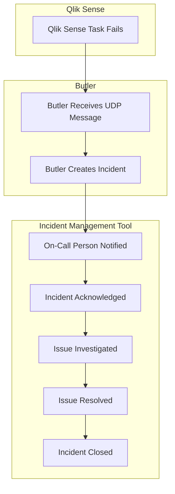
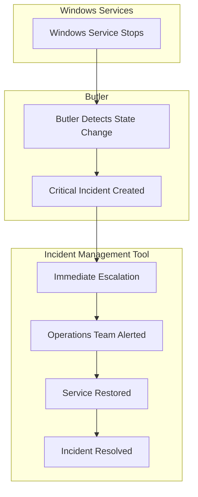

# Incident Management

Integration with enterprise-grade incident management tools for proper IT operations and alerting workflows.

## What is Incident Management?

Incident management tools provide structured approaches to handling IT incidents, from initial detection through resolution. When integrated with Butler and Qlik Sense, these tools enable:

- **Automated Incident Creation**: Failed reloads automatically create incidents
- **On-Call Management**: Route incidents to the right people at the right time
- **Escalation Policies**: Automatic escalation if incidents aren't acknowledged
- **Mobile Notifications**: Real-time alerts on mobile devices
- **Audit Trails**: Complete records of incident handling and resolution

## Why Use Incident Management Tools?

### Beyond Simple Notifications

While Slack, Teams, and email notifications are useful, enterprise environments often need more sophisticated incident handling:

- **24/7 Operations**: Proper on-call rotation and escalation
- **SLA Management**: Track response times and resolution metrics
- **Integration Ecosystem**: Connect with other enterprise tools
- **Compliance**: Audit trails for regulatory requirements
- **Analytics**: Understand incident patterns and trends

### Integration Benefits

Butler's incident management integrations provide:

1. **Seamless Alerting**: Failed reloads automatically create structured incidents
2. **Rich Context**: Include script logs, app metadata, and troubleshooting links
3. **Bi-directional Updates**: Acknowledge incidents from mobile apps or web interfaces
4. **Escalation Chains**: Automatic escalation if no response within configured timeframes
5. **Metric Collection**: Track MTTR (Mean Time To Resolution) and other operational metrics

## Supported Platforms

Butler integrates with two incident management platforms:

### New Relic

- **Type**: Full observability platform with incident management features
- **Strengths**: Unified metrics, logs, and events with alerting
- **Best For**: Organizations wanting comprehensive observability and alerting
- **Integration**: Events API for incidents, tight Butler SOS integration

### Signl4

- **Type**: Mobile-first incident management platform
- **Strengths**: Simple setup, excellent mobile experience, generous free tier
- **Best For**: Teams wanting dedicated incident management without complexity
- **Integration**: REST API for incident creation and management

## Common Integration Patterns

### 1. Failed Reload Incident Workflow

### 2. Service Monitoring Integration

## Implementation Considerations

### Incident Severity Mapping

Define clear severity levels for different types of Qlik Sense issues:

**Critical (P1)**:

- Core Qlik Sense services stopped
- Repository database connectivity lost
- Multiple app reload failures

**High (P2)**:

- Important business app reload failures
- Individual service failures (non-critical)
- License threshold breaches

**Medium (P3)**:

- Non-critical app reload failures
- Performance degradation alerts
- Configuration warnings

**Low (P4)**:

- Informational alerts
- Successful recovery notifications
- Routine maintenance alerts

### On-Call Strategy

**Follow the Sun**: Global teams with regional on-call responsibilities
**Tiered Support**: L1 → L2 → L3 escalation based on expertise
**Subject Matter Experts**: Specific escalation for complex Qlik Sense issues

### Alert Fatigue Prevention

- **Intelligent Grouping**: Consolidate related incidents
- **Rate Limiting**: Prevent spam from rapidly failing tasks
- **Contextual Information**: Include enough detail for quick triage
- **Auto-Resolution**: Close incidents when conditions clear

## Best Practices

### 1. **Start Simple**

Begin with basic failed reload incidents before adding complex scenarios

### 2. **Include Context**

Ensure incidents contain enough information for quick triage:

- App name and purpose
- Error details and script logs
- Links to QMC and relevant dashboards
- Historical failure patterns

### 3. **Define Clear Processes**

- Document incident response procedures
- Define escalation criteria and timelines
- Establish communication protocols
- Create runbooks for common issues

### 4. **Monitor and Improve**

- Track incident response metrics
- Regular review of false positives
- Refine alert thresholds based on experience
- Update escalation policies as team changes

### 5. **Integration Hygiene**

- Regular testing of incident creation
- Verification of mobile notifications
- Backup alerting channels (email, Slack)
- Documentation of API keys and configuration

## Security Considerations

### API Key Management

- Use dedicated service accounts for Butler integrations
- Rotate API keys regularly
- Store keys securely (environment variables, secrets management)
- Limit API permissions to minimum required scope

### Network Security

- Verify HTTPS for all API communications
- Consider IP whitelisting for webhook endpoints
- Monitor for unauthorized API usage
- Implement rate limiting on Butler's side

### Data Privacy

- Review what data is sent to external platforms
- Ensure compliance with data retention policies
- Consider data residency requirements
- Implement data anonymization where appropriate

## Cost Optimization

### New Relic

- Understand event ingestion pricing
- Monitor data volume and retention
- Use alert policies to prevent unnecessary events
- Take advantage of free tier limits

### Signl4

- Start with free tier for evaluation
- Scale pricing based on team size
- Consider usage patterns for cost optimization
- Monitor alert volume for billing purposes

## Troubleshooting

### Common Issues

**Incidents Not Created**:

- Verify API keys and authentication
- Check Butler logs for API errors
- Test API endpoints independently
- Verify network connectivity

---

::: tip Getting Started

1. **Choose Your Platform**: Evaluate New Relic vs Signl4 based on your needs
2. **Start with One Use Case**: Begin with failed reload incidents
3. **Test Thoroughly**: Verify the complete incident workflow
4. **Iterate and Improve**: Refine based on operational experience

:::

## Next Steps

- **[New Relic Integration](/docs/concepts/incident-management/new-relic)** - Complete observability platform
- **[Signl4 Integration](/docs/concepts/incident-management/signl4)** - Mobile-first incident management
- **[Setup Guide](/docs/getting-started/setup/incident-mgmt-tools/)** - Step-by-step configuration instructions
