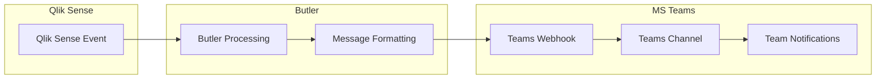

# Sending Messages to MS Teams

Send automated notifications and alerts from Butler to Microsoft Teams channels for real-time collaboration and incident response.

## What is MS Teams Integration?

Microsoft Teams integration allows Butler to send notifications directly to Teams channels, enabling seamless communication about Qlik Sense events, alerts, and operational status. Teams messages can include rich formatting, interactive cards, and deep links for immediate access to relevant information.

### Key Capabilities

- **Rich Message Formatting**: Send formatted messages with cards, buttons, and links
- **Channel-Specific Routing**: Direct messages to appropriate Teams channels
- **Interactive Elements**: Include action buttons and quick response options
- **Threaded Conversations**: Maintain context with message threading
- **Adaptive Cards**: Rich, interactive message layouts
- **Webhook Integration**: Simple and reliable message delivery

## How Butler Integrates with Teams

### Integration Architecture

Butler sends messages to Teams using incoming webhooks, creating a straightforward communication channel:

1. **Event Processing**: Butler processes Qlik Sense events and triggers
2. **Message Formatting**: Events are formatted as Teams-compatible messages
3. **Webhook Delivery**: Messages are sent to Teams via webhook URLs
4. **Channel Distribution**: Messages appear in designated Teams channels
5. **User Interaction**: Team members can respond and take action

### Data Flow



## Integration Benefits

### Real-Time Communication

**Immediate Awareness**: Team members receive instant notifications about:

- **Failed Reloads**: Critical application failures requiring immediate attention
- **Service Issues**: Windows service problems affecting system availability
- **Performance Alerts**: System performance degradation warnings
- **Security Events**: Authentication failures and security incidents

### Contextual Information

**Rich Message Content**: Teams messages include comprehensive context:

- **Error Details**: Complete error messages and diagnostic information
- **Script Logs**: Relevant script excerpts for troubleshooting
- **Server Information**: Source server and environment details
- **Remediation Links**: Direct links to management consoles and documentation

### Team Collaboration

**Coordinated Response**: Teams integration facilitates collaborative incident response:

- **Shared Visibility**: All team members see the same information simultaneously
- **Threaded Discussions**: Maintain organized conversations about specific incidents
- **Action Coordination**: Coordinate response activities within Teams
- **Knowledge Sharing**: Share solutions and lessons learned

## Included Message Templates

The distribution ZIP file and the GitHub repository contain several example message templates for different scenarios, including

- Failed reload tasks (client-managed Qlik Sense)
- Aborted reload tasks (client-managed Qlik Sense)
- Failed app reloads (Qlik Sense Cloud)
- Windows service stopped
- Windows service started

## Setting Up Teams Webhooks

::: info Power Automate Requirement
Microsoft Teams has moved away from simple incoming webhooks to a concept called "workflows", which are really Microsoft Power Automate workflows. This means that a Power Automate webhook is needed in order for Butler to send messages to Teams.

This section describes both how to create new channels in Teams and how to set up new webhooks that can be used to send messages to the new channel.
:::

### Overview

The goal is to create a new Teams channel to which Butler will send alerts when monitored Windows services are stopped or started.

The same concept is used to create channels and/or webhooks for other Butler alert features, such as failed reload tasks (client-managed Qlik Sense) or failed app reloads (Qlik Sense Cloud).

### Create a New Channel

Creating a new channel is an easy two-step process:

**Step 1**: Open the new channel window

<ResponsiveImage
  src="/img/butler-teams-create-channel-1.png"
  alt="Open the new channel window"
  caption="Open the new channel window"
/>

**Step 2**: Select which team the channel should belong to, the channel name/description and permissions. Click Create.

<ResponsiveImage
  src="/img/butler-teams-create-channel-2.png"
  alt="Enter info about the new channel"
  caption="Enter info about the new channel"
/>

### Create a Webhook-Triggered Workflow

Now let's create a new workflow, with associated webhook that can be used to send messages to the channel.

**Step 1**: Open the workflow view by clicking on the "Workflows" link in the menu on the left. It may be hidden under the three-button menu.

<ResponsiveImage
  src="/img/butler-teams-create-webhook-1.png"
  alt="Open the workflow view"
  caption="Open the workflow view"
/>

**Step 2**: Existing workflows are listed, for all channels the user has access to. Create a new workflow by clicking the "New flow" button in upper right corner.

<ResponsiveImage
  src="/img/butler-teams-create-webhook-2.png"
  alt="Create new workflow"
  caption="Create new workflow"
/>

**Step 3**: Start creating the new workflow.

<ResponsiveImage
  src="/img/butler-teams-create-webhook-3.png"
  alt="Open the workflow view"
  caption="Open the workflow view"
/>

**Step 4**: Search for "webhook" in the "Search templates" text box. The template we need is called "Post to a channel when a webhook request is received".

<ResponsiveImage
  src="/img/butler-teams-create-webhook-4.png"
  alt="Search for workflow templates related to webhooks"
  caption="Search for workflow templates related to webhooks"
/>

**Step 5**: Give the workflow a name and sign in. In most cases you will already be signed in, which shows by the green check mark to the right of the "Microsoft Teams" text.

<ResponsiveImage
  src="/img/butler-teams-create-webhook-5.png"
  alt="Give the workflow a name"
  caption="Give the workflow a name"
/>

**Step 6**: Select which team and channel posts should be sent to.

<ResponsiveImage
  src="/img/butler-teams-create-webhook-6.png"
  alt="Select team and channel"
  caption="Select team and channel"
/>

**Step 7**: Workflow has been created! Copy the shown URL - it should be pasted into the Butler config file.

<ResponsiveImage
  src="/img/butler-teams-create-webhook-7.png"
  alt="Workflow created, take note of the URL"
  caption="Workflow created, take note of the URL"
/>

**Step 8**: The new workflow shows up in the overview and is now enabled.

<ResponsiveImage
  src="/img/butler-teams-create-webhook-8.png"
  alt="Workflow created and enabled"
  caption="Workflow created and enabled"
/>

::: warning Webhook Activation Delay
It may take a few minutes (5-10) until the webhook starts working, so don't be worried if alert messages from Butler don't show up right away.
:::

### Example Messages in Teams

Here the "Print Spooler" service was stopped and started again on a Windows server:

<ResponsiveImage
  src="/img/butler-teams-winservice-alert-1.png"
  alt="Alert when Windows service stopped"
  caption="Alert when Windows service stopped"
/>

<ResponsiveImage
  src="/img/butler-teams-winservice-alert-2.png"
  alt="Notification when Windows service started"
  caption="Notification when Windows service started"
/>

### Template Variables

The [reference section](/docs/reference/alert-template-fields/client-managed/) includes a complete list of available template variables.

## Getting Started Checklist

::: tip Quick Start Steps

1. **Create Teams Channel**: Follow the steps above to create a dedicated channel
2. **Create Power Automate Workflow**: Set up webhook using the workflow template
3. **Copy Webhook URL**: Save the URL from step 7 for Butler configuration
4. **Configure Butler**: Add webhook URL to Butler's configuration file
5. **Test Integration**: Send test messages to verify connectivity
6. **Customize Templates**: Design message templates for your team's needs
7. **Monitor Performance**: Track message delivery and team response

:::

::: warning Security Considerations

- Store webhook URLs securely using environment variables
- Regularly rotate webhook URLs for security
- Monitor webhook access logs for unauthorized usage
- Use HTTPS for all webhook communications
- Implement proper error handling to prevent information leakage

:::

## Next Steps

- **[Task Alerts Setup](/docs/getting-started/setup/task-alerts/)** - Configure Butler to send task alerts to Teams
- **[Windows Service Monitor](/docs/getting-started/setup/windows-service-monitor/)** - Set up Windows service monitoring with Teams notifications

```

```
