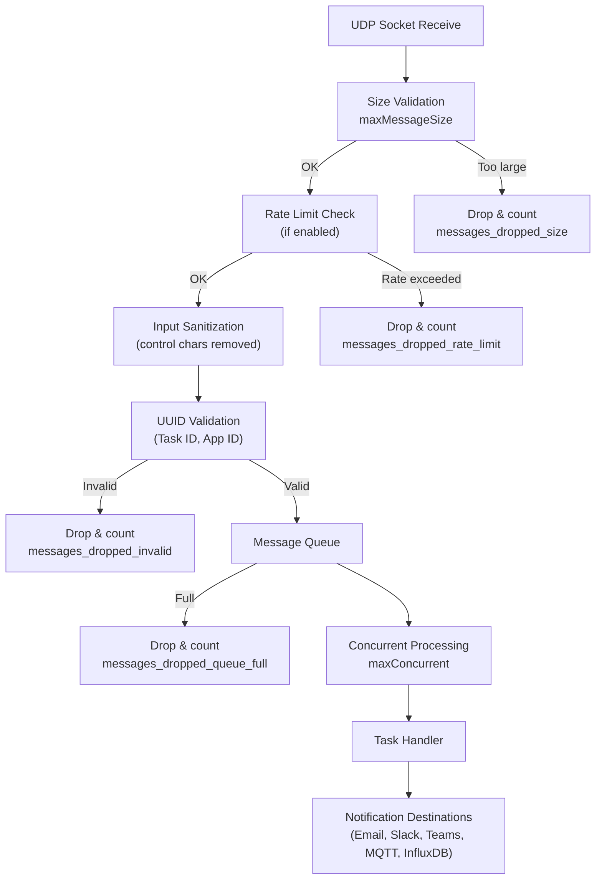

# UDP Message Queue

Butler uses a managed queue to handle incoming UDP messages from Qlik Sense. This ensures that a sudden burst of task events doesn't overwhelm Butler or its notification destinations.

## Overview

Butler's UDP server includes the following protections:

- **Controlled concurrency** — messages are processed with a configurable limit on parallel operations
- **Optional rate limiting** — prevent message flooding by limiting messages per minute
- **Message size validation** — messages exceeding the maximum UDP datagram size are rejected
- **Backpressure detection** — warnings when queue utilization exceeds a configurable threshold
- **Queue metrics** — optional storage of queue health data in InfluxDB for monitoring and alerting
- **Input sanitization** — control characters removed and field lengths enforced
- **UUID validation** — Task ID and App ID formats validated before processing

All messages flow through the queue - it cannot be disabled.

## Message Flow



### Components

- **Queue Manager** — manages message buffering and concurrent processing
- **Rate Limiter** — fixed-window counter that resets each minute
- **Input Sanitizer** — removes control characters, enforces max field length (500 chars)
- **UUID Validator** — validates Task ID and App ID are proper UUIDs
- **Metrics Collector** — tracks queue health, message counts, processing times
- **InfluxDB Writer** — periodic metrics storage at configurable interval

## Configuration

### UDP Server Configuration

```yaml
Butler:
  udpServerConfig:
    enable: false # Should the UDP server responsible for receiving task failure/aborted events be started?
    serverHost: 10.11.12.13 # FQDN or IP (or localhost) of server where Butler is running
    portTaskFailure: 9998
    maxMessageSize: 65507 # Max UDP message size in bytes (default: 65507 = IPv4 max, 65527 = IPv6 max)
    enableSourceValidation: false # Enable source IP validation for incoming UDP messages
    allowedSources: [] # List of allowed IPv4 addresses or hostnames (e.g., ["192.168.1.100", "sense-server-01"])

    # Queue settings for handling incoming UDP messages
    messageQueue:
      maxConcurrent: 10 # Max concurrent message processing
      maxSize: 200 # Max queue size before rejecting
      backpressureThreshold: 80 # Log warning when queue reaches this utilization percentage (0-100)

    # Rate limiting (optional)
    rateLimit:
      enable: false # Enable rate limiting to prevent message flooding
      maxMessagesPerMinute: 600 # Max messages per minute (~10/second)

    # Queue metrics (optional - requires InfluxDB)
    queueMetrics:
      influxdb:
        enable: false # Store queue metrics in InfluxDB
        writeFrequency: 20000 # Write interval (ms)
        measurementName: butler_udp_queue
        tags: [] # Optional tags added to all queue metrics points
```

#### Configuration Properties

| Property | Default | Description |
|----------|---------|-------------|
| `enable` | false | Should the UDP server responsible for receiving task failure/aborted events be started? |
| `serverHost` | - | FQDN or IP (or localhost) of server where Butler is running |
| `portTaskFailure` | 9998 | Port where Butler listens for UDP messages |
| `maxMessageSize` | 65507 | Max UDP message size in bytes (default: 65507 = IPv4 max, 65527 = IPv6 max) |
| `enableSourceValidation` | false | Enable source IP validation for incoming UDP messages |
| `allowedSources` | [] | List of allowed IPv4 addresses or hostnames (e.g., ["192.168.1.100", "sense-server-01"]) |
| `messageQueue.maxConcurrent` | 10 | Max concurrent message processing |
| `messageQueue.maxSize` | 200 | Max queue size before rejecting |
| `messageQueue.backpressureThreshold` | 80 | Log warning when queue reaches this utilization percentage (0-100) |
| `rateLimit.enable` | false | Enable rate limiting to prevent message flooding |
| `rateLimit.maxMessagesPerMinute` | 600 | Max messages per minute (~10/second) |
| `queueMetrics.influxdb.enable` | false | Store queue metrics in InfluxDB |
| `queueMetrics.influxdb.writeFrequency` | 20000 | Write interval (ms) |
| `queueMetrics.influxdb.measurementName` | butler_udp_queue | InfluxDB measurement name |
| `queueMetrics.influxdb.tags` | [] | Optional tags added to all queue metrics points |

### Source IP Validation

Butler can optionally validate the source IP address of incoming UDP messages. When enabled, only messages from IP addresses or hostnames in the allowed list will be processed.

**How it works:**

1. At startup, Butler parses `allowedSources` and resolves any hostnames to IPv4 addresses
2. When a UDP message arrives, the sender's IP address is checked against the allowed list
3. Messages from unauthorized sources are rejected with a warning log entry
4. If `allowedSources` is empty while validation is enabled, all messages are denied

**Supported formats:**

- **IPv4 addresses**: Exact match (e.g., `192.168.1.100`)
- **Hostnames**: Resolved to IPv4 at startup (e.g., `sense-server-01`)

**Notes:**

- Disabled by default (`enableSourceValidation: false`) for backward compatibility
- Hostnames are resolved once at startup, not on each message
- IPv6 addresses are not supported - use IPv4 addresses or hostnames that resolve to IPv4
- Should be used together with firewall rules for defense in depth

**Security benefit:** Since UDP lacks built-in authentication, source IP validation prevents unauthorized hosts from sending messages to Butler. This is critical for production deployments where Butler is exposed to the network.

## Performance Tuning

### Small Environment (< 50 users, < 10 apps)

```yaml
messageQueue:
  maxConcurrent: 5
  maxSize: 100
rateLimit:
  enable: false
```

### Medium Environment (50-200 users, 10-50 apps)

```yaml
messageQueue:
  maxConcurrent: 10
  maxSize: 200
rateLimit:
  enable: false
  maxMessagesPerMinute: 600
```

### Large Environment (200+ users, 50+ apps)

```yaml
messageQueue:
  maxConcurrent: 20
  maxSize: 500
rateLimit:
  enable: true
  maxMessagesPerMinute: 1200
```

### Tuning Based on Metrics

| Symptom | Likely Cause | Action |
|---------|-------------|--------|
| High queue utilization (> 80%) | Messages arriving faster than they can be processed | Increase `maxConcurrent` and/or `maxSize`. Check if downstream systems (InfluxDB, MQTT) are a bottleneck. |
| Dropped messages (`messages_dropped_queue_full` > 0) | Queue capacity insufficient for message bursts | Increase `maxSize` and/or `maxConcurrent`. Consider rate limiting at the Qlik Sense side. |
| High processing times (p95 > 1000ms) | Resource contention or slow downstream systems | Decrease `maxConcurrent` to reduce contention. Check downstream system performance and network latency. |
| Rate limit violations (`messages_dropped_rate_limit` > 0) | Rate limit too restrictive or excessive Sense messages | Increase `maxMessagesPerMinute` if capacity allows. Investigate why Sense is sending excessive messages. |

### Resource Considerations

**Memory usage:** Each queued message uses approximately 1-5 KB. At `maxSize: 200`, the queue uses about 200-1000 KB.

**CPU usage:** Higher `maxConcurrent` values utilize more CPU cores. It is recommended to set `maxConcurrent` to at most the number of available CPU cores.

**InfluxDB load:** If queue metrics are enabled, metrics are written at the configured `writeFrequency` interval. At the default 20 seconds, that's 3 writes per minute.

## Queue Metrics in InfluxDB

When `queueMetrics.influxdb.enable` is set to `true`, queue metrics are stored in InfluxDB.

### Tags

| Tag | Type | Description |
|-----|------|-------------|
| `host` | string | Butler hostname |
| Custom tags | string | From config `tags` array |

### Fields

#### Queue Status

| Field | Type | Description |
|-------|------|-------------|
| `queue_size` | integer | Current number of messages in queue |
| `queue_max_size` | integer | Maximum queue capacity |
| `queue_utilization_pct` | float | Queue utilization percentage (0-100) |
| `queue_running` | integer | Messages currently being processed |

#### Message Counters

| Field | Type | Description |
|-------|------|-------------|
| `messages_received` | integer | Total messages received (since last write) |
| `messages_queued` | integer | Messages added to queue |
| `messages_processed` | integer | Messages successfully processed |
| `messages_failed` | integer | Messages that failed processing |

#### Dropped Messages

| Field | Type | Description |
|-------|------|-------------|
| `messages_dropped_total` | integer | Total dropped messages |
| `messages_dropped_rate_limit` | integer | Dropped due to rate limit |
| `messages_dropped_queue_full` | integer | Dropped due to full queue |
| `messages_dropped_size` | integer | Dropped due to size validation |

#### Performance

| Field | Type | Description |
|-------|------|-------------|
| `processing_time_avg_ms` | float | Average processing time (milliseconds) |
| `processing_time_p95_ms` | float | 95th percentile processing time |
| `processing_time_max_ms` | float | Maximum processing time |

#### Rate Limit & Backpressure

| Field | Type | Description |
|-------|------|-------------|
| `rate_limit_current` | integer | Current message rate (messages/minute) |
| `backpressure_active` | integer | Backpressure status (0=inactive, 1=active) |

### Example Grafana Queries

**Queue utilization over time:**

```text
from(bucket: "butler")
  |> range(start: -1h)
  |> filter(fn: (r) => r["_measurement"] == "butler_udp_queue")
  |> filter(fn: (r) => r["_field"] == "queue_utilization_pct")
```

**Messages dropped by reason:**

```text
from(bucket: "butler")
  |> range(start: -1h)
  |> filter(fn: (r) => r["_measurement"] == "butler_udp_queue")
  |> filter(fn: (r) => r["_field"] =~ /messages_dropped_/)
  |> aggregateWindow(every: 1m, fn: sum)
```

**Processing time percentiles:**

```text
from(bucket: "butler")
  |> range(start: -1h)
  |> filter(fn: (r) => r["_measurement"] == "butler_udp_queue")
  |> filter(fn: (r) => r["_field"] == "processing_time_p95_ms" or r["_field"] == "processing_time_avg_ms")
```

## Troubleshooting

### Backpressure Warnings

**Symptom:** Log messages like:
```
WARN: [UDP Queue] Backpressure detected: Queue utilization 85.5% (threshold: 80%)
```

**Causes:**
- Message rate exceeds processing capacity
- Downstream systems (InfluxDB/MQTT) are slow to respond
- Insufficient `maxConcurrent` setting

**Solutions:**
1. Monitor queue metrics to identify the pattern
2. Increase `maxConcurrent` if CPU/memory is available
3. Increase `maxSize` for more buffer capacity
4. Check downstream system performance
5. Enable rate limiting if messages are arriving too fast

### Messages Being Dropped

**Queue full drops (`messages_dropped_queue_full`):**
- Queue size too small for message bursts
- Increase `maxSize` and/or `maxConcurrent`

**Rate limit drops (`messages_dropped_rate_limit`):**
- Rate limit too restrictive
- Increase `maxMessagesPerMinute` or disable rate limiting
- Investigate why Qlik Sense is sending so many messages

**Size validation drops (`messages_dropped_size`):**
- Messages exceed the UDP datagram size
- Usually indicates malformed messages from Qlik Sense
- Check your Qlik Sense log appender configuration

### High Processing Times

**Symptom:** `processing_time_p95_ms` > 1000ms

**Causes:** Downstream systems slow (InfluxDB write latency, MQTT broker delays), network latency, too many concurrent operations causing resource contention.

**Solutions:**
1. Check InfluxDB query performance
2. Check MQTT broker responsiveness
3. Reduce `maxConcurrent` to decrease resource contention
4. Review network latency between Butler and destinations

### Debug Logging

For verbose queue debugging, set the Butler log level to `verbose` or `debug`:

```bash
butler --log-level verbose
```

Look for log messages with these prefixes:
- `[UDP]` — UDP server operations
- `UDP Queue` — Queue operations and status

### No Queue Metrics in InfluxDB

If queue metrics are not appearing in InfluxDB, check:
1. `queueMetrics.influxdb.enable` is set to `true`
2. `Butler.influxDb.enable` is set to `true`
3. The InfluxDB connection is working (check Butler logs)
4. The configured measurement name is correct
5. Wait for the `writeFrequency` interval to elapse

## Monitoring Best Practices

### Essential Alerts

| Condition | Suggested Threshold |
|-----------|-------------------|
| Queue utilization too high | `queue_utilization_pct > 90` for >5 minutes |
| Excessive dropped messages | `messages_dropped_total > 100` per minute |
| Persistent backpressure | `backpressure_active = 1` for >10 minutes |
| Processing degradation | `processing_time_p95_ms > 2000` |

### Recommended Dashboard Panels

1. Queue utilization percentage (line chart)
2. Messages received vs processed (line chart)
3. Dropped messages by reason (stacked area chart)
4. Processing time percentiles (line chart: avg, p95, max)
5. Backpressure status (state timeline)
6. Current queue size (gauge)

### Proactive Monitoring

- Establish baseline processing times for your environment during normal operations
- Review queue metrics weekly to catch trends before they become problems
- Test queue behavior during peak usage periods (e.g., end-of-month reloads)
- Adjust thresholds after observing actual patterns rather than relying solely on defaults