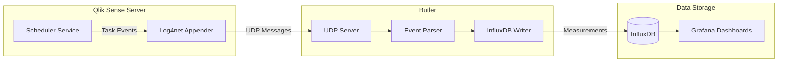

## What's this?

Butler can store information about all Qlik Sense task types and Windows services in InfluxDB, enabling comprehensive monitoring and visualization through tools like Grafana.

## Architecture Overview

The following diagram shows how task events flow from Qlik Sense to InfluxDB:



## Supported Task Types

Butler supports storing information about all Qlik Sense task types in InfluxDB:

| Task Type                  | Success | Failure | Notes                                      |
| -------------------------- | :-----: | :-----: | ------------------------------------------ |
| **Reload tasks**           |   ✅    |   ✅    | Full support including script log excerpts |
| **External program tasks** |   ✅    |   ✅    | Task execution details                     |
| **User sync tasks**        |   ✅    |   ✅    | User directory synchronization status      |
| **Distribute tasks**       |   ✅    |   ✅    | App distribution/publishing status         |
| **Preload tasks**          |   ✅    |   ✅    | App preloading status                      |

::: info Aborted tasks
Aborted tasks are **not stored** in InfluxDB. Only successful and failed task executions are tracked.
:::

**Windows service monitoring:**

- Service status information
- Service state changes (running/stopped)

Once the information is in InfluxDB it can be used in Grafana dashboards for:

- Real-time monitoring of task execution status
- Historical trend analysis
- Alerting via Grafana's alerting capabilities (Slack, Teams, email, etc.)
- Capacity planning and performance optimization

Please note that InfluxDB must be enabled and correctly configured in the Butler config file for the below features to work.

## Reload Tasks

### Monitor failed reload tasks

If enabled using the `Butler.influxDb.reloadTaskFailure.enable` setting, Butler will store information about all failed reload tasks in InfluxDB.

The information stored includes (among other things):

- The name and ID of the app that the failed reload task was reloading.
- The name and ID of the reload task.
- The name of the Qlik Sense node/server that the task was running on.
- User who started the reload task. This will be the service account when the task was started by a schedule or via a task chain/trigger.
- Execution ID of the reload. This is a unique ID that is generated by Qlik Sense for each reload task execution, it can be used to cross-reference the reload task with related entries in the Qlik Sense log files.
- Last `Butler.influxDb.reloadTaskFailure.tailScriptLogLines` lines of the Sense log file for the reload task.
- Static tags defined in the config file's `Butler.influxDb.reloadTaskFailure.tag.static` section.
- Dynamic app tags, i.e. Sense tags for the app being reloaded, if enabled in the config file `Butler.influxDb.reloadTaskFailure.tag.dynamic.useAppTags` section.
- Dynamic reload task tags, i.e. Sense tags for the reload task being executed, if enabled in the config file `Butler.influxDb.reloadTaskFailure.tag.dynamic.useTaskTags` section.

A complete definition of all information sent to InfluxDB is available in the [reference section](/docs/reference/influxdb).

### Monitor successful reload tasks

Butler can monitor all reload tasks for successful completion, or only some of them.

#### Monitor all successful reload tasks

If enabled using the `Butler.influxDb.reloadTaskSuccess.allReloadTasks.enable` setting, Butler will store information about all successful reload tasks in InfluxDB.

The information stored is almost the same as for failed reload tasks, except that the Sense script log file is not included.

#### Monitor only some successful reload tasks

If enabled using the `Butler.influxDb.reloadTaskSuccess.byCustomProperty.enable` setting, Butler will store information about only some successful reload tasks in InfluxDB.

Which tasks to store information about is controlled using a custom property on the reload task.  
The name of the custom property is defined in the `Butler.influxDb.reloadTaskSuccess.byCustomProperty.customPropertyName` setting.  
The value of the custom property that will be used to indicate that the reload task should be monitored is defined in the `Butler.influxDb.reloadTaskSuccess.byCustomProperty.enabledValue` setting.

## External Program Tasks

External program tasks execute scripts or programs outside of Qlik Sense. Butler can monitor both successful and failed executions.

### Monitor failed external program tasks

Enable with `Butler.influxDb.externalProgramTaskFailure.enable`. Butler will store:

- Task name and ID
- Host where the task executed
- User who ran the task
- Execution timestamp and duration
- Static and dynamic tags

### Monitor successful external program tasks

Enable with `Butler.influxDb.externalProgramTaskSuccess.enable`. The same information as failed tasks is stored.

## User Sync Tasks

User sync tasks synchronize user information from external directories (like Active Directory) into Qlik Sense.

### Monitor failed user sync tasks

Enable with `Butler.influxDb.userSyncTaskFailure.enable`. Butler will store:

- Task name and ID
- Host where the task executed
- Execution timestamp
- Static and dynamic tags

### Monitor successful user sync tasks

Enable with `Butler.influxDb.userSyncTaskSuccess.enable`. The same information as failed tasks is stored.

## Distribute Tasks

Distribute tasks handle app distribution and publishing in Qlik Sense.

### Monitor failed distribute tasks

Enable with `Butler.influxDb.distributeTaskFailure.enable`. Butler will store:

- Task name and ID
- Associated app name and ID (if available)
- Host where the task executed
- Execution timestamp
- Static and dynamic tags

### Monitor successful distribute tasks

Enable with `Butler.influxDb.distributeTaskSuccess.enable`. Additional information includes:

- Execution duration
- Execution status details
- Node where the task was executed

## Preload Tasks

Preload tasks pre-cache app data to improve user experience when opening apps.

### Monitor failed preload tasks

Enable with `Butler.influxDb.preloadTaskFailure.enable`. Butler will store:

- Task name and ID
- Associated app name and ID (if available)
- Host where the task executed
- Execution timestamp
- Static and dynamic tags

### Monitor successful preload tasks

Enable with `Butler.influxDb.preloadTaskSuccess.enable`. Additional information includes:

- Execution duration
- Execution status details
- Node where the task was executed

## Static vs dynamic tags

Butler offers two kinds of tags: Static and dynamic.

Static tags are defined in the config file and are the same for all messages stored in InfluxDB.  
An example of a static tag could be the name of the Qlik Sense server that Butler is running on, or whether the message related to a production or test Qlik Sense environment.

Dynamic attributes are determined at run-time when the message is stored in InfluxDB.

## Settings in config file

Below is a complete example showing all InfluxDB task monitoring settings:

```yaml
---
Butler:
  ...
  influxDb:
    enable: true
    hostIP: influxdb.mycompany.com
    hostPort: 8086
    auth:
      enable: false
      username: user_joe
      password: joesecret
    dbName: butler
    retentionPolicy:
      name: 10d
      duration: 10d

    # Reload tasks
    reloadTaskFailure:
      enable: true
      tailScriptLogLines: 20
      tag:
        static:
          - name: butler_instance
            value: prod-1
        dynamic:
          useAppTags: true
          useTaskTags: true
    reloadTaskSuccess:
      enable: true
      allReloadTasks:
        enable: false
      byCustomProperty:
        enable: true
        customPropertyName: 'Butler_SuccessReloadTask_InfluxDB'
        enabledValue: 'Yes'
      headScriptLogLines: 15
      tailScriptLogLines: 25
      tag:
        static: []
        dynamic:
          useAppTags: true
          useTaskTags: true

    # User sync tasks
    userSyncTaskSuccess:
      enable: true
      tag:
        static: []
        dynamic:
          useTaskTags: true
    userSyncTaskFailure:
      enable: true
      tag:
        static: []
        dynamic:
          useTaskTags: true

    # External program tasks
    externalProgramTaskSuccess:
      enable: true
      tag:
        static: []
        dynamic:
          useTaskTags: true
    externalProgramTaskFailure:
      enable: true
      tag:
        static: []
        dynamic:
          useTaskTags: true

    # Distribute tasks
    distributeTaskSuccess:
      enable: true
      tag:
        static: []
        dynamic:
          useTaskTags: true
    distributeTaskFailure:
      enable: true
      tag:
        static: []
        dynamic:
          useTaskTags: true

    # Preload tasks
    preloadTaskSuccess:
      enable: true
      tag:
        static: []
        dynamic:
          useTaskTags: true
    preloadTaskFailure:
      enable: true
      tag:
        static: []
        dynamic:
          useTaskTags: true
  ...
```

## InfluxDB Measurements Reference

For detailed information about all fields and tags stored in InfluxDB for each task type, see the [InfluxDB reference documentation](/docs/reference/influxdb).
