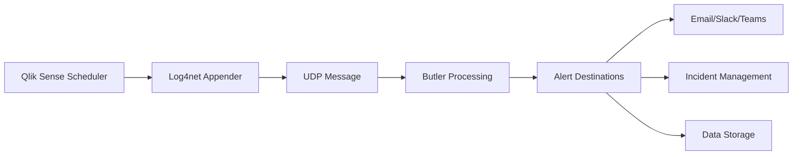

# Reload Alerts

Overview of the actions Butler can take when a reload task fails, is aborted or succeeds.

::: info Platform Support
Client-managed and cloud versions of Qlik Sense support different source triggers (reload failed/stopped/succeeded) and alert destinations (email, Teams, Slack, etc).

Check each section below for information about which triggers and destinations are supported for each version.
:::

## Qlik Sense Deployment Types

Butler's reload alerting capabilities vary depending on your Qlik Sense deployment:

### Client-Managed Qlik Sense

**[Client-managed Qlik Sense](/docs/concepts/failed-reloads/client-managed/)** environments provide the most comprehensive alerting capabilities through Butler's integration with the Qlik Sense logging system.

**Available Alert Destinations**:

- **[Email Notifications](/docs/concepts/failed-reloads/client-managed/alert-emails/)** - Rich HTML emails with script logs and custom formatting
- **[Slack & Teams](/docs/concepts/failed-reloads/client-managed/alerts-slack-teams/)** - Real-time messages to collaboration platforms
- **[Incident Management](/docs/concepts/incident-management/)** - Integration with New Relic, Signl4, and other platforms
- **Data Storage** - InfluxDB metrics and MQTT publishing
- **File System** - Automated script log storage and webhooks

**Trigger Events**:

- Reload task failures
- Reload task aborts
- Reload task successes (optional)

### Qlik Sense Cloud

For Qlik Sense Cloud (SaaS) deployments, Butler's alerting capabilities are more limited due to platform restrictions.

**Available Features**:

- Basic webhook notifications (where supported)
- Limited API-based monitoring
- External monitoring integrations

**Limitations**:

- No direct access to Qlik Sense logs
- Reduced real-time event detection
- Limited customization options

## Key Capabilities

### Rich Alert Content

Butler's alerts include comprehensive context for effective incident response:

- **Application Metadata**: App name, ID, owner information
- **Task Details**: Task name, ID, execution duration
- **Error Information**: Detailed error messages and codes
- **Script Logs**: Last lines of the reload script for troubleshooting
- **Server Context**: Host information and environment details
- **Historical Data**: Previous execution history and patterns

### Flexible Targeting

Control who receives alerts and when:

- **Custom Properties**: Use Qlik Sense custom properties to control alerting per task
- **App Ownership**: Send alerts directly to app owners
- **Environment-Based**: Different alert destinations for production vs. development
- **Severity-Based**: Route critical alerts to different channels
- **Business Hours**: Adjust alert frequency based on time of day

### Template Customization

Personalize alerts using Handlebars templating:

- **HTML Email Templates**: Rich formatting with CSS styling
- **Slack Message Blocks**: Interactive messages with buttons and formatting
- **Teams Adaptive Cards**: Rich cards with structured information
- **Custom Fields**: Include any available metadata in your templates

## Integration Architecture

### How Butler Detects Reload Events

For client-managed deployments, Butler uses log4net appenders to monitor Qlik Sense scheduler logs:



### Alert Processing Flow

1. **Event Detection**: Log appender captures reload failure in Qlik Sense logs
2. **Message Parsing**: Butler extracts task, app, and error information
3. **Context Enrichment**: Additional metadata retrieved from Qlik Sense APIs
4. **Template Processing**: Handlebars templates populated with event data
5. **Multi-Channel Delivery**: Alerts sent to configured destinations
6. **Acknowledgment Tracking**: Monitor delivery status and retries

## Configuration Overview

### Basic Configuration

```yaml
Butler:
  # Enable reload failure alerts
  alerting:
    reloadTaskFailure:
      enable: true
      destinations: ["email", "slack", "teams"]

    reloadTaskAborted:
      enable: true
      destinations: ["email", "teams"]

  # Email configuration
  emailNotification:
    enable: true
    smtp:
      host: "smtp.company.com"
      port: 587
    from: "Butler <butler@company.com>"
    to: ["ops@company.com"]

  # Slack configuration
  slackNotification:
    enable: true
    webhook: "https://hooks.slack.com/services/..."
    channel: "#qlik-alerts"

  # Teams configuration
  teamsNotification:
    enable: true
    webhook: "https://company.webhook.office.com/..."
```

### Advanced Configuration

```yaml
Butler:
  # Conditional alerting
  alerting:
    conditions:
      # Only alert for production apps
      productionOnly:
        enable: true
        customProperty: "Environment"
        requiredValue: "Production"

      # Skip test tasks
      excludeTestTasks:
        enable: true
        taskNameFilter: ["*test*", "*dev*"]

    # Rate limiting
    rateLimit:
      enable: true
      maxAlertsPerHour: 20
      groupSimilarAlerts: true

  # Custom templates
  templates:
    reloadFailure:
      email: "/templates/reload-failed-email.html"
      slack: "/templates/reload-failed-slack.json"
      teams: "/templates/reload-failed-teams.json"
```

## Best Practices

### Alert Design

**Prioritize Information**:

1. What failed (app/task name)
2. When it failed (timestamp)
3. Why it failed (error message)
4. Where to investigate (links to QMC, logs)
5. Who to contact (escalation information)

**Avoid Alert Fatigue**:

- Use severity levels appropriately
- Implement rate limiting for repeated failures
- Group similar alerts together
- Provide clear escalation paths

### Operational Integration

**Incident Response**:

- Link alerts to runbooks and troubleshooting guides
- Include direct links to Qlik Sense QMC and affected apps
- Provide escalation contact information
- Track alert resolution in incident management systems

**Monitoring Integration**:

- Correlate reload alerts with system monitoring data
- Include performance metrics in alert context
- Track alert patterns for capacity planning
- Integrate with broader observability platforms

## Troubleshooting

### Common Issues

**Alerts Not Received**:

- Verify log4net appender configuration in Qlik Sense
- Check Butler connectivity to Qlik Sense servers
- Validate SMTP/webhook credentials and network access
- Review Butler logs for error messages

**Missing Alert Content**:

- Confirm template field syntax and availability
- Check Qlik Sense API permissions for metadata retrieval
- Verify custom property configurations
- Test templates with sample data

**Performance Issues**:

- Monitor alert processing latency
- Check for network connectivity problems
- Review rate limiting and throttling settings
- Optimize template complexity and size

### Debug Configuration

```yaml
Butler:
  # Enable debug logging
  logLevel: debug

  # Log all alert processing
  alerting:
    debug: true
    logTemplateProcessing: true
    logDestinationResponses: true
```

::: tip Getting Started
Start with basic email or Slack notifications for reload failures, then gradually add more destinations and customize templates based on your team's workflow and requirements.
:::

::: warning Log Appender Dependency
Butler's client-managed alerting relies on proper log4net appender configuration. Ensure appenders are correctly installed and configured in your Qlik Sense environment before expecting alerts to work.
:::

## Next Steps

- **[Setup Guide](/docs/getting-started/setup/task-alerts/)** - Complete configuration walkthrough
- **[Client-Managed Alerts](/docs/concepts/failed-reloads/client-managed/)** - Detailed client-managed capabilities
- **[Template Fields](/docs/reference/alert-template-fields/)** - Available template variables
- **[Incident Management](/docs/concepts/incident-management/)** - Advanced alerting integrations
