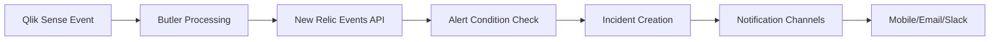

# New Relic Integration

Comprehensive observability platform integration for metrics, logs, events, and incident management.

## What is New Relic?

New Relic is not primarily an incident management tool, but rather a complete SaaS platform for handling metrics, logs, events, and trace messages. Their event handling includes alert management features that integrate seamlessly with Butler and Qlik Sense.

### Key Capabilities

- **Unified Observability**: Metrics, logs, events, and traces in one platform
- **Alert Management**: Built-in incident handling with escalation policies
- **Integration Ecosystem**: Connects with PagerDuty, VictorOps, OpsGenie, Slack, Teams, and more
- **Generous Free Tier**: Excellent for testing Butler alerts and small deployments
- **Butler SOS Integration**: Works alongside Butler SOS for complete Qlik Sense monitoring

## How Butler Integrates with New Relic

### Integration Architecture

The Butler-New Relic integration creates a seamless incident management workflow:

1. **Event Ingestion**: Butler sends alerts to New Relic using their Events and Logs APIs
2. **Metadata Enrichment**: Failed reload tasks include app metadata and script log excerpts
3. **Alert Conditions**: New Relic rules define when to create incidents from Butler events
4. **Alert Policies**: Group conditions and define notification channels
5. **Incident Management**: New Relic manages incident lifecycle until resolution

### Data Flow



## Integration Benefits

### Immediate Incident Visibility

- **Near-instantaneous**: Events forwarded within seconds of Qlik Sense failures
- **Rich Context**: Include script logs for immediate troubleshooting insight
- **Persistent State**: Incidents remain open until explicitly acknowledged
- **Multiple Channels**: Notifications via web, mobile, email, Slack, Teams, PagerDuty

### Operational Intelligence

When combined with Butler SOS, New Relic provides comprehensive Qlik Sense observability:

- **Performance Metrics**: Server CPU, memory, user sessions
- **Operational Events**: Failed/successful reloads, service status
- **Historical Analysis**: Trend analysis and capacity planning
- **Correlation**: Connect performance issues with operational events

### Enterprise Integration

- **ITSM Integration**: Connect with ServiceNow, Jira Service Management
- **Communication Tools**: Slack, Teams, email notifications
- **On-Call Management**: PagerDuty, VictorOps, OpsGenie integration
- **Webhooks**: Custom integrations with any system

## New Relic Dashboards

Butler provides rich operational dashboards when integrated with New Relic:

### Light Mode Dashboard


### Dark Mode Dashboard with Different Time Range


### Detailed Failure Information


### Butler SOS Metrics Integration


### Incidents Overview


### Alert Conditions Management


## Slack Integration Examples

New Relic can send formatted alerts to Slack channels:

### Basic Slack Alert


### Comprehensive Slack Alert


## Configuration Requirements

### New Relic Setup

1. **Account Creation**: Create New Relic account (free tier available)
2. **API Keys**: Generate Insert API key for events ingestion
3. **Alert Policies**: Create policies for different severity levels
4. **Notification Channels**: Configure Slack, Teams, email, or PagerDuty
5. **Dashboards**: Import or create Butler-specific dashboards

### Butler Configuration

```yaml
Butler:
  newRelic:
    enable: true
    accountId: "your-account-id"
    insertApiKey: "your-insert-api-key"
    region: "us" # or 'eu' for EU data centers

    # Failed reload events
    reloadTaskFailure:
      enable: true
      includeScriptLogs: true
      logLines: 20

    # Successful reload events
    reloadTaskSuccess:
      enable: true

    # Windows service events
    serviceMonitor:
      enable: true
```

## Event Types and Data

### Failed Reload Task Events

```json
{
  "eventType": "ButlerReloadTaskFailure",
  "timestamp": 1647875400000,
  "appName": "Sales Dashboard",
  "appId": "a8b4c123-def4-5678-9abc-def012345678",
  "taskName": "Reload Sales Data",
  "taskId": "b9c5d234-efe5-6789-abcd-ef0123456789",
  "errorMessage": "Connection failed to database",
  "scriptLog": "...",
  "serverName": "qlik-server-01",
  "severity": "high",
  "environment": "production"
}
```

### Windows Service Events

```json
{
  "eventType": "ButlerWindowsService",
  "timestamp": 1647875400000,
  "serviceName": "QlikSenseEngineService",
  "serviceDisplayName": "Qlik Sense Engine Service",
  "hostName": "qlik-server-01",
  "state": "stopped",
  "previousState": "running",
  "severity": "critical"
}
```

## Alert Conditions

### NRQL Queries for Alert Conditions

**Failed Reload Alert**:

```sql
SELECT count(*)
FROM ButlerReloadTaskFailure
WHERE appName LIKE '%Production%'
```

**Critical Service Alert**:

```sql
SELECT latest(state)
FROM ButlerWindowsService
WHERE serviceName IN ('QlikSenseRepositoryService', 'QlikSenseEngineService')
AND state = 'stopped'
```

**High Failure Rate Alert**:

```sql
SELECT percentage(count(*), WHERE eventType = 'ButlerReloadTaskFailure')
FROM (
  SELECT count(*) FROM ButlerReloadTaskFailure,
  SELECT count(*) FROM ButlerReloadTaskSuccess
)
SINCE 1 hour ago
```

## Best Practices

### Event Design

**Consistent Schema**: Use standardized event structures across all Butler integrations

**Rich Metadata**: Include enough context for immediate triage:

- Application business purpose
- Error details and classifications
- Environmental context (prod/test/dev)
- Historical failure patterns

**Severity Mapping**: Align Butler severity levels with New Relic incident priorities

### Alert Policy Strategy

**Tiered Policies**:

- **Critical**: Repository/Engine services, database connectivity
- **High**: Business-critical app failures, license issues
- **Medium**: Non-critical app failures, performance degradation
- **Low**: Informational events, recovery notifications

**Notification Channels**:

- **Immediate**: PagerDuty for critical issues
- **Standard**: Slack/Teams for business hours
- **Delayed**: Email for non-urgent issues

### Dashboard Organization

**Executive View**: High-level KPIs and trend analysis
**Operations View**: Real-time system health and active incidents
**Technical View**: Detailed metrics and troubleshooting data
**Historical View**: Trend analysis and capacity planning

## Cost Management

### Data Ingestion

- **Event Volume**: Monitor Butler event generation rates
- **Retention Policies**: Set appropriate data retention periods
- **Sampling**: Use sampling for high-volume, low-priority events
- **Compression**: Optimize event payload sizes

### Free Tier Optimization

- **100GB/month**: Generous free tier for most Butler deployments
- **1 User**: Sufficient for automated Butler integrations
- **Data Retention**: 8 days retention on free tier
- **Alert Policies**: Unlimited alert policies

## Troubleshooting

### Common Issues

**Events Not Appearing**:

- Verify API key permissions and region
- Check Butler logs for API errors
- Validate event payload format
- Monitor New Relic API rate limits

**Alerts Not Firing**:

- Review NRQL query syntax
- Check alert condition thresholds
- Verify event data structure
- Test alert conditions manually

**Missing Notifications**:

- Verify notification channel configuration
- Check escalation policies
- Test notification channels independently
- Review incident management workflow

### Debug Configuration

```yaml
Butler:
  newRelic:
    debug: true
    logApiCalls: true
    validatePayloads: true

  # Enhanced logging
  logLevel: debug
  logDestination: file
```

## Integration Examples

### Basic Failed Reload Integration

```yaml
Butler:
  newRelic:
    enable: true
    accountId: "1234567"
    insertApiKey: "NRII-..."
    reloadTaskFailure:
      enable: true
      includeScriptLogs: true
      logLines: 25
```

### Comprehensive Monitoring

```yaml
Butler:
  newRelic:
    enable: true
    accountId: "1234567"
    insertApiKey: "NRII-..."

    reloadTaskFailure:
      enable: true
      includeScriptLogs: true
      logLines: 25

    reloadTaskSuccess:
      enable: true

    serviceMonitor:
      enable: true

    customAttributes:
      environment: production
      datacenter: primary
      team: qlik-ops
```

## Advanced Features

### Custom Attributes

Add environment-specific metadata to all events:

```yaml
Butler:
  newRelic:
    customAttributes:
      environment: production
      region: us-east-1
      team: analytics
      cost-center: it-operations
```

### Event Filtering

Control which events are sent to New Relic:

```yaml
Butler:
  newRelic:
    filters:
      excludeApps:
        - "test-app-*"
        - "sandbox-*"
      includeApps:
        - "*-production"
        - "critical-*"
      minimumSeverity: medium
```

::: tip Getting Started

1. **Create New Relic Account**: Start with the generous free tier
2. **Generate API Keys**: Create Insert API key for Butler integration
3. **Configure Butler**: Enable New Relic integration with basic settings
4. **Test Integration**: Trigger test events to verify data flow
5. **Create Alert Conditions**: Set up basic failed reload alerts
6. **Add Notification Channels**: Configure Slack, Teams, or email alerts

:::

::: warning API Rate Limits

New Relic has API rate limits that Butler respects. For high-volume environments, consider:

- Event batching and compression
- Filtering non-critical events
- Using appropriate severity levels
- Monitoring API usage in New Relic

:::

## Next Steps

- **[Setup Guide](/docs/getting-started/setup/incident-mgmt-tools/new-relic/)** - Step-by-step configuration
- **[Alert Templates](/docs/reference/alert-template-fields/)** - Customize event payloads
- **[Butler SOS Integration](https://butler-sos.ptarmiganlabs.com)** - Complete observability stack
