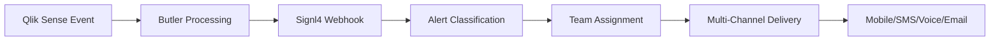

# Signl4 Integration

Modern cloud-based incident management and alert notification service designed for operational teams.

## What is Signl4?

Signl4 is a specialized incident management platform focused on reliable alert delivery and team collaboration. It excels at ensuring critical alerts reach the right people through multiple channels with escalation policies and persistent notifications.

### Key Capabilities

- **Multi-Channel Alerting**: Push notifications, SMS, voice calls, email
- **Intelligent Escalation**: Automatic escalation based on acknowledgment status
- **Team Collaboration**: Shared incident management with role-based access
- **Mobile-First Design**: Native mobile apps for iOS and Android
- **Duty Scheduling**: Built-in on-call rotation management
- **Integration Hub**: Connects with monitoring tools, ITSM, and communication platforms

## How Butler Integrates with Signl4

### Integration Architecture

Butler sends incidents to Signl4 via webhooks, creating a robust alert management workflow:

1. **Webhook Delivery**: Butler sends structured alerts to Signl4 webhook endpoints
2. **Alert Processing**: Signl4 processes and categorizes incoming alerts
3. **Team Notification**: Alerts are distributed to appropriate team members
4. **Escalation Management**: Unacknowledged alerts follow escalation policies
5. **Incident Tracking**: All alerts and responses are tracked in Signl4 dashboard

### Data Flow



## Integration Benefits

### Reliable Alert Delivery

- **Guaranteed Delivery**: Multiple delivery channels ensure alerts reach recipients
- **Persistent Notifications**: Alerts continue until acknowledged or escalated
- **Offline Handling**: SMS and voice calls work even without internet connectivity
- **Delivery Confirmation**: Real-time confirmation of alert delivery and acknowledgment

### Team Coordination

- **Shared Incidents**: Multiple team members can collaborate on incident resolution
- **Real-Time Updates**: Status changes are synchronized across all team members
- **Communication Thread**: Built-in chat for incident-related communication
- **Knowledge Base**: Link incidents to documentation and runbooks

### Operational Intelligence

- **Incident Analytics**: Detailed reporting on alert volume, response times, and patterns
- **Team Performance**: Track individual and team response metrics
- **Historical Trends**: Identify recurring issues and improvement opportunities
- **Custom Dashboards**: Visualize operational metrics and KPIs

## Mobile App Features

Signl4's mobile apps provide comprehensive incident management capabilities:

### Real-Time Notifications

- **Push Notifications**: Instant delivery with rich content
- **Sound Profiles**: Custom notification sounds for different alert types
- **Vibration Patterns**: Haptic feedback for silent mode alerting
- **Badge Counters**: Visual indicators of pending incidents

### Incident Management

- **One-Tap Acknowledgment**: Quick response to incoming alerts
- **Status Updates**: Real-time incident status changes
- **Team Chat**: Collaborative communication within incidents
- **Escalation Control**: Manual escalation to senior team members

### Dashboard Views

- **Active Incidents**: Overview of all current incidents
- **Team Status**: See who's on-call and availability
- **Alert History**: Historical view of all incidents
- **Performance Metrics**: Personal and team statistics

## Configuration Requirements

### Signl4 Setup

1. **Account Creation**: Create Signl4 team account
2. **Team Configuration**: Add team members and define roles
3. **Webhook Endpoints**: Generate webhook URLs for Butler integration
4. **Escalation Policies**: Define alert escalation rules
5. **Mobile Apps**: Install and configure mobile apps for team members

### Butler Configuration

```yaml
Butler:
  signl4:
    enable: true
    webhookUrl: "https://connect.signl4.com/webhook/..."

    # Failed reload events
    reloadTaskFailure:
      enable: true
      teamSecret: "your-team-secret"
      category: "qlik-reload-failure"
      priority: "high"

    # Service monitoring events
    serviceMonitor:
      enable: true
      teamSecret: "your-team-secret"
      category: "qlik-service-issue"
      priority: "critical"
```

## Event Types and Payloads

### Failed Reload Task Events

```json
{
  "Title": "Qlik Sense Reload Failed: Sales Dashboard",
  "Message": "The reload task for 'Sales Dashboard' failed with connection error",
  "Priority": "High",
  "Category": "qlik-reload-failure",
  "ExtId": "reload-task-123",
  "Properties": {
    "App Name": "Sales Dashboard",
    "App ID": "a8b4c123-def4-5678-9abc-def012345678",
    "Task Name": "Reload Sales Data",
    "Error Message": "Connection failed to database",
    "Server": "qlik-server-01",
    "Environment": "Production",
    "Script Log": "..."
  }
}
```

### Windows Service Events

```json
{
  "Title": "Critical: Qlik Sense Service Stopped",
  "Message": "QlikSenseEngineService has stopped on qlik-server-01",
  "Priority": "Critical",
  "Category": "qlik-service-issue",
  "ExtId": "service-engine-01",
  "Properties": {
    "Service Name": "QlikSenseEngineService",
    "Display Name": "Qlik Sense Engine Service",
    "Host Name": "qlik-server-01",
    "Previous State": "Running",
    "Current State": "Stopped",
    "Environment": "Production"
  }
}
```

## Alert Categories and Priorities

### Category Classification

**qlik-reload-failure**:

- Application reload failures
- Data refresh issues
- Script execution errors

**qlik-service-issue**:

- Windows service failures
- Repository service problems
- Engine service interruptions

**qlik-license-issue**:

- License allocation problems
- User access license conflicts
- Professional license exhaustion

**qlik-performance**:

- CPU/memory threshold breaches
- Slow query performance
- System resource warnings

### Priority Mapping

| Butler Severity | Signl4 Priority | Escalation Time | Channels         |
| --------------- | --------------- | --------------- | ---------------- |
| Critical        | Critical        | Immediate       | Push, SMS, Voice |
| High            | High            | 5 minutes       | Push, SMS        |
| Medium          | Medium          | 15 minutes      | Push, Email      |
| Low             | Low             | 30 minutes      | Push             |

## Escalation Policies

### Standard Escalation Flow

1. **Primary Contact** (0 minutes): Initial alert to assigned team member
2. **Team Escalation** (5 minutes): Alert entire team if unacknowledged
3. **Manager Escalation** (15 minutes): Escalate to team lead or manager
4. **Executive Escalation** (30 minutes): Final escalation to operations director

### Custom Escalation Rules

```yaml
Butler:
  signl4:
    escalationPolicies:
      critical:
        - level: 1
          delay: 0
          contacts: ["primary-oncall"]
          channels: ["push", "sms", voice']
        - level: 2
          delay: 5
          contacts: ["team"]
          channels: ["push", "sms"]
        - level: 3
          delay: 15
          contacts: ["manager"]
          channels: ["push", "sms", "voice"]

      high:
        - level: 1
          delay: 0
          contacts: ["primary-oncall"]
          channels: ["push", "sms"]
        - level: 2
          delay: 10
          contacts: ["team"]
          channels: ["push"]
```

## Team Management

### Role-Based Access

**Administrator**:

- Full team configuration access
- Webhook and integration management
- Escalation policy configuration
- Team member management

**Team Lead**:

- Incident assignment and management
- Team member status updates
- Escalation policy execution
- Performance reporting access

**Team Member**:

- Incident acknowledgment and response
- Status updates and communication
- Mobile app access
- Personal metric tracking

### On-Call Scheduling

```yaml
Butler:
  signl4:
    onCall:
      schedule:
        - name: "Primary On-Call"
          members: ["alice", "bob", "charlie"]
          rotation: "weekly"
          startDay: "monday"
        - name: "Secondary On-Call"
          members: ["david", "eve", "frank"]
          rotation: "daily"
          startTime: "18:00"
```

## Dashboard and Reporting

### Incident Dashboard

- **Active Incidents**: Real-time view of open incidents
- **Response Times**: Average acknowledgment and resolution times
- **Team Performance**: Individual and team response statistics
- **Alert Volume**: Trending of alert frequency and patterns

### Analytics Features

**Response Metrics**:

- Mean time to acknowledgment (MTTA)
- Mean time to resolution (MTTR)
- Escalation frequency
- Team member availability

**Operational Insights**:

- Peak incident times
- Most common alert types
- Recurring incident patterns
- Team workload distribution

### Custom Reports

```yaml
Butler:
  signl4:
    reporting:
      schedules:
        - name: "Weekly Operations Report"
          frequency: weekly
          recipients: ["operations-manager@company.com"]
          metrics: ["incidents", "response-times", "escalations"]
        - name: "Monthly Executive Summary"
          frequency: monthly
          recipients: ["cto@company.com"]
          metrics: ["trends", "team-performance", "cost-analysis"]
```

## Integration Examples

### Basic Failed Reload Integration

```yaml
Butler:
  signl4:
    enable: true
    webhookUrl: "https://connect.signl4.com/webhook/team-secret-123"

    reloadTaskFailure:
      enable: true
      priority: "high"
      category: "qlik-reload-failure"
      includeScriptLogs: true
```

### Comprehensive Monitoring

```yaml
Butler:
  signl4:
    enable: true
    webhookUrl: "https://connect.signl4.com/webhook/team-secret-123"

    reloadTaskFailure:
      enable: true
      priority: "high"
      category: "qlik-reload-failure"
      includeScriptLogs: true
      logLines: 25

    serviceMonitor:
      enable: true
      priority: "critical"
      category: "qlik-service-issue"

    customProperties:
      Environment: "Production"
      Team: "Analytics Operations"
      DataCenter: "Primary"
```

## Advanced Features

### Custom Alert Templates

```yaml
Butler:
  signl4:
    templates:
      reloadFailure:
        title: "🚨 Qlik App Reload Failed: {{appName}}"
        message: |
          Application: {{appName}}
          Task: {{taskName}}
          Error: {{errorMessage}}

          Environment: {{environment}}
          Server: {{serverName}}

          📋 Check logs for details
        properties:
          App_ID: "{{appId}}"
          Task_ID: "{{taskId}}"
          Reload_Time: "{{reloadDuration}}"
          Last_Success: "{{lastSuccessfulReload}}"
```

### Conditional Alerting

```yaml
Butler:
  signl4:
    conditions:
      businessHours:
        enable: true
        priority: 'high'
        schedule: 'mon-fri 08:00-18:00'
      afterHours:
        enable: true
        priority: 'critical'
        schedule: 'sat-sun,weekdays 18:00-08:00'

    filters:
      excludeApps:
        - "test-*"
        - "sandbox-*"
      criticalApps:
        - "*-production"
        - "executive-*"
        priority: 'critical'
```

## Mobile App Configuration

### iOS/Android Setup

1. **App Installation**: Download Signl4 from App Store or Google Play
2. **Team Join**: Use team invitation link or QR code
3. **Notification Settings**: Configure sound, vibration, and display preferences
4. **Location Services**: Enable for context-aware alerting
5. **Background Refresh**: Ensure app can receive alerts when backgrounded

### Push Notification Setup

```yaml
Butler:
  signl4:
    mobile:
      pushNotifications:
        enable: true
        sound: "critical-alert"
        vibration: "urgent"
        badge: true

      locationServices:
        enable: true
        geofencing: true
        contextualAlerts: true
```

## Troubleshooting

### Common Issues

**Alerts Not Delivered**:

- Verify webhook URL and team secret
- Check Butler logs for HTTP errors
- Validate JSON payload format
- Test webhook endpoint manually

**Mobile Notifications Missing**:

- Verify mobile app is updated
- Check notification permissions
- Ensure background refresh enabled
- Test push notification delivery

**Escalation Not Working**:

- Review escalation policy configuration
- Check team member availability status
- Verify contact information accuracy
- Test escalation rules manually

### Debug Configuration

```yaml
Butler:
  signl4:
    debug: true
    logWebhookCalls: true
    validatePayloads: true
    testMode: true

  # Enhanced logging
  logLevel: debug
  logDestination: file
```

## Cost Considerations

### Signl4 Pricing

- **Per User Model**: Monthly subscription per team member
- **Alert Volume**: No limits on alert quantity
- **SMS/Voice**: Additional charges for SMS and voice calls
- **Enterprise Features**: Advanced reporting and integrations

### Optimization Strategies

**Alert Filtering**:

- Implement severity-based filtering
- Use business hours scheduling
- Filter out non-critical test environments
- Batch similar alerts where appropriate

**Team Sizing**:

- Right-size team membership
- Use role-based access appropriately
- Optimize on-call rotations
- Share teams across related services

## Best Practices

### Alert Design

**Clear Titles**: Use descriptive, actionable alert titles
**Rich Context**: Include all necessary troubleshooting information
**Consistent Categories**: Use standardized categorization across all alerts
**Priority Mapping**: Align priorities with business impact

### Team Organization

**Role Definition**: Clearly define team member roles and responsibilities
**Escalation Paths**: Design escalation policies that match operational needs
**On-Call Scheduling**: Balance workload and maintain coverage
**Training**: Ensure all team members understand the incident management process

### Integration Management

**Webhook Security**: Use HTTPS and validate webhook authenticity
**Error Handling**: Implement retry logic for failed webhook deliveries
**Monitoring**: Monitor integration health and performance
**Testing**: Regularly test alert delivery and escalation workflows

::: tip Getting Started

1. **Create Signl4 Team**: Set up team account and add initial members
2. **Install Mobile Apps**: Ensure all team members have mobile apps configured
3. **Generate Webhook**: Create webhook URL for Butler integration
4. **Configure Butler**: Enable Signl4 integration with basic settings
5. **Test Integration**: Send test alerts to verify delivery
6. **Setup Escalation**: Define escalation policies for different scenarios

:::

::: warning Webhook Security

Signl4 webhooks should be treated as sensitive endpoints:

- Use HTTPS for all webhook URLs
- Store team secrets securely
- Monitor webhook access logs
- Rotate team secrets regularly
- Validate webhook payload authenticity

:::

## Next Steps

- **[Setup Guide](/docs/getting-started/setup/incident-mgmt-tools/signl4/)** - Step-by-step configuration
- **[Alert Templates](/docs/reference/alert-template-fields/)** - Customize alert payloads
- **[Mobile App Guide](https://signl4.com/mobile-app/)** - Mobile app configuration and features
