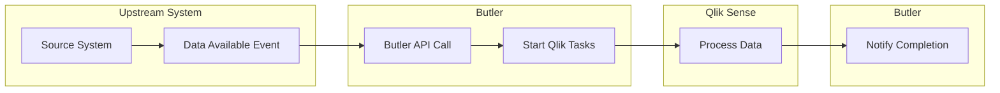

# Start Sense Tasks

Start Qlik Sense reload tasks programmatically using Butler's REST API, enabling automation and integration with external systems.

## Why Programmatic Task Starting?

While the QMC provides a user interface for manually starting tasks, many scenarios benefit from automation:

### Automation Benefits

- **Event-Driven Processing**: Start tasks when source data becomes available instead of polling via Sense app reload schedules
- **External System Integration**: Allow upstream systems to trigger Qlik Sense processing
- **Workflow Orchestration**: Include Qlik Sense reloads in broader data processing pipelines
- **Conditional Logic**: Start tasks based on complex business rules or external conditions

### Example Scenario

Consider a financial ERP system that generates new data throughout the day:

**Traditional Approach (Polling):**

- Qlik Sense polls the ERP system every hour for new data
- Wastes resources when no new data is available
- May miss critical updates between polling intervals

**Event-Driven Approach:**

- ERP system notifies Butler when new data is available
- Butler immediately starts the relevant Qlik Sense reload tasks
- Processing begins immediately when data is ready
- More efficient resource utilization

## Task Identification Methods

Butler provides flexible ways to identify which tasks to start.

::: tip Remember
Task IDs are permanent for a specific task, but if tasks are re-created they will get new task IDs.

By specifying tasks using tags and/or custom properties instead, the outside systems that need to start tasks don’t have to deal with task IDs that may change.

Lower risk for issues and less maintenance thus.
:::

### 1. Task IDs (Direct)

Start specific tasks using their unique identifiers:

- **Single Task**: Start one task by including its ID in the URL
- **Multiple Tasks**: Specify additional task IDs in the request body
- **Use Case**: Direct control when you know exact task IDs

```text
POST /v4/reloadtask/a8b4c123-def4-5678-9abc-def012345678/start
```

### 2. Tags (Flexible)

Start tasks based on tags assigned in the QMC:

- **Single Tag**: Start all tasks with a specific tag
- **Multiple Tags**: Start tasks that have any of the specified tags
- **Use Case**: Logical grouping of related tasks

### 3. Custom Properties (Structured)

Start tasks based on custom property values:

- **Property/Value Matching**: Start tasks with specific custom property values
- **Multiple Properties**: Combine multiple property criteria
- **Use Case**: Complex categorization and selection logic

## Task Identification Strategies

### By Task ID

**Advantages:**

- Direct and unambiguous
- Fast execution
- Simple API calls

**Disadvantages:**

- Task IDs change if tasks are recreated
- Requires maintenance when tasks are modified
- Brittle integration

<ResponsiveImage 
  src="/img/start-tasks-using-taskid-1.png" 
  alt="Task IDs in QMC"
  maxWidth="800px"
  caption="Finding task IDs in the Qlik Management Console"
/>

### By Tags

**Advantages:**

- Stable identifiers (survive task recreation)
- Logical grouping of tasks
- Easy bulk operations

**Example Scenario:**

```yaml
Tags in QMC:
- "Butler 5.0 demo" (4 tasks)
- "startTask1" (3 tasks)
- "hourly-reload" (6 tasks)
```

A single API call with tag `Butler 5.0 demo` would start all 4 associated tasks.

<ResponsiveImage 
  src="/img/start-tasks-using-tag-1.png" 
  alt="Task Tags in QMC"
  maxWidth="800px"
  caption="Using tags to group related tasks in the QMC"
/>

### By Custom Properties

**Advantages:**

- Hierarchical organization
- Multiple classification dimensions
- Business-friendly naming

**Example Configuration:**

```yaml
Custom Property: taskGroup
Values:
  - "financial-reports"
  - "operational-dashboards"
  - "regulatory-compliance"
```

API call with `taskGroup=financial-reports` starts all financial reporting tasks.

<ResponsiveImage 
  src="/img/start-tasks-using-cp-1.png" 
  alt="Custom Properties in QMC"
  maxWidth="800px"
  caption="Custom properties provide structured task categorization"
/>

## API Endpoint

Butler provides the `/v4/reloadtask/<taskid>/start` endpoint for starting tasks:

### HTTP Methods

Both `POST` and `PUT` are supported and behave identically:

```text
POST /v4/reloadtask/start
PUT /v4/reloadtask/start
```

### URL Patterns

```text
# Start single task by ID
POST /v4/reloadtask/{taskId}/start

# Start multiple tasks (body contains additional IDs/tags/custom properties/criteria)
POST /v4/reloadtask/-/start
```

## Request Examples

### Single Task by ID

```text
POST /v4/reloadtask/a8b4c123-def4-5678-9abc-def012345678/start
Content-Type: application/json

{}
```

### Multiple Tasks by ID

```text
POST /v4/reloadtask/-/start
Content-Type: application/json

{
  "taskId": [
    "a8b4c123-def4-5678-9abc-def012345678",
    "b9c5d234-efe5-6789-abcd-ef0123456789"
  ]
}
```

### Tasks by Tags

```text
POST /v4/reloadtask/-/start
Content-Type: application/json

{
  "tag": [
    "financial-reports",
    "daily-refresh"
  ]
}
```

### Tasks by Custom Properties

```text
POST /v4/reloadtask/-/start
Content-Type: application/json

{
  "customProperty": [
    {
      "name": "taskGroup",
      "value": "operational-dashboards"
    },
    {
      "name": "priority",
      "value": "high"
    }
  ]
}
```

### Combined Criteria

```text
POST /v4/reloadtask/-/start
Content-Type: application/json

{
  "taskId": ["a8b4c123-def4-5678-9abc-def012345678"],
  "tag": ["urgent"],
  "customProperty": [
    {
      "name": "department",
      "value": "finance"
    }
  ]
}
```

## Response Format

### Successful Response

```json
{
  "tasksStarted": [
    {
      "taskId": "a8b4c123-def4-5678-9abc-def012345678",
      "taskName": "Financial Dashboard Reload",
      "status": "started"
    },
    {
      "taskId": "b9c5d234-efe5-6789-abcd-ef0123456789",
      "taskName": "Sales Report Update",
      "status": "started"
    }
  ],
  "tasksNotFound": [],
  "totalTasksStarted": 2
}
```

### Error Response

```json
{
  "error": "Invalid task ID format",
  "details": "Task ID must be a valid GUID"
}
```

## Integration Patterns

### Event-Driven Architecture



### Webhook Integration

External systems can trigger task starts via webhooks:

```bash
curl -X POST "https://butler.company.com/v4/reloadtask/start" \
  -H "Content-Type: application/json" \
  -d '{
    "tag": ["data-refresh"],
    "customProperty": [
      {
        "name": "source",
        "value": "erp-system"
      }
    ]
  }'
```

### MQTT Integration

Use MQTT messages to trigger task starts:

```yaml
# Butler listens on MQTT topic
Butler:
  mqttConfig:
    taskStartTopic: qliksense/task/start

# External system publishes task start request
Topic: qliksense/task/start
Payload: { "tag": ["daily-reports"] }
```

## Best Practices

### Task Organization

1. **Use Tags for Logical Grouping**: Group related tasks with meaningful tags
2. **Custom Properties for Hierarchies**: Use custom properties for complex categorization
3. **Consistent Naming**: Establish naming conventions for tags and properties
4. **Documentation**: Document tag and property meanings

### API Design

1. **Prefer Tags/Properties**: Use tags or custom properties over task IDs when possible
2. **Batch Operations**: Start multiple related tasks in single API calls
3. **Error Handling**: Implement robust error handling for API failures
4. **Retry Logic**: Add retry mechanisms for transient failures

### Monitoring

1. **Task Tracking**: Monitor which tasks are started by external systems
2. **Performance Metrics**: Track API response times and success rates
3. **Audit Logging**: Log all external task start requests
4. **Alert Integration**: Integrate with monitoring systems for failure alerts

### Maintenance

1. **Regular Reviews**: Periodically review tag and property usage
2. **Cleanup**: Remove obsolete tags and properties
3. **Testing**: Test API integrations after Qlik Sense updates
4. **Documentation**: Keep integration documentation current

::: tip Integration Examples

For detailed implementation examples, see:

- [REST API Examples](/docs/examples/start-task/start-task-from-rest/)
- [MQTT Integration](/docs/examples/start-task/start-task-from-mqtt/)
- [Authentication Setup](/docs/getting-started/setup/authentication/)

:::

::: warning Task Dependencies

When starting multiple tasks:

1. **Consider Dependencies**: Ensure prerequisite tasks complete before starting dependent tasks
2. **Parallel Execution**: Multiple tasks started simultaneously may compete for resources
3. **Resource Limits**: Check Qlik Sense server capacity before starting many tasks
4. **Error Propagation**: Plan for scenarios where some tasks succeed and others fail

:::
