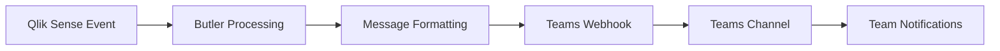

# Sending Messages to MS Teams

Send automated notifications and alerts from Butler to Microsoft Teams channels for real-time collaboration and incident response.

## What is MS Teams Integration?

Microsoft Teams integration allows Butler to send notifications directly to Teams channels, enabling seamless communication about Qlik Sense events, alerts, and operational status. Teams messages can include rich formatting, interactive cards, and deep links for immediate access to relevant information.

### Key Capabilities

- **Rich Message Formatting**: Send formatted messages with cards, buttons, and links
- **Channel-Specific Routing**: Direct messages to appropriate Teams channels
- **Interactive Elements**: Include action buttons and quick response options
- **Threaded Conversations**: Maintain context with message threading
- **Adaptive Cards**: Rich, interactive message layouts
- **Webhook Integration**: Simple and reliable message delivery

## How Butler Integrates with Teams

### Integration Architecture

Butler sends messages to Teams using incoming webhooks, creating a straightforward communication channel:

1. **Event Processing**: Butler processes Qlik Sense events and triggers
2. **Message Formatting**: Events are formatted as Teams-compatible messages
3. **Webhook Delivery**: Messages are sent to Teams via webhook URLs
4. **Channel Distribution**: Messages appear in designated Teams channels
5. **User Interaction**: Team members can respond and take action

### Data Flow



## Integration Benefits

### Real-Time Communication

**Immediate Awareness**: Team members receive instant notifications about:

- **Failed Reloads**: Critical application failures requiring immediate attention
- **Service Issues**: Windows service problems affecting system availability
- **Performance Alerts**: System performance degradation warnings
- **Security Events**: Authentication failures and security incidents

### Contextual Information

**Rich Message Content**: Teams messages include comprehensive context:

- **Error Details**: Complete error messages and diagnostic information
- **Script Logs**: Relevant script excerpts for troubleshooting
- **Server Information**: Source server and environment details
- **Remediation Links**: Direct links to management consoles and documentation

### Team Collaboration

**Coordinated Response**: Teams integration facilitates collaborative incident response:

- **Shared Visibility**: All team members see the same information simultaneously
- **Threaded Discussions**: Maintain organized conversations about specific incidents
- **Action Coordination**: Coordinate response activities within Teams
- **Knowledge Sharing**: Share solutions and lessons learned

## Teams Message Types

### Failed Reload Notifications

Rich cards with detailed failure information:

````json
{
  "@type": "MessageCard",
  "@context": "http://schema.org/extensions",
  "summary": "Qlik Sense Reload Failed",
  "themeColor": "FF0000",
  "sections": [
    {
      "activityTitle": "🚨 Qlik Sense Reload Failed",
      "activitySubtitle": "Sales Dashboard - Production Environment",
      "facts": [
        {
          "name": "Application:",
          "value": "Sales Dashboard"
        },
        {
          "name": "Task:",
          "value": "Reload Sales Data"
        },
        {
          "name": "Error:",
          "value": "Connection failed to database"
        },
        {
          "name": "Server:",
          "value": "qlik-server-01"
        },
        {
          "name": "Time:",
          "value": "2023-12-01 14:22:00"
        }
      ],
      "text": "**Script Log:**\n```\nLet vErrorMessage = 'Connection timeout';\nEXIT Script;\n```"
    }
  ],
  "potentialAction": [
    {
      "@type": "OpenUri",
      "name": "View App",
      "targets": [
        {
          "os": "default",
          "uri": "https://qlik-server/sense/app/abc123"
        }
      ]
    },
    {
      "@type": "OpenUri",
      "name": "Check Logs",
      "targets": [
        {
          "os": "default",
          "uri": "https://qlik-server/qmc/tasks"
        }
      ]
    }
  ]
}
````

### Service Status Updates

System health and service status notifications:

```json
{
  "@type": "MessageCard",
  "@context": "http://schema.org/extensions",
  "summary": "Qlik Service Status Alert",
  "themeColor": "FF6600",
  "sections": [
    {
      "activityTitle": "⚠️ Qlik Sense Service Alert",
      "activitySubtitle": "Repository Service - qlik-server-01",
      "facts": [
        {
          "name": "Service:",
          "value": "QlikSenseRepositoryService"
        },
        {
          "name": "Status:",
          "value": "Stopped"
        },
        {
          "name": "Previous Status:",
          "value": "Running"
        },
        {
          "name": "Server:",
          "value": "qlik-server-01"
        },
        {
          "name": "Impact:",
          "value": "High - Repository functionality unavailable"
        }
      ]
    }
  ],
  "potentialAction": [
    {
      "@type": "OpenUri",
      "name": "Server Management",
      "targets": [
        {
          "os": "default",
          "uri": "https://qlik-server/qmc/services"
        }
      ]
    }
  ]
}
```

### Performance Alerts

System performance and resource utilization warnings:

```json
{
  "@type": "MessageCard",
  "@context": "http://schema.org/extensions",
  "summary": "Qlik Performance Alert",
  "themeColor": "FFAA00",
  "sections": [
    {
      "activityTitle": "📊 Performance Alert",
      "activitySubtitle": "High CPU Usage - qlik-server-02",
      "facts": [
        {
          "name": "Metric:",
          "value": "CPU Utilization"
        },
        {
          "name": "Current Value:",
          "value": "92%"
        },
        {
          "name": "Threshold:",
          "value": "85%"
        },
        {
          "name": "Duration:",
          "value": "15 minutes"
        },
        {
          "name": "Trend:",
          "value": "Increasing"
        }
      ]
    }
  ]
}
```

### Success Notifications

Positive confirmations for successful operations:

```json
{
  "@type": "MessageCard",
  "@context": "http://schema.org/extensions",
  "summary": "Qlik Reload Successful",
  "themeColor": "00AA00",
  "sections": [
    {
      "activityTitle": "✅ Reload Completed Successfully",
      "activitySubtitle": "Executive Dashboard - Production",
      "facts": [
        {
          "name": "Application:",
          "value": "Executive Dashboard"
        },
        {
          "name": "Duration:",
          "value": "4 minutes 32 seconds"
        },
        {
          "name": "Rows Loaded:",
          "value": "2,847,392"
        },
        {
          "name": "Completion Time:",
          "value": "2023-12-01 15:45:00"
        }
      ]
    }
  ]
}
```

## Configuration Options

### Basic Configuration

```yaml
Butler:
  teamsNotification:
    enable: true

    # Basic webhook configuration
    webhooks:
      operations:
        url: "https://company.webhook.office.com/webhookb2/..."
        description: "General operations alerts"

      critical:
        url: "https://company.webhook.office.com/webhookb2/..."
        description: "Critical system alerts"

    # Event routing
    reloadTaskFailure:
      enable: true
      webhook: "critical"
      messageCard: true

    serviceMonitor:
      enable: true
      webhook: "operations"
      messageCard: true
```

### Advanced Configuration

```yaml
Butler:
  teamsNotification:
    enable: true

    # Multiple webhook endpoints
    webhooks:
      operations:
        url: "https://company.webhook.office.com/webhookb2/operations"
        description: "Operations team alerts"
        retryAttempts: 3
        timeout: 10

      development:
        url: "https://company.webhook.office.com/webhookb2/dev-team"
        description: "Development team notifications"
        businessHoursOnly: true
        timezone: "America/New_York"

      executive:
        url: "https://company.webhook.office.com/webhookb2/executives"
        description: "Executive dashboard alerts"
        criticalOnly: true
        escalationDelay: 300

    # Event-specific configuration
    reloadTaskFailure:
      enable: true
      routing:
        critical:
          webhook: "executive"
          condition: "appName.includes('Executive') || appName.includes('Board')"
        normal:
          webhook: "operations"
          condition: "default"

      messageFormat:
        includeScriptLogs: true
        maxLogLines: 20
        includeMetadata: true
        addActionButtons: true

    reloadTaskSuccess:
      enable: true
      webhook: "operations"
      businessHoursOnly: true
      minimumDuration: 300 # Only for reloads > 5 minutes

    serviceMonitor:
      enable: true
      routing:
        critical:
          webhook: "operations"
          services: ["QlikSenseRepositoryService", "QlikSenseEngineService"]
        normal:
          webhook: "operations"
          services: ["QlikSenseSchedulerService", "QlikSenseProxyService"]

    # Message customization
    templates:
      reloadFailure:
        title: "🚨 {{appName}} Reload Failed"
        color: "FF0000"
        includeActions: true
        actionButtons:
          - name: "View App"
            url: "{{qmcAppUrl}}"
          - name: "Check Logs"
            url: "{{qmcTaskUrl}}"

      serviceAlert:
        title: "⚠️ Service Alert: {{serviceName}}"
        color: "FF6600"
        includeServerInfo: true

    # Business rules
    businessRules:
      businessHours:
        start: "08:00"
        end: "18:00"
        timezone: "America/New_York"
        weekdays: ["Monday", "Tuesday", "Wednesday", "Thursday", "Friday"]

      escalation:
        criticalDelay: 0
        highDelay: 300
        mediumDelay: 900
        lowDelay: 1800
```

## Webhook Setup in Teams

### Creating Incoming Webhooks

**Steps to create Teams webhooks**:

1. **Navigate to Channel**: Go to the Teams channel for notifications
2. **Channel Settings**: Click the "..." menu and select "Connectors"
3. **Add Webhook**: Find "Incoming Webhook" and click "Add"
4. **Configure Webhook**: Provide name and optional image
5. **Copy URL**: Save the generated webhook URL for Butler configuration
6. **Test Webhook**: Send a test message to verify connectivity

### Webhook Security

**Best Practices**:

- **Secure Storage**: Store webhook URLs as environment variables or secrets
- **Access Control**: Limit webhook access to authorized applications only
- **Rotation**: Regularly rotate webhook URLs for security
- **Monitoring**: Monitor webhook usage and access patterns
- **Validation**: Validate webhook responses and handle failures gracefully

### Multiple Channel Strategy

**Channel Organization**:

- **Critical Alerts**: High-priority incidents requiring immediate attention
- **Operations**: Day-to-day operational notifications
- **Development**: Development and testing environment alerts
- **Executive**: Business-critical summaries and escalations
- **Archive**: Historical record of all notifications

## Message Templates and Customization

### Adaptive Cards

Use Adaptive Cards for rich, interactive messages:

```json
{
  "type": "AdaptiveCard",
  "version": "1.3",
  "body": [
    {
      "type": "TextBlock",
      "text": "Qlik Sense Alert",
      "weight": "bolder",
      "size": "large"
    },
    {
      "type": "FactSet",
      "facts": [
        {
          "title": "Application:",
          "value": "{{appName}}"
        },
        {
          "title": "Status:",
          "value": "{{status}}"
        },
        {
          "title": "Server:",
          "value": "{{serverName}}"
        }
      ]
    }
  ],
  "actions": [
    {
      "type": "Action.OpenUrl",
      "title": "View Details",
      "url": "{{detailsUrl}}"
    }
  ]
}
```

### Template Variables

**Available Variables**:

- **{{appName}}**: Application name
- **{{taskName}}**: Reload task name
- **{{errorMessage}}**: Error description
- **{{serverName}}**: Qlik Sense server name
- **{{timestamp}}**: Event timestamp
- **{{environment}}**: Environment identifier
- **{{severity}}**: Alert severity level
- **{{scriptLog}}**: Script log excerpt
- **{{qmcUrl}}**: QMC management link

### Dynamic Content

**Conditional Formatting**:

```yaml
Butler:
  teamsNotification:
    templates:
      dynamicAlert:
        title: |
          {{#if (eq severity 'critical')}}
          🚨 CRITICAL: {{eventType}}
          {{else if (eq severity 'high')}}
          ⚠️ HIGH: {{eventType}}
          {{else}}
          ℹ️ {{eventType}}
          {{/if}}

        color: |
          {{#if (eq severity 'critical')}}
          FF0000
          {{else if (eq severity 'high')}}
          FF6600
          {{else}}
          0066FF
          {{/if}}
```

## Monitoring and Analytics

### Message Delivery Tracking

Butler tracks Teams message delivery:

```json
{
  "timestamp": "2023-12-01T14:22:00Z",
  "messageId": "msg-12345",
  "webhook": "operations",
  "channel": "Qlik Operations",
  "status": "delivered",
  "responseTime": 245,
  "retryAttempts": 0,
  "messageType": "reloadFailure",
  "severity": "high"
}
```

### Delivery Analytics

**Metrics Collected**:

- Message delivery success rates
- Average response times
- Retry attempt frequencies
- Channel-specific performance
- Peak usage patterns

### Error Handling

**Common Issues and Resolutions**:

**Webhook URL Invalid**:

- Verify webhook URL format and accessibility
- Check Teams channel permissions
- Regenerate webhook if expired

**Message Formatting Errors**:

- Validate JSON message format
- Check template variable substitution
- Verify Adaptive Card schema compliance

**Rate Limiting**:

- Implement exponential backoff
- Batch similar messages
- Use multiple webhooks for high volume

## Best Practices

### Message Design

**Clear and Concise**:

- Use descriptive titles that convey urgency and context
- Include essential information in the message preview
- Provide actionable next steps and relevant links
- Use consistent formatting and color coding

**Visual Hierarchy**:

- Use appropriate colors for severity levels
- Structure information with facts and sections
- Include relevant icons and emojis for quick recognition
- Maintain consistent card layouts across message types

### Channel Management

**Logical Organization**:

- Separate channels by team, environment, or severity
- Use naming conventions that reflect purpose
- Document channel purposes and subscription guidelines
- Regularly review and optimize channel structure

**Noise Reduction**:

- Filter messages based on business hours
- Implement severity-based routing
- Use message threading to reduce channel clutter
- Provide digest options for low-priority alerts

### Integration Management

**Reliability**:

- Implement retry logic for failed deliveries
- Monitor webhook health and performance
- Maintain backup notification channels
- Test webhook connectivity regularly

**Security**:

- Store webhook URLs securely
- Use HTTPS for all webhook communications
- Implement webhook URL rotation policies
- Monitor for unauthorized webhook usage

## Troubleshooting

### Common Issues

**Messages Not Appearing**:

- Verify webhook URL is correct and active
- Check Teams channel permissions
- Validate message JSON format
- Review Butler logs for HTTP errors

**Formatting Problems**:

- Validate Adaptive Card schema
- Check template variable substitution
- Verify color codes and formatting
- Test with simple message format first

**Performance Issues**:

- Monitor webhook response times
- Check for rate limiting
- Implement message batching
- Use multiple webhooks for load distribution

### Debug Configuration

```yaml
Butler:
  teamsNotification:
    debug: true
    logLevel: debug

    # Enhanced logging
    detailedLogging:
      webhookCalls: true
      messageFormatting: true
      templateProcessing: true
      errorDetails: true
```

## Integration Examples

### Basic Teams Integration

```yaml
Butler:
  teamsNotification:
    enable: true

    webhooks:
      alerts:
        url: "https://company.webhook.office.com/webhookb2/12345"

    reloadTaskFailure:
      enable: true
      webhook: "alerts"
      includeScriptLogs: true
```

### Multi-Environment Setup

```yaml
Butler:
  teamsNotification:
    enable: true

    # Environment-specific webhooks
    webhooks:
      prod-critical:
        url: "https://company.webhook.office.com/webhookb2/prod-critical"
        description: "Production critical alerts"

      prod-operations:
        url: "https://company.webhook.office.com/webhookb2/prod-ops"
        description: "Production operations"

      dev-team:
        url: "https://company.webhook.office.com/webhookb2/dev-team"
        description: "Development team"

    # Event routing by environment
    environments:
      production:
        reloadTaskFailure:
          critical:
            webhook: "prod-critical"
            condition: "severity === 'critical'"
          normal:
            webhook: "prod-operations"

        serviceMonitor:
          webhook: "prod-critical"

      development:
        reloadTaskFailure:
          webhook: "dev-team"
          businessHoursOnly: true

        serviceMonitor:
          webhook: "dev-team"
          minimumSeverity: "medium"

    # Custom templates
    templates:
      production:
        title: "🏭 PROD: {{eventType}}"
        color: "FF0000"
        urgency: "high"

      development:
        title: "🧪 DEV: {{eventType}}"
        color: "0066FF"
        urgency: "normal"
```

::: tip Getting Started

1. **Create Teams Webhooks**: Set up incoming webhooks in target Teams channels
2. **Configure Butler**: Add webhook URLs to Butler configuration
3. **Test Integration**: Send test messages to verify connectivity
4. **Customize Templates**: Design message templates for your team's needs
5. **Monitor Performance**: Track message delivery and team response

:::

::: warning Security Considerations

- Store webhook URLs securely using environment variables
- Regularly rotate webhook URLs for security
- Monitor webhook access logs for unauthorized usage
- Use HTTPS for all webhook communications
- Implement proper error handling to prevent information leakage

:::

## Next Steps

- **[Setup Guide](/docs/getting-started/setup/teams-integration/)** - Step-by-step Teams integration setup
- **[Message Templates](/docs/reference/teams-message-templates/)** - Advanced message template examples
- **[Webhook Management](/docs/reference/webhook-security/)** - Webhook security and management best practices
