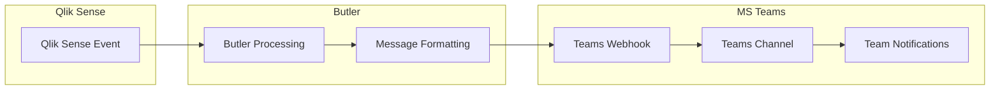

# Sending Messages to MS Teams

Send automated notifications and alerts from Butler to Microsoft Teams channels for real-time collaboration and incident response.

## What is MS Teams Integration?

Microsoft Teams integration allows Butler to send notifications directly to Teams channels, enabling seamless communication about Qlik Sense events, alerts, and operational status. Teams messages can include rich formatting, interactive cards, and deep links for immediate access to relevant information.

### Key Capabilities

- **Rich Message Formatting**: Send formatted messages with cards, buttons, and links
- **Channel-Specific Routing**: Direct messages to appropriate Teams channels
- **Interactive Elements**: Include action buttons and quick response options
- **Threaded Conversations**: Maintain context with message threading
- **Adaptive Cards**: Rich, interactive message layouts
- **Webhook Integration**: Simple and reliable message delivery

## How Butler Integrates with Teams

### Integration Architecture

Butler sends messages to Teams using incoming webhooks, creating a straightforward communication channel:

1. **Event Processing**: Butler processes Qlik Sense events and triggers
2. **Message Formatting**: Events are formatted as Teams-compatible messages
3. **Webhook Delivery**: Messages are sent to Teams via webhook URLs
4. **Channel Distribution**: Messages appear in designated Teams channels
5. **User Interaction**: Team members can respond and take action

### Data Flow



## Integration Benefits

### Real-Time Communication

**Immediate Awareness**: Team members receive instant notifications about:

- **Failed Reloads**: Critical application failures requiring immediate attention
- **Service Issues**: Windows service problems affecting system availability
- **Performance Alerts**: System performance degradation warnings
- **Security Events**: Authentication failures and security incidents

### Contextual Information

**Rich Message Content**: Teams messages include comprehensive context:

- **Error Details**: Complete error messages and diagnostic information
- **Script Logs**: Relevant script excerpts for troubleshooting
- **Server Information**: Source server and environment details
- **Remediation Links**: Direct links to management consoles and documentation

### Team Collaboration

**Coordinated Response**: Teams integration facilitates collaborative incident response:

- **Shared Visibility**: All team members see the same information simultaneously
- **Threaded Discussions**: Maintain organized conversations about specific incidents
- **Action Coordination**: Coordinate response activities within Teams
- **Knowledge Sharing**: Share solutions and lessons learned

## Included Message Templates

The distribution ZIP file and the GitHub repository contain several example message templates for different scenarios, including

- Failed reload tasks (client-managed Qlik Sense)
- Aborted reload tasks (client-managed Qlik Sense)
- Failed app reloads (Qlik Sense Cloud)
- Windows service stopped
- Windows service started

## Webhook Setup in Teams

### Template Variables

**Available Variables**:

- **{{appName}}**: Application name
- **{{taskName}}**: Reload task name
- **{{errorMessage}}**: Error description
- **{{serverName}}**: Qlik Sense server name
- **{{timestamp}}**: Event timestamp
- **{{environment}}**: Environment identifier
- **{{severity}}**: Alert severity level
- **{{scriptLog}}**: Script log excerpt
- **{{qmcUrl}}**: QMC management link

::: tip Getting Started

1. **Create Teams Webhooks**: Set up incoming webhooks in target Teams channels
2. **Configure Butler**: Add webhook URLs to Butler configuration
3. **Test Integration**: Send test messages to verify connectivity
4. **Customize Templates**: Design message templates for your team's needs
5. **Monitor Performance**: Track message delivery and team response

:::

::: warning Security Considerations

- Store webhook URLs securely using environment variables
- Regularly rotate webhook URLs for security
- Monitor webhook access logs for unauthorized usage
- Use HTTPS for all webhook communications
- Implement proper error handling to prevent information leakage

:::

## Next Steps

- **[Setup Guide](/docs/getting-started/setup/teams-integration/)** - Step-by-step Teams integration setup
- **[Message Templates](/docs/reference/teams-message-templates/)** - Advanced message template examples
- **[Webhook Management](/docs/reference/webhook-security/)** - Webhook security and management best practices

```

```
