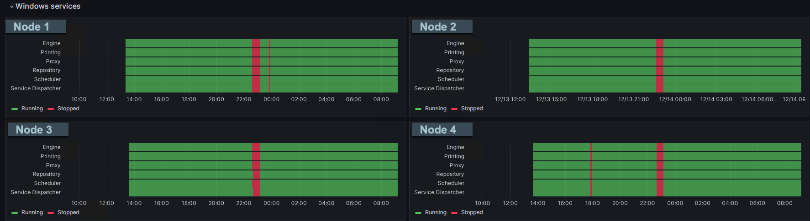

# Windows Services Monitoring

Monitor Windows services across multiple servers and get alerted when services stop or start.

::: warning Windows Only
Windows service monitoring is obviously only available on computers running Windows.

Butler can be installed on any platform, but the Windows service monitoring feature will only work when Butler is installed on a Windows computer.
:::

## Overview

If a Sense service stops unexpectedly, end users will be impacted immediately. Apps may stop reloading, users may lose access to the hub or QMC, or other critical functions may become unavailable.

Many organizations rely on dedicated infrastructure teams for monitoring, but in smaller environments, the same team that develops and maintains Sense apps often handles system monitoring. For these teams, immediate notification when services fail is crucial.

Butler provides comprehensive Windows service monitoring with support for:

- **Multiple Servers**: Monitor services across your entire Qlik Sense deployment
- **Multiple Services**: Track any Windows service, not just Qlik Sense services
- **Real-time Alerts**: Get notified immediately when service states change
- **Multiple Destinations**: Send alerts to Slack, Teams, email, webhooks, InfluxDB, New Relic, and MQTT

## Grafana Integration

Butler can send service status data to InfluxDB, enabling powerful Grafana dashboards and alerting.

### Service Timeline Visualization



This Grafana "state timeline" chart shows Qlik Sense service status across 4 servers over time. The red bars indicate when all services were restarted, with additional shorter outages visible on some servers.

### Advanced Alerting

With service data in InfluxDB, you can create Grafana alerts that trigger when services stop, automatically sending notifications to:

- **Incident Management**: PagerDuty, OpsGenie, VictorOps
- **Communication**: Slack, Teams, email
- **Custom Integrations**: Webhooks for any external system

## Service State Management

Butler uses an internal state machine to track service status and detect changes:


### State Transitions

- **RUNNING** → **STOPPED**: Service failure detected
- **STOPPED** → **RUNNING**: Service recovery detected
- **UNKNOWN**: Initial state or when service status cannot be determined

### Alert Triggers

Butler sends alerts only when service states change, preventing notification spam while ensuring you're informed of every important event.

::: info State Persistence
The state machine is not persisted to disk. If Butler restarts, it will not remember previous service states and will re-establish baseline status on the next monitoring cycle.
:::

## Performance Considerations

### Sequential Execution

Service checks are executed sequentially, which means:

- **Multiple servers + services = longer check cycles**
- **Remote servers add network latency**
- **Plan check frequency accordingly**

### Network Connectivity

Remote server monitoring requires WMI (Windows Management Instrumentation) connectivity. For best results:

- **Firewall Configuration**: Ensure WMI ports are open
- **Authentication**: Run Butler with appropriate permissions
- **Network Latency**: Consider round-trip time in your monitoring frequency

## Permissions and Security

### Local Monitoring

For services on the same server as Butler, standard service query permissions are sufficient.

### Remote Monitoring

To monitor services on remote servers, the Butler service account needs:

1. **Local Administrator**: Easiest approach - add Butler's account to local Administrators group on each monitored server
2. **WMI Permissions**: More secure - grant specific WMI query permissions
3. **Network Access**: Ensure firewall allows WMI connectivity

::: tip Security Best Practice
While local Administrator membership is the simplest approach, consider implementing least-privilege access using specific WMI permissions for production environments.
:::

## Configuration

### Service Definition

Define which services to monitor on which servers:

```yaml
Butler:
  serviceMonitor:
    enable: true # Master switch for service monitoring
    frequency: every 5 minutes # Check frequency using Later.js syntax
    monitor:
      - host: qlik-server-01 # First server
        services:
          - name: postgresql-x64-12 # Repository database
            friendlyName: Repository DB
          - name: QlikSenseEngineService
            friendlyName: Engine
          - name: QlikSensePrintingService
            friendlyName: Printing
          - name: QlikSenseProxyService
            friendlyName: Proxy
          - name: QlikSenseRepositoryService
            friendlyName: Repository
          - name: QlikSenseSchedulerService
            friendlyName: Scheduler
          - name: QlikSenseServiceDispatcher
            friendlyName: Service Dispatcher
      - host: qlik-server-02 # Second server
        services:
          - name: QlikSenseEngineService
            friendlyName: Engine
          - name: QlikSenseProxyService
            friendlyName: Proxy
```

### Alert Destinations

Control which destinations receive service alerts:

```yaml
Butler:
  serviceMonitor:
    alertDestination:
      influxDb:
        enable: true # Send to InfluxDB for dashboards
      newRelic:
        enable: true # Send to New Relic APM
      email:
        enable: true # Send email notifications
      mqtt:
        enable: true # Publish to MQTT topics
      teams:
        enable: true # Send to Microsoft Teams
      slack:
        enable: true # Send to Slack
      webhook:
        enable: true # Call external webhooks
```

### Destination-Specific Configuration

#### Microsoft Teams

```yaml
Butler:
  teamsNotification:
    enable: true
    serviceStopped:
      webhookURL: <Teams webhook URL>
      messageType: formatted # formatted or basic
      basicMsgTemplate: 'Windows service stopped: "{{serviceName}}" on host "{{host}}"'
      rateLimit: 30 # Minimum seconds between messages
      templateFile: /path/to/teams/service-stopped.handlebars
    serviceStarted:
      webhookURL: <Teams webhook URL>
      messageType: formatted
      basicMsgTemplate: 'Windows service started: "{{serviceName}}" on host "{{host}}"'
      rateLimit: 30
      templateFile: /path/to/teams/service-started.handlebars
```

#### Webhooks

```yaml
Butler:
  webhookNotification:
    enable: true
    serviceMonitor:
      rateLimit: 15 # Min seconds between calls per service
      webhooks:
        - description: "Primary alerting webhook"
          webhookURL: http://alerting.company.com/api/webhook
          httpMethod: POST
        - description: "Backup notification system"
          webhookURL: http://backup-alerts.company.com/notify
          httpMethod: PUT
        - description: "Monitoring dashboard update"
          webhookURL: http://dashboard.company.com/api/status
          httpMethod: GET
```

#### MQTT

```yaml
Butler:
  mqttConfig:
    enable: true
    brokerHost: mqtt.company.com
    brokerPort: 1883
    serviceRunningTopic: qliksense/service_running
    serviceStoppedTopic: qliksense/service_stopped
    serviceStatusTopic: qliksense/service_status
```

### Frequency Configuration

The monitoring frequency uses [Later.js](https://bunkat.github.io/later/parsers.html) syntax:

```yaml
# Every 5 minutes
frequency: every 5 minutes

# Every 30 seconds
frequency: every 30 seconds

# Every hour at minute 15
frequency: at 15 minutes past every hour

# Every day at 2:30 AM
frequency: at 2:30 am
```

## Common Service Names

### Qlik Sense Services

```yaml
services:
  - name: QlikSenseEngineService
    friendlyName: Engine
  - name: QlikSensePrintingService
    friendlyName: Printing
  - name: QlikSenseProxyService
    friendlyName: Proxy
  - name: QlikSenseRepositoryService
    friendlyName: Repository
  - name: QlikSenseSchedulerService
    friendlyName: Scheduler
  - name: QlikSenseServiceDispatcher
    friendlyName: Service Dispatcher
```

### Database Services

```yaml
services:
  - name: postgresql-x64-12
    friendlyName: PostgreSQL Repository DB
  - name: MSSQLSERVER
    friendlyName: SQL Server
  - name: SQLSERVERAGENT
    friendlyName: SQL Server Agent
```

### Web Services

```yaml
services:
  - name: W3SVC
    friendlyName: IIS Web Service
  - name: WAS
    friendlyName: Windows Process Activation
```

## Use Cases

### Proactive Monitoring

- **Service Failure Detection**: Immediate alerts when critical services stop
- **Recovery Confirmation**: Notifications when services restart successfully
- **Maintenance Windows**: Monitor service states during planned maintenance

### Capacity Management

- **Resource Planning**: Historical service uptime data for SLA reporting
- **Performance Correlation**: Correlate service restarts with performance issues
- **Trend Analysis**: Identify services that restart frequently

### Integration Scenarios

- **Automation**: Trigger automated restart procedures via webhooks
- **Incident Management**: Create tickets automatically when services fail
- **Dashboard Updates**: Real-time service status on monitoring dashboards

## Complete Configuration Example

```yaml
Butler:
  serviceMonitor:
    enable: true
    frequency: every 2 minutes
    monitor:
      - host: qlik-central-node
        services:
          - name: QlikSenseRepositoryService
            friendlyName: Repository
          - name: QlikSenseProxyService
            friendlyName: Proxy
          - name: postgresql-x64-12
            friendlyName: Repository DB
      - host: qlik-engine-node-01
        services:
          - name: QlikSenseEngineService
            friendlyName: Engine
          - name: QlikSenseServiceDispatcher
            friendlyName: Service Dispatcher
      - host: qlik-engine-node-02
        services:
          - name: QlikSenseEngineService
            friendlyName: Engine
          - name: QlikSenseServiceDispatcher
            friendlyName: Service Dispatcher
    alertDestination:
      influxDb:
        enable: true
      email:
        enable: true
      slack:
        enable: true
      webhook:
        enable: true

  # Email configuration for service alerts
  emailNotification:
    enable: true
    serviceMonitor:
      rateLimit: 60
      recipients:
        - admin@company.com
        - ops-team@company.com

  # Slack configuration for service alerts
  slackNotification:
    enable: true
    serviceMonitor:
      rateLimit: 30
      webhookURL: <Slack webhook URL>

  # InfluxDB for dashboards and long-term storage
  influxDb:
    enable: true
    serviceMonitor:
      enable: true
```

::: tip Best Practices

1. **Start Small**: Begin monitoring core services on primary servers
2. **Set Appropriate Frequency**: Balance monitoring speed with system load
3. **Use Rate Limiting**: Prevent notification spam during service instability
4. **Monitor Dependencies**: Include database and web services, not just Qlik Sense
5. **Test Connectivity**: Verify WMI access to all monitored servers before going live

:::
